# RCG-Fusion：实验设计、结果与维护记录

> 文档性质：论文实验章节中文母稿与实验进度活文档  
> 当前版本：v1.0  
> 最近更新：2026-10-01  
> 数据范围：CMU-MOSI、CMU-MOSEI、CREMA-D、AV-MNIST  
> 方法版本：多教师交叉拟合软联盟监督、解析贡献锚定列表式路由、完整联盟锚定两级安全融合

## 文档使用说明

本文档是 RCG-Fusion 当前唯一的实验章节主文档，用于同时维护论文实验设计、开发结果、正式结果、待完成实验与图表索引。方法定义以 `MAIN_WORK_CN.md` 为准；可靠性–贡献差距（Reliability–Contribution Gap, RCG）的详细观测过程归档于 `docx/01_observation_history/OBSERVATION_EXPERIMENT_CHECKLIST.md`；旧协议和旧结果统一存放在 `docx/`，不覆盖本文档中的当前协议。

本文档中的结果使用以下标签：

- **开发结果**：该数据或测试结果参与过结构设计、诊断或超参数决策，能够说明可行性，但不能作为完全无偏的最终确认。
- **正式结果**：方法、比较协议和超参数冻结后获得，并完成预注册统计分析。
- **历史结果**：对应已经被替代的方法版本，仅用于解释失败经验，不进入论文主表。
- **待运行**：已经固定协议但尚未产生结果。

每项实验统一记录研究目的、待检验假设、实验设置、比较方法、评价指标、统计方法、预期判读、实际结果、结果解释、失败解释和产物路径。实际结果缺失时保留显式占位符，不根据预期补写结论。

### 与现有文档的关系

| 文档 | 后续用途 |
|---|---|
| `docx/03_experiment_history/MAIN_EXPERIMENT_PROGRESS.md` | 旧版 E1–E9 实验安排和历史进度，不再作为最新协议 |
| `docx/01_observation_history/OBSERVATION_EXPERIMENT_CHECKLIST.md` | 独立 RCG 问题观测章节的来源 |
| `docx/02_method_history/INTEGRATED_THREE_INNOVATIONS_REPORT.md` | 最新三项创新联调与开发结果来源 |
| `docx/03_experiment_history/EXPERIMENT_PROTOCOL_V1.md` | 历史冻结协议，其中旧创新三已经失效 |
| `docx/01_observation_history/RESULTS_SYNTHESIS.md` | 早期观测结果来源 |
| `MAIN_WORK_CN.md` | 当前方法章节，与本实验章节逐项对应 |

## 术语与统计口径

| 规范术语 | 定义 |
|---|---|
| 完整联盟 | 包含当前所有可用模态的联盟，记为 $\mathcal M$ |
| 子联盟 | 完整联盟的任意非空真子集 $S\subset\mathcal M$ |
| 联盟预测 | 联盟 $S$ 的任务概率 $p_S(y\mid x_S)$ |
| 联盟优势 | $A_S=L_{\mathcal M}-L_S$，正值表示联盟 $S$ 优于完整联盟 |
| 解析贡献 | 对逐标签损失差按估计标签后验积分得到的条件期望贡献 |
| 解析锚点 | 解析贡献排序第一的候选联盟 |
| 列表式残差路由 | 在解析分数基础上学习有界排序残差的候选扩充器 |
| 完整联盟集成 | 多个模型成员的完整联盟概率平均，是完整系统的计算匹配基线之一 |
| 系统级相对错误率下降 | 最终系统相对单成员完整联盟平均的错误率下降 |
| 集成上相对错误率下降 | 最终系统相对完整联盟集成的错误率下降 |

相对错误率下降统一定义为：

$$
\operatorname{RER}
=
\frac{\operatorname{Error}_{\mathrm{base}}-
\operatorname{Error}_{\mathrm{method}}}
{\operatorname{Error}_{\mathrm{base}}}.
$$

文中所说的“10%提升”只允许指明确定义的相对错误率、相对 NLL 或相对融合后悔下降，不能改写为 Accuracy 绝对提高10个百分点。

---

# 1. 实验目标与研究问题

前述独立观测章节已经说明，单模态可靠性不能稳定表示其在当前联盟中的带符号贡献，并且强制完整融合可能产生可避免的任务损失。本章进一步验证多教师交叉拟合软联盟监督、解析贡献锚定列表式路由和完整联盟锚定两级安全融合能否分别解决联盟监督不稳定、无测试标签条件下的贡献估计，以及候选融合可能引起的有害修正。

实验围绕六个研究问题展开：

| 编号 | 研究问题 |
|---|---|
| RQ1 | 完整 RCG-Fusion 是否能在四个现有数据集上改善任务性能和概率质量？ |
| RQ2 | 多教师交叉拟合软联盟监督是否比训练内监督、单教师和硬 oracle 更稳定？ |
| RQ3 | 解析贡献锚定列表式路由能否识别有益联盟并提高候选覆盖率？ |
| RQ4 | 两级安全融合能否把候选联盟信息转化为实际收益，同时控制有害修正？ |
| RQ5 | 三个创新点及其组件是否分别提供必要增益？ |
| RQ6 | 方法在质量退化、模态缺失、不同融合骨干和计算约束下是否仍然成立？ |

三个创新点和实验之间的对应关系为：

| 创新点 | 对应研究问题 | 核心证据 |
|---|---|---|
| 创新一：多教师交叉拟合软联盟监督 | RQ2 | OOF隔离、教师稳定性、软目标、成对偏序和Top-$K$覆盖 |
| 创新二：解析贡献锚定列表式路由 | RQ3 | 贡献识别、联盟排序、解析Top-1保持和Top-2/Top-3扩充 |
| 创新三：完整联盟锚定两级安全融合 | RQ1、RQ4 | 主性能、负向翻转、损害、样本级混合和模型级回退 |
| 完整系统 | RQ5、RQ6 | 逐层消融、质量退化、缺失、骨干迁移和效率 |

本章的证据顺序固定为：

```text
完整系统产生任务收益
    ↓
软联盟监督提供更稳定的候选学习目标
    ↓
解析锚定路由扩大有益联盟候选覆盖
    ↓
两级融合把候选信息转化为性能收益并限制损害
    ↓
消融、鲁棒性、迁移和失败分析排除替代解释
```

---

# 2. 实验设置

## 2.1 数据集与任务

当前实验不扩充新数据集，只使用四个已经完成数据准备的数据集。它们覆盖文本主导情感分析、自然音视频情绪识别和强互补视听数字识别三种模态关系。

| 数据集 | 任务 | 模态 | 类别数 | 主要作用 |
|---|---|---|---:|---|
| CMU-MOSI | 正负情感识别，排除标签0 | 文本、音频、视觉 | 2 | 方法开发和细粒度机制分析 |
| CMU-MOSEI | 正负情感识别，排除标签0 | 文本、音频、视觉 | 2 | 大规模同任务复验 |
| CREMA-D | 表演意图情绪识别 | 音频、视频 | 6 | 非文本自然音视频验证 |
| AV-MNIST | 视听数字识别 | 图像、音频 | 10 | 强互补边界和完整联盟保留验证 |

固定数据协议如下：

- MOSI 使用 1,231/115/101/656 的训练、selection、calibration和测试划分。
- MOSEI 使用 12,786/771/667/3,634 的训练、selection、calibration和测试划分。
- MOSI和MOSEI按原视频分组，任何原视频不得跨训练、selection、calibration和测试。
- CREMA-D共7,442条样本，按91名演员执行五折 GroupKFold；演员不得跨训练、selection、calibration和测试。
- AV-MNIST使用16,800/1,800/1,800/3,600划分，并在论文中说明该划分来自当前社区镜像。
- 归一化参数只能由训练集估计；selection用于模型选择和允许的超参数选择；calibration只用于预先声明的概率或风险校准；测试集只用于最终评价。

## 2.2 输入表示

| 数据集 | 模态表示 |
|---|---|
| MOSI | BERT文本768维、音频5维、视觉20维 |
| MOSEI | BERT文本768维、音频74维、视觉35维 |
| CREMA-D | Wav2Vec2-Base音频768维、Kinetics-400预训练R3D-18视频512维 |
| AV-MNIST | 图像像素784维、音频频谱描述130维 |

所有结果统一称为“固定表示上的融合比较”。特征空间噪声和遮蔽只能用于检验融合层对表示质量变化的反应，不能表述为对真实摄像头、麦克风或端到端编码器噪声的直接验证。

## 2.3 联盟任务骨干

所有联盟共享模态投影器、集合编码器和任务头：

```text
ModalityProjector:
d_m → 128 → ReLU → Dropout(0.2) → 128

CoalitionEncoder:
2-layer TransformerEncoder
hidden=128, heads=4, FFN=256, dropout=0.2

TaskHead:
128 → 128 → ReLU → Dropout(0.2) → K
```

训练时以0.5概率使用完整联盟，以0.5概率从非空不完整联盟中均匀采样。三模态任务包含7个非空联盟，二模态任务包含3个非空联盟。该训练用于保证联盟删除属于训练支持范围，而不是把未训练的清零输入作为反事实。

默认优化设置为：

| 项目 | 设置 |
|---|---|
| 优化器 | AdamW |
| 学习率 | $10^{-3}$ |
| weight decay | $10^{-2}$ |
| 最大epoch | 100 |
| 早停指标 | selection NLL |
| patience | 10 |
| 梯度裁剪 | 5.0 |
| batch size | MOSI/CREMA-D为64；MOSEI/AV-MNIST为128 |

标签后验网络、列表式路由和两级融合的结构及损失定义以 `MAIN_WORK_CN.md` 为准。实验章节不通过修改测试集结果来重新定义方法。

## 2.4 比较方法

### 2.4.1 基础融合

- 最佳单模态；
- 等权概率平均；
- 完整输入拼接；
- modality dropout拼接；
- coalition dropout完整联盟；
- 静态late fusion；
- 逐样本测试标签oracle最佳联盟，仅作为分析上界。

### 2.4.2 可靠性与动态融合

- 最大概率加权；
- 负熵加权；
- 温度校准置信度融合；
- TMC；
- QMF；
- PDF。

### 2.4.3 关系与路由

- I²MoE；
- 直接realized-benefit回归；
- 单候选硬路由；
- 无锚定列表式残差路由；
- 旧top-3凸包投影。

TMC、QMF、PDF和I²MoE在统一固定表示轨道中的结果均标记为“统一特征适配”，不与原论文表格作数值等价比较。只有使用相同划分、输入和评价协议重新运行的结果进入显著性比较。

### 2.4.4 RCG-Fusion内部版本

- coalition-aware完整联盟骨干；
- 多教师软联盟监督；
- 解析贡献；
- 解析Top-1；
- 无锚定列表式路由；
- 解析锚定列表式路由；
- 样本级锚定候选混合；
- 贡献概率自适应收缩；
- 模型级稳定凸聚合；
- 完整联盟集成回退；
- 完整两级RCG-Fusion。

## 2.5 评价指标

### 2.5.1 主任务指标

- Accuracy；
- Macro-F1；
- NLL；
- Brier score；
- ECE，固定10个等宽区间；
- CREMA-D额外报告每类召回率。

### 2.5.2 创新一指标

- OOF与训练内联盟损失差距；
- 不同教师oracle联盟一致率；
- 软oracle熵；
- 成对偏序一致率；
- 单教师与多教师目标方差；
- Top-1、Top-2和Top-3 oracle候选覆盖；
- 下游NDCG@3和最终NLL。

### 2.5.3 创新二指标

- 有益联盟识别AUROC和AUPRC；
- 联盟收益Spearman相关；
- NDCG@3；
- Top-1、Top-2和Top-3 oracle恢复率；
- 成对联盟排序准确率；
- Top-10%和Top-20%候选安全精确率；
- 有益概率分箱校准；
- 解析锚点和锚定候选集的真实平均收益。

### 2.5.4 创新三指标

- 相对单成员完整联盟的Accuracy、Macro-F1和NLL变化；
- 相对计算匹配的完整联盟集成的变化；
- 相对错误率和相对NLL下降；
- 负向翻转率；
- 错误到正确的纠错率；
- 平均截断损害；
- 融合后悔下降；
- 样本级收缩系数分布；
- 动作权重分布；
- 模型级聚合权重和完整联盟回退系数；
- 与oracle联盟的差距。

## 2.6 统计协议

最终统计采用“核心数据集强复验”方案：

- MOSI和MOSEI训练5组独立的5成员集成，共25个任务成员；
- CREMA-D和AV-MNIST保留1组5成员集成，并使用配对bootstrap估计样本不确定性；
- MOSI和MOSEI按原视频进行10,000次配对簇bootstrap；
- CREMA-D按演员进行10,000次配对簇bootstrap；
- AV-MNIST按类别分层进行10,000次样本bootstrap；
- 主要比较使用同一样本上的成对差值；
- 预注册主比较使用Holm校正；
- 不使用“两组独立置信区间是否重叠”代替配对差异检验。

MOSI和MOSEI的独立集成种子组固定为：

```text
G1: 11, 22, 33, 44, 55
G2: 66, 77, 88, 99, 110
G3: 121, 132, 143, 154, 165
G4: 176, 187, 198, 209, 220
G5: 231, 242, 253, 264, 275
```

当前五个种子形成的一个五成员集成只算一个系统点，不能替代五组独立集成的训练随机性统计。

## 2.7 P0：最终系统定义与预测溯源

**状态：** ✅ 完成。

P0将后续正式系统唯一固定为`rcg-fusion-a8-v1`：

$$
\text{分组OOF联盟监督}
\rightarrow
\text{解析贡献}
\rightarrow
\text{解析锚定列表候选}
\rightarrow
\text{候选mixer}
\rightarrow
\text{贡献概率收缩（A7）}
\rightarrow
\text{完整联盟与A7成员的非负凸聚合及回退（A8）}.
$$

正式实现集中在`rcg/final_system.py`。模型级动作固定为每个成员的完整联盟预测和A7预测；非负凸权重及回退系数只使用selection标签拟合，测试接口不接收标签。每个数据集的最终预测保存`method_version`，并对按`fold/sample_id`排序后的双精度概率计算SHA-256。E13不再本地重建最终概率，而是按样本ID直接读取这份规范预测。

| 数据集 | 样本数 | 完整联盟Accuracy | 规范A8 Accuracy | $\Delta$Accuracy | 完整联盟NLL | 规范A8 NLL | NLL改善 | 预测哈希前12位 |
|---|---:|---:|---:|---:|---:|---:|---:|---|
| MOSI | 656 | 79.73% | 80.34% | +0.61 pp | 0.45045 | 0.44180 | +0.00865 | `b0d8d7277071` |
| MOSEI | 3,634 | 84.34% | 84.12% | -0.22 pp | 0.35557 | 0.35631 | -0.00074 | `e3760ee1b4eb` |
| CREMA-D | 7,442 | 63.44% | 63.53% | +0.09 pp | 0.97384 | 0.96549 | +0.00835 | `290ea9a5a0a0` |
| AV-MNIST | 3,600 | 99.19% | 99.33% | +0.14 pp | 0.02780 | 0.02130 | +0.00650 | `3680ab5fbeed` |

P0还明确区分历史与正式路径：E1/E7的“完整联盟＋标签后验”聚合保留为历史聚合基线；E8是规范干净预测来源；E9继续使用A7成员并应用E8的规范权重；E11需要在S4中按完整规范系统重跑；E13已经引用规范预测。此后不得把E1/E7旧聚合结果称为完整RCG-Fusion。

**产物路径：**

- `rcg/final_system.py`
- `runs/formal-e8-{dataset}/final_predictions.parquet`
- `runs/formal-e8-{dataset}/manifest.json`
- `results/p0_final_system_registry.csv`
- `results/p0_final_system_registry.json`

---

# 3. 完整系统主性能

## E1：干净数据主结果

**状态：** ⚫ 历史聚合结果已完成；P0后不再作为规范最终系统主表，统一S1待运行。

**研究目的：** 检验完整RCG-Fusion是否在正常输入下改善任务决策和概率质量，并区分RCG机制收益与普通模型集成收益。

**待检验假设：** 完整系统相对单成员和计算匹配的完整联盟集成都能降低NLL；至少部分数据集同时提高Accuracy或Macro-F1，且不存在不可接受的负迁移。

**实验设置：** 在四个数据集上比较单成员完整联盟、五成员完整联盟集成、五成员标签后验集成、稳定凸聚合和完整两级RCG-Fusion。所有成员使用相同数据划分和训练预算。

**主要报告：** Accuracy、Macro-F1、NLL、Brier、ECE、相对单模型错误率下降和相对完整联盟集成错误率下降。

### 历史结果（P0后不作为规范最终系统主表）

| 数据集 | 单模型平均Accuracy | 完整联盟集成 | 最终系统 | 相对单模型错误率下降 | 相对完整集成NLL下降 |
|---|---:|---:|---:|---:|---:|
| MOSI | 77.87% | 79.73% | **80.49%** | **11.85%** | **1.97%** |
| MOSEI | 83.83% | **84.34%** | 84.29% | 2.83% | **0.34%** |
| CREMA-D | 60.88% | 63.39% | **63.55%** | 6.93% | **1.17%** |
| AV-MNIST | 98.81% | 99.19% | **99.47%** | **55.61%** | **19.69%** |

MOSI最终NLL为0.4416，低于单模型平均0.4658和完整联盟集成0.4504。MOSEI最终NLL为0.3544，低于完整联盟集成0.3556，但Accuracy低0.055个百分点，应视为持平并保留负迁移风险。CREMA-D五折平均最终NLL为0.9631，低于完整联盟集成0.9748。AV-MNIST最终NLL为0.0223，低于完整联盟集成0.0278。

上述结果只说明当前系统具有继续正式复验的价值。相对完整联盟集成的错误率下降分别约为MOSI 3.76%、MOSEI -0.35%、CREMA-D 0.47%和AV-MNIST 34.48%，因此当前不能声称四个数据集都达到10%提升。

### MOSI五组独立集成复验

本实验进一步训练四组互不重叠的五成员集成，并与已有G1共同构成五个独立集成重复。每组均重新训练联盟骨干、五折OOF教师和解析标签后验；模型级非负凸权重及完整联盟回退系数仅由selection确定。每组测试对象均为相同的656个MOSI测试片段。

本轮复验沿用G1的冻结实现：每个成员的完整联盟概率和解析标签后验进入模型级非负凸聚合，再由selection选择完整联盟回退系数。它直接验证E1中的干净性能和E7中的稳定聚合，但不替代E5、E6对样本级锚定动作混合与自适应收缩的专门消融。

| 独立集成 | 完整联盟集成Acc. | RCG-Fusion Acc. | $\Delta$Acc. | 完整联盟NLL | RCG-Fusion NLL | $\Delta$NLL | 相对单模型错误率下降 |
|---|---:|---:|---:|---:|---:|---:|---:|
| G1 | 79.73% | 80.49% | +0.76 pp | 0.4504 | 0.4416 | -0.0089 | 11.85% |
| G2 | 79.73% | 80.64% | +0.91 pp | 0.4610 | 0.4446 | -0.0164 | 9.80% |
| G3 | 79.73% | 80.03% | +0.30 pp | 0.4516 | 0.4526 | +0.0010 | 9.78% |
| G4 | 79.88% | 81.55% | +1.68 pp | 0.4526 | 0.4405 | -0.0121 | 13.20% |
| G5 | 80.03% | 80.34% | +0.30 pp | 0.4411 | 0.4375 | -0.0036 | 6.39% |
| **均值±SD** | **79.82±0.14%** | **80.61±0.57%** | **+0.79±0.56 pp** | **0.4514±0.0071** | **0.4434±0.0057** | **-0.0080±0.0069** | **10.20±2.58%** |

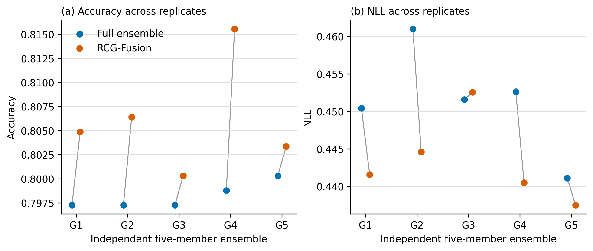

**结果分析：** 五个独立集成重复的Accuracy均高于各自计算匹配的完整联盟集成，平均提高0.79个百分点。以五个训练重复作为独立单位的双侧单样本$t$检验得到95%置信区间$[0.09,1.49]$个百分点，$p=0.0348$。按原视频进行10,000次配对簇bootstrap，并在每次重采样中对五个训练重复取平均，Accuracy差值的95%区间为$[0.15,1.41]$个百分点。两种不确定性分析均支持Accuracy改善方向。

NLL在4/5组中下降，平均差值为$-0.0080$。训练重复层面的95% $t$区间为$[-0.0165,0.0005]$，$p=0.0594$，尚未排除训练随机性下的零差异；把五个已训练模型组视为固定并按视频bootstrap时，95%区间为$[-0.0133,-0.0024]$。因此当前证据支持测试样本层面的平均NLL改善，但对“跨任意训练初始化稳定降低NLL”的主张仍应保守。

相对单成员完整联盟，平均错误率下降为10.20%，但只有2/5个独立重复单独达到10%门槛。相对计算匹配的完整联盟集成，平均错误率下降为3.93±2.80%，平均相对NLL下降为1.76±1.49%。因此可以表述为“系统相对单模型的平均错误率下降约10%，且相对完整联盟集成具有较小但重复的Accuracy收益”，不能表述为“每次重复或相对强集成都达到10%提升”。

**实验结论：** MOSI上的独立复验通过“5/5组Accuracy不下降”和平均Accuracy改善检验，但没有通过“5/5组NLL均改善”或“每组均超过10%相对错误率下降”。该结果需要与下述MOSEI独立复验共同判读。

### MOSEI五组独立集成复验

MOSEI采用与开发阶段G1严格相同的计算协议：每组包含五个任务成员和五个解析标签后验成员，OOF贡献目标由一个独立教师生成，旧风险头只训练1 epoch且不进入最终稳定聚合。G2–G5仅替换为互不重叠的任务种子、教师种子和后验种子，没有根据G1或MOSI结果调整模型、权重约束或selection规则。每组均在相同的3,634个MOSEI测试片段上评价。

| 独立集成 | 完整联盟集成Acc. | RCG-Fusion Acc. | $\Delta$Acc. | 完整联盟NLL | RCG-Fusion NLL | $\Delta$NLL | 相对单模型错误率下降 |
|---|---:|---:|---:|---:|---:|---:|---:|
| G1 | 84.34% | 84.29% | -0.06 pp | 0.3556 | 0.3544 | -0.0012 | 2.83% |
| G2 | 84.23% | 84.40% | +0.17 pp | 0.3561 | 0.3563 | +0.0003 | 3.74% |
| G3 | 84.23% | 84.51% | +0.28 pp | 0.3555 | 0.3534 | -0.0020 | 5.15% |
| G4 | 84.15% | 84.34% | +0.19 pp | 0.3554 | 0.3588 | +0.0034 | 5.79% |
| G5 | 84.09% | 84.18% | +0.08 pp | 0.3540 | 0.3537 | -0.0003 | 2.61% |
| **均值±SD** | **84.21±0.09%** | **84.34±0.12%** | **+0.13±0.13 pp** | **0.3553±0.0008** | **0.3553±0.0022** | **+0.0000±0.0021** | **4.02±1.41%** |

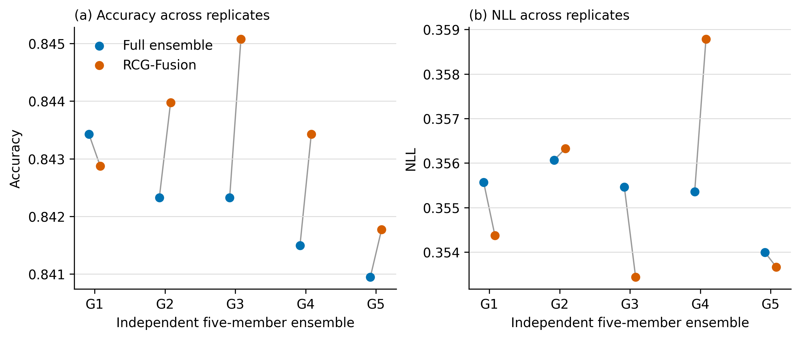

**结果分析：** Accuracy在4/5个独立重复中高于完整联盟集成，但平均增益只有0.13个百分点。以五个训练重复为独立单位的95% $t$区间为$[-0.02,0.29]$个百分点，$p=0.0777$；按原视频进行10,000次配对簇bootstrap所得区间为$[-0.14,0.41]$个百分点。两个区间都包含零，因此不能声称当前方法在MOSEI上稳定提高Accuracy。开发阶段G1出现的轻微Accuracy负迁移没有成为多数情况，但也没有转化为统计支持的正提升。

NLL在3/5组中下降、2/5组中上升，平均差值仅为$+0.00003$。训练重复层面的95% $t$区间为$[-0.00256,0.00262]$，$p=0.9777$；视频簇bootstrap区间为$[-0.00274,0.00293]$。这表明当前稳定后验聚合在MOSEI上的NLL与完整联盟集成实质持平，原G1的单组NLL改善不能推广为稳定结论。

相对单成员完整联盟的平均错误率下降为4.02±1.41%，没有任何独立重复达到10%。相对计算匹配完整联盟集成的平均错误率下降为0.84±0.79%，平均相对NLL变化为$-0.01\pm0.59\%$。因此MOSEI只支持“当前系统未出现明显系统性Accuracy崩溃，并与强集成基线大体持平”，不支持“明显提升”或“稳定概率质量改善”。

**实验结论：** MOSEI未通过E1的性能提升判据。该结果限制了论文的主性能主张：MOSI可以作为稳定Accuracy收益证据，MOSEI应作为大规模同任务上的中性结果和方法边界。后续实验不能通过挑选G3或只报告相对单模型的收益来掩盖与计算匹配集成持平的事实。

### CREMA-D五演员外折与演员簇bootstrap

CREMA-D使用五个演员隔离的外折覆盖全部7,442个样本和91名演员。数据核查确认每个样本只出现一次，每名演员只进入一个测试折，五折分别包含18、18、18、19和18名演员。每折使用五个任务成员构成完整联盟集成，并与同成员预算下的稳定后验聚合比较。统计以演员为簇进行10,000次配对bootstrap，保留同一演员的全部片段。

| 指标 | 完整联盟集成 | RCG-Fusion | 差值（RCG−完整集成） | 演员簇95% CI |
|---|---:|---:|---:|---:|
| Accuracy | 63.44% | 63.59% | +0.15 pp | $[-0.56,0.89]$ pp |
| Macro-F1 | 63.30% | 63.46% | +0.16 pp | $[-0.57,0.94]$ pp |
| NLL | 0.9738 | 0.9622 | -0.0117 | $[-0.0256,0.0038]$ |
| Brier | 0.4890 | 0.4847 | -0.0043 | $[-0.0113,0.0035]$ |
| ECE | 0.0144 | 0.0163 | +0.0020 | $[-0.0184,0.0244]$ |
| 负向翻转率 | — | 2.69% | — | $[2.20,3.19]\%$ |
| 纠错率 | — | 2.84% | — | $[2.26,3.46]\%$ |

五个演员外折的配对结果为：

| 外折 | 完整联盟Acc. | RCG-Fusion Acc. | $\Delta$Acc. | 完整联盟NLL | RCG-Fusion NLL | $\Delta$NLL | 回退系数$\rho$ |
|---|---:|---:|---:|---:|---:|---:|---:|
| F1 | 65.11% | 65.58% | +0.47 pp | 0.9406 | 0.9390 | -0.0016 | 1.0 |
| F2 | 54.85% | 54.51% | -0.34 pp | 1.1712 | 1.1497 | -0.0216 | 1.0 |
| F3 | 63.12% | 63.12% | 0.00 pp | 0.9520 | 0.9520 | 0.0000 | 0.0 |
| F4 | 68.11% | 67.27% | -0.84 pp | 0.8740 | 0.8606 | -0.0134 | 1.0 |
| F5 | 65.78% | 67.28% | +1.50 pp | 0.9361 | 0.9142 | -0.0218 | 1.0 |

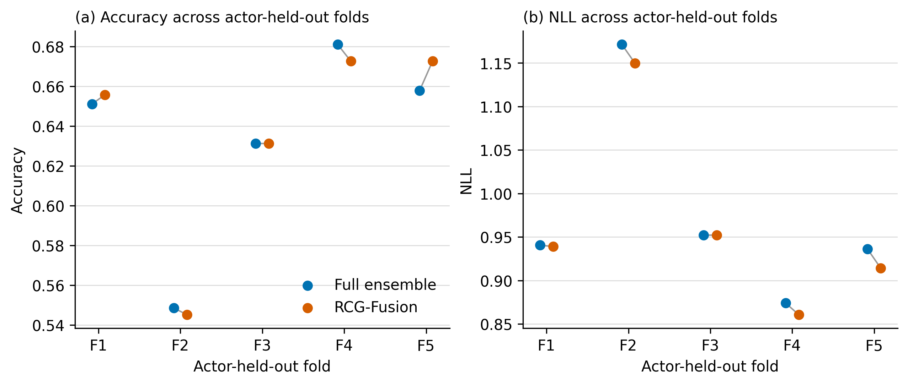

**结果分析：** 总体Accuracy提高0.15个百分点，Macro-F1提高0.16个百分点，但演员簇置信区间均包含零。五折中F1和F5提高Accuracy，F2和F4下降，F3在selection上选择$\rho=0$并完全回退到完整联盟。纠错率仅比负向翻转率高0.15个百分点，与总体Accuracy差异一致。这说明当前系统没有造成大幅系统性崩溃，但分类改善集中于部分演员折，不能作为稳定跨演员收益。

NLL在四个实际启用后验聚合的外折中全部下降，F3因完整回退保持不变；总体相对NLL下降1.20%。然而演员簇bootstrap的NLL差异区间为$[-0.0256,0.0038]$，仍包含零，说明少数演员簇对估计有较大影响。Brier呈相同方向但区间也跨零，ECE则轻微上升且无统计支持。因此较准确的结论是“多数外折呈现概率损失改善趋势，但现有91名演员不足以确认稳定的跨演员收益”。

**实验结论：** CREMA-D未通过显著主任务提升判据。当前结果支持完整联盟回退在一个外折中避免不必要修正，也显示后验聚合可能改善概率质量，但不支持明显Accuracy、Macro-F1或NLL提升。该边界必须进入主文或局限性分析，不能只报告五折加权平均的正数。

### AV-MNIST类别分层bootstrap

AV-MNIST使用一个由五个独立成员组成的最终集成，在固定测试集的3,600个样本上比较完整联盟平均集成与RCG-Fusion。十个数字类别各包含360个测试样本。统计在每个类别内部按原类别样本数有放回抽样，再合并十类计算指标，共执行10,000次配对bootstrap；该方案保持每次重采样的类别构成不变。

| 指标 | 完整联盟集成 | RCG-Fusion | 差值（RCG−完整集成） | 分层bootstrap 95% CI |
|---|---:|---:|---:|---:|
| Accuracy | 99.19% | 99.47% | +0.28 pp | $[0.06,0.50]$ pp |
| Macro-F1 | 99.19% | 99.47% | +0.28 pp | $[0.06,0.50]$ pp |
| NLL | 0.0278 | 0.0223 | -0.0055 | $[-0.0100,-0.0006]$ |
| Brier | 0.0129 | 0.0095 | -0.0034 | $[-0.0056,-0.0013]$ |
| ECE | 0.0084 | 0.0017 | -0.0066 | $[-0.0088,-0.0027]$ |
| 负向翻转率 | — | 0.11% | — | $[0.03,0.22]\%$ |
| 纠错率 | — | 0.39% | — | $[0.19,0.61]\%$ |

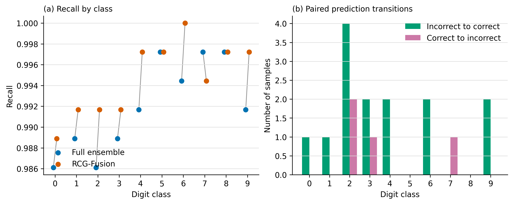

**结果分析：** RCG-Fusion纠正14个完整联盟集成的错误，同时造成4个负向翻转，净增加10个正确预测。Accuracy和Macro-F1均提高0.28个百分点，类别分层bootstrap区间不含零。相对于完整联盟集成的0.81%错误率，这对应34.48%的相对错误率下降。NLL相对下降19.69%，Brier和ECE也同步下降，三项概率质量差异的区间均支持改善。

逐类结果显示，数字0、1、2、3、4、6和9的召回率提高，数字5和8保持不变，数字7下降0.28个百分点。四个负向翻转集中在数字2、3和7，而14个纠错分布在七个类别中。因此收益并非由单一类别完全驱动，但数字7仍构成明确失败边界。selection最终选择$\rho=1$，说明本次结果来自完整使用稳定后验凸聚合，而非回退到完整联盟。

**实验结论：** AV-MNIST通过E1的主任务和概率质量改善判据，并在计算匹配的完整联盟集成基础上超过10%相对错误率下降。由于该结论来自一组五成员集成和一个固定测试划分，其统计区间只刻画测试样本不确定性，不刻画重新训练造成的方差；因此不能把34.48%的相对下降直接推广为跨训练初始化的期望收益。

**正式判定：**

- 至少三个数据集的NLL配对95%置信区间低于零；
- 至少两个数据集相对完整联盟集成改善Accuracy或Macro-F1；
- MOSI和MOSEI的结论在五组独立集成上保持；
- 不用相对单模型提升掩盖普通集成已经产生的收益；
- 未达到10%相对下降的数据集如实报告。

**失败解释：** 如果收益主要来自普通五成员集成，而RCG相对完整联盟集成没有稳定增益，则创新三应收窄为校准型后验聚合，不能声称贡献路由带来主要性能改善。

**E1总体结论：** 四个数据集的正式统计已经完成。MOSI提供跨五组训练重复的稳定Accuracy收益，AV-MNIST提供单组集成下由分层bootstrap支持的任务与概率质量收益；MOSEI与计算匹配集成持平，CREMA-D仅呈NLL改善趋势。因而E1没有达到“至少三个数据集NLL置信区间低于零”的预设强判据，也不能支持跨所有任务稳定提升。现有证据支持方法在MOSI和AV-MNIST上的有效性，同时要求后续消融解释收益为何没有稳定迁移到MOSEI和CREMA-D。

**产物路径：** 四个数据集的本地正式汇总分别位于`runs/formal-e1-mosi/`、`runs/formal-e1-mosei/`、`runs/formal-e1-cremad/`和`runs/formal-e1-avmnist/`；可追踪汇总位于`results/e1_*`；论文图片位于`figures/e1_*.png`。

---

# 4. 创新一：多教师交叉拟合软联盟监督

## E2：交叉拟合与软监督有效性

**状态：** ✅ MOSI、MOSEI、CREMA-D与AV-MNIST的五种子六版本正式消融已完成。

**研究目的：** 验证创新一能否减少训练内乐观偏差，表达教师对近优联盟的分歧，并为后续候选路由提供比硬oracle更稳定的监督。

**待检验假设：** OOF监督比训练内监督更保守；多教师软oracle比单教师硬标签具有更低的目标方差；软列表、成对偏序和一致性权重能够提高Top-2/Top-3候选覆盖或下游NLL。

**比较版本：**

1. 训练内损失监督；
2. OOF单教师监督；
3. OOF多教师硬oracle；
4. OOF多教师软oracle；
5. 软oracle加成对偏序；
6. 完整创新一：软oracle、成对偏序、稳定改善和一致性权重。

**评价指标：** 训练内与OOF损失差、oracle一致率、软oracle熵、目标方差、Top-$K$覆盖、NDCG@3、候选集oracle NLL和最终系统NLL。

### 已有开发诊断

MOSI训练数据上，五个OOF教师的逐样本oracle联盟具有明显随机性：平均最大投票比例为65.05%，至少4/5教师一致的样本为36.80%，五教师完全一致仅为11.54%，任意两个教师oracle完全相同的比例为44.58%。这些结果说明精确恢复单一逐样本oracle不是稳定的主监督目标，也构成使用软联盟分布和Top-$K$候选的直接经验依据。

### MOSI五种子监督消融

本实验固定联盟骨干、解析标签后验、模型结构、selection早停规则和五个训练种子，只替换路由监督。训练内硬目标由对应任务骨干在训练样本上的联盟损失产生；OOF单教师使用与任务种子对应的未见样本教师；OOF多教师版本使用五个分组交叉拟合教师。所有版本均在相同656个测试片段上评价，测试标签只用于训练完成后的联盟排序统计。

首先审计监督来源。五个种子的训练内平均联盟NLL为$0.4822$，OOF平均联盟NLL为$0.5792$，平均差异为$0.0971$；训练内与OOF联盟损失的平均Spearman相关性为$0.754$。因此训练内损失存在明显乐观偏差，但两个目标并非完全无关。

五个OOF教师的硬oracle目标方差为$0.4433$，温度软化后的目标方差为$0.0333$，即降低$92.50\%$。然而软目标的归一化熵为$0.770$，表明稳定性提升伴随较强平滑。以下结果报告均值±训练种子标准差：

| 监督版本 | NDCG | 成对排序准确率 | 锚定Top-3覆盖 | 候选oracle NLL↓ | 硬选择NLL↓ |
|---|---:|---:|---:|---:|---:|
| 训练内硬目标 | **0.8654±0.0102** | 0.7074±0.0564 | **76.77±9.64%** | **0.3951±0.0146** | **0.4614±0.0075** |
| OOF单教师硬目标 | 0.8403±0.0166 | 0.6881±0.0335 | 54.63±18.18% | 0.4051±0.0314 | 0.4718±0.0244 |
| OOF多教师硬目标 | 0.8529±0.0185 | **0.7188±0.0245** | 65.82±7.92% | 0.4155±0.0061 | 0.4633±0.0101 |
| OOF多教师软目标 | 0.8468±0.0165 | 0.7186±0.0099 | 51.40±12.39% | 0.4234±0.0127 | 0.4616±0.0089 |
| 软目标＋成对偏序 | 0.8476±0.0163 | 0.7177±0.0067 | 55.82±9.82% | 0.4215±0.0116 | 0.4622±0.0079 |
| 完整软监督 | 0.8413±0.0184 | 0.7088±0.0155 | 57.62±2.99% | 0.4150±0.0109 | 0.4628±0.0087 |

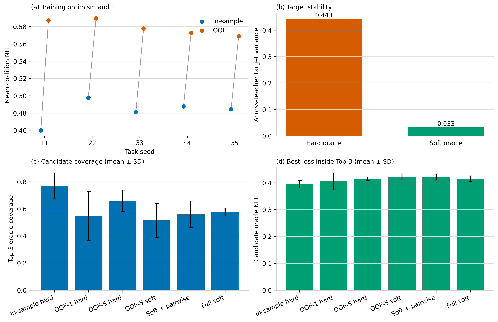

**结果分析：** 多教师硬目标相对单教师硬目标将Top-3覆盖提高11.19个百分点，并降低跨种子标准差，但只在3/5个种子上提高覆盖，配对$t$检验$p=0.172$，证据不足以确认稳定增益。将多教师硬目标改为软目标后，目标方差虽然显著降低，Top-3覆盖却下降14.42个百分点，只有1/5个种子改善，配对$p=0.092$。这说明“教师目标更平滑”不等于“路由候选更有效”。

在纯软目标上增加成对偏序、稳定改善和一致性权重后，完整版本将Top-3覆盖从51.40%恢复到57.62%，在4/5个种子中优于纯软目标；候选oracle NLL也从0.4234降至0.4150。但这些补偿仍没有超过多教师硬目标，更没有超过训练内硬目标。完整软监督相对训练内硬目标的Top-3覆盖低19.15个百分点，五个种子全部下降，配对$p=0.0080$；候选oracle NLL平均高0.0199。

硬选择NLL在训练内硬目标、OOF多教师软目标和完整软监督之间接近，说明较差的Top-3覆盖尚未在单联盟硬选择NLL上形成同等幅度的恶化，但也没有产生预期的下游收益。当前结果支持OOF协议能够消除训练内目标复用、软目标能够表达教师分歧并降低目标方差；它不支持“完整软联盟监督在MOSI上提高候选覆盖或最终路由性能”。

**实验结论：** 创新一在MOSI上只通过“监督泄漏控制与目标稳定化”部分，没有通过“优于训练内硬目标或多教师硬目标的下游效果”部分。论文当前不能把软联盟监督写成主要性能来源。后续跨数据集复验若仍出现相同模式，应将创新一收窄为可信贡献监督协议，并优先保留OOF多教师硬目标或研究避免过度平滑的软目标，而不是默认使用当前完整软监督。

### MOSEI五种子跨数据集复验

MOSEI严格复用MOSI的六版本配置、损失权重、温度、早停与残差强度选择规则。为满足多教师比较，按原GroupKFold与内部selection划分补充训练种子22、33、44和55的OOF教师，并与已有种子11合并；每个教师均未见其负责预测的训练片段。五个路由种子最终在相同3,634个测试片段上评价。

MOSEI训练内平均联盟NLL为$0.4413$，OOF平均联盟NLL为$0.4937$，差异为$0.0524$；训练内与OOF损失的平均Spearman相关性为$0.891$。五教师硬目标方差为$0.3944$，软目标方差为$0.0225$，下降$94.28\%$。教师最大投票比例平均为69.07%，至少4/5教师一致的样本为45.35%，完全一致样本为18.47%，仍说明单一硬oracle存在明显教师依赖。

| 监督版本 | 残差强度 | NDCG | 成对排序准确率 | 锚定Top-3覆盖 | 候选oracle NLL↓ | 硬选择NLL↓ |
|---|---:|---:|---:|---:|---:|---:|
| 训练内硬目标 | 0.00±0.00 | 0.8857±0.0064 | **0.7960±0.0058** | 48.86±8.04% | 0.3389±0.0043 | **0.3647±0.0048** |
| OOF单教师硬目标 | 0.00±0.00 | 0.8857±0.0064 | **0.7960±0.0058** | 48.86±8.04% | 0.3389±0.0043 | **0.3647±0.0048** |
| OOF多教师硬目标 | 0.00±0.00 | 0.8857±0.0064 | **0.7960±0.0058** | 48.86±8.04% | 0.3389±0.0043 | **0.3647±0.0048** |
| OOF多教师软目标 | 0.34±0.42 | **0.8943±0.0077** | 0.7820±0.0239 | 64.82±7.47% | **0.3318±0.0108** | 0.3686±0.0052 |
| 软目标＋成对偏序 | 0.39±0.45 | 0.8929±0.0071 | 0.7882±0.0196 | **67.12±8.38%** | 0.3336±0.0081 | 0.3683±0.0062 |
| 完整软监督 | 0.19±0.32 | 0.8883±0.0059 | 0.7900±0.0164 | 59.99±7.63% | 0.3344±0.0109 | 0.3669±0.0043 |

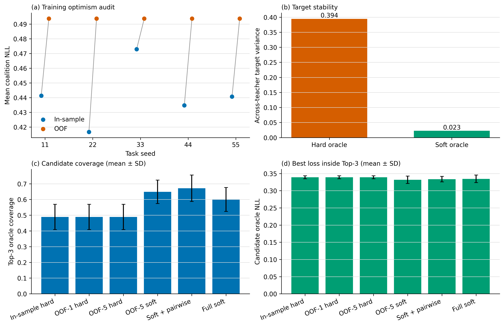

**结果分析：** 三个硬目标版本的selection均选择零残差，因此测试时全部退回同一个解析排序。它们数值相同并不证明训练内、单教师和多教师目标等价，只说明当前selection规则拒绝了这些版本学到的残差。软目标使残差在4/5个种子中启用，并相对多教师硬目标将Top-3覆盖提高15.96个百分点，配对$p=0.063$。软目标加成对偏序进一步将增益扩大到18.26个百分点，在4/5个种子中改善，配对$p=0.0467$。

候选集扩大没有自动转化为安全的单联盟决策。软目标加成对偏序虽然把候选oracle NLL平均降低$0.0053$，硬选择NLL却比多教师硬目标高$0.0036$；对应配对$p$分别为$0.212$和$0.160$。这说明新增候选包含更好的联盟，但路由第一名仍会选错，后续融合必须利用Top-3候选而不能直接硬选择。

加入稳定改善和一致性权重的完整软监督将Top-3覆盖从67.12%降至59.99%，同时没有改善硬选择NLL。因此MOSEI支持“软列表与成对偏序可扩大候选覆盖”，不支持当前一致性加权完整目标优于简化版本。它与MOSI中软目标降低覆盖的结果共同说明，该组件存在明显数据集依赖。

**MOSI/MOSEI阶段结论：** OOF在两个数据集上都揭示训练内乐观偏差，软化也都使教师目标方差下降超过92%。下游效果不稳定：MOSI偏好多教师硬目标，MOSEI偏好软目标加成对偏序；当前“完整软监督”在两个数据集上都不是最佳版本。

### CREMA-D演员隔离复验

CREMA-D在91名演员上使用五个外层GroupKFold，每个外折再按演员构造五教师OOF目标。重建的内层分组与原种子11的分配逐样本一致；新增教师种子22、33、44和55后，共训练100个小型OOF教师。六种监督版本在每个外折分别用五个路由种子训练，共150次路由训练。因为CREMA-D只有两个模态和三个非空联盟，候选恢复使用Top-2；使用Top-3会把所有联盟全部纳入，指标恒为100%而失去区分力。

五个外折加权后，训练内平均联盟NLL为$0.8861$，OOF平均联盟NLL为$1.2947$，差异为$0.4086$；训练内与OOF损失的平均Spearman相关性为$0.631$。五教师硬oracle目标方差为$0.2249$，软目标方差为$0.1221$，下降$45.69\%$。教师最大投票比例平均为83.05%，至少4/5教师一致的样本为72.32%，五教师完全一致为46.07%。CREMA-D的教师分歧小于MOSI/MOSEI，软化所能消除的方差也明显较小。

| 监督版本 | 残差强度 | NDCG | 成对排序准确率 | 锚定Top-2覆盖 | 候选oracle NLL↓ | 硬选择NLL↓ |
|---|---:|---:|---:|---:|---:|---:|
| 训练内硬目标 | 0.47 | **0.8553±0.0050** | **0.7365±0.0055** | **81.25±0.87%** | 0.8722±0.0231 | 1.0450±0.0148 |
| OOF单教师硬目标 | 0.39 | 0.8510±0.0044 | 0.7232±0.0038 | 81.00±0.81% | 0.8690±0.0233 | 1.0467±0.0172 |
| OOF多教师硬目标 | 0.46 | 0.8491±0.0037 | 0.7214±0.0011 | 81.08±0.52% | 0.8680±0.0226 | 1.0460±0.0181 |
| OOF多教师软目标 | 0.54 | 0.8477±0.0034 | 0.7237±0.0044 | 80.77±0.51% | 0.8703±0.0252 | 1.0449±0.0150 |
| 软目标＋成对偏序 | 0.59 | 0.8492±0.0033 | 0.7260±0.0042 | 80.95±0.67% | 0.8696±0.0228 | **1.0419±0.0167** |
| 完整软监督 | 0.62 | 0.8475±0.0035 | 0.7225±0.0049 | 80.93±0.46% | **0.8677±0.0222** | 1.0435±0.0128 |

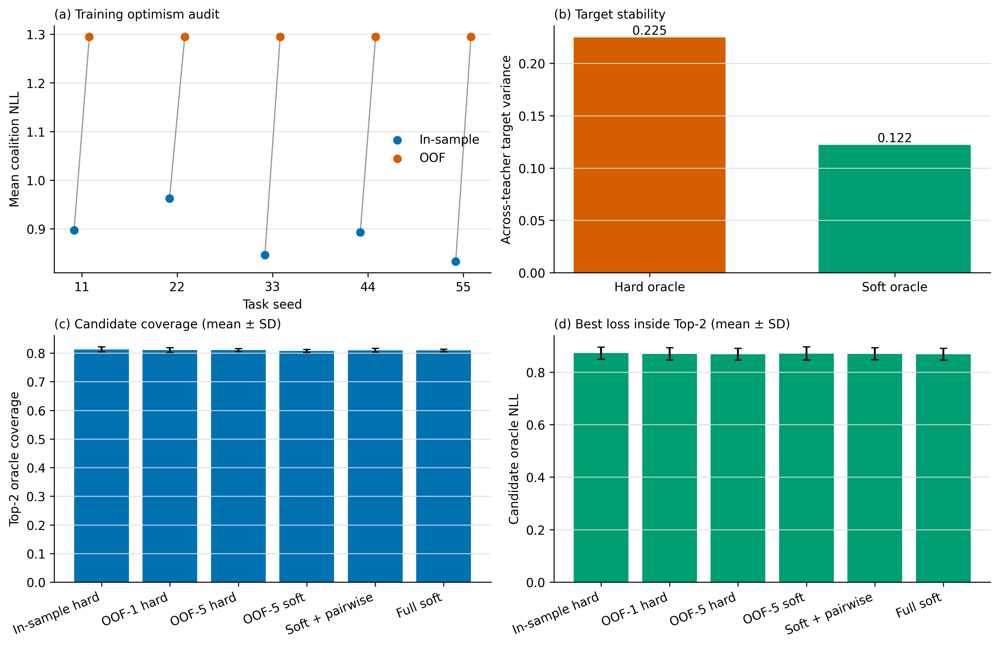

**结果分析：** 六个版本的Top-2覆盖全部介于80.77%和81.25%之间，最大差距不到0.5个百分点。多教师软目标相对多教师硬目标下降0.31个百分点，5/5个种子都未改善，配对$p=0.0682$；加入成对偏序后差异缩小为$-0.12$个百分点，$p=0.520$。这表明CREMA-D上候选覆盖主要由解析锚点决定，当前残差监督很难再改变Top-2集合。

完整软监督相对训练内硬目标在5/5个种子上都降低候选oracle NLL，平均下降$0.00455$，但只有五个种子，配对$p=0.0964$，尚不足以支持稳定改善。同时，它的NDCG比训练内硬目标低$0.0078$，5/5种子均下降，$p=0.0015$；成对排序准确率也低$0.0141$，$p=0.0003$。软目标＋成对偏序得到最低硬选择NLL，但相对多教师硬目标的改善仅为$0.00416$，$p=0.101$。

**CREMA-D实验结论：** 本实验确认了OOF协议对训练内乐观偏差的必要性，也证明软化可降低教师目标方差。它没有证明软目标提高排序或Top-2覆盖，也没有得到具有统计支持的下游NLL改善。

### AV-MNIST强互补边界复验

AV-MNIST严格复用既有分层五折OOF分配。原运行只含种子11的教师，本实验补充种子22、33、44和55，并在合并前验证重建的折号与原文件逐样本一致。共新增20个OOF教师，随后训练5个路由种子×6种监督版本。二模态联盟的候选指标同样使用Top-2。

训练内平均联盟NLL为$0.2184$，OOF平均联盟NLL为$0.2614$，差异为$0.0430$；两者Spearman相关性为$0.864$。五教师硬oracle目标方差为$0.0509$，软目标方差为$0.0212$，下降$58.29\%$。但教师本身已高度一致：平均最大投票比例为96.33%，至少4/5教师一致的样本为95.13%，完全一致样本为86.63%。因此，AV-MNIST不是教师分歧严重的场景。

| 监督版本 | 残差强度 | NDCG | 成对排序准确率 | 锚定Top-2覆盖 | 候选oracle NLL↓ | 硬选择NLL↓ |
|---|---:|---:|---:|---:|---:|---:|
| 训练内硬目标 | 0.26 | 0.9953±0.0011 | 0.9871±0.0018 | **99.38±0.20%** | 0.03002±0.00862 | 0.04125±0.01076 |
| OOF单教师硬目标 | 0.37 | **0.9954±0.0011** | **0.9879±0.0022** | 99.38±0.20% | 0.03001±0.00864 | 0.04130±0.01069 |
| OOF多教师硬目标 | 0.37 | 0.9951±0.0012 | 0.9852±0.0048 | 99.36±0.22% | 0.03004±0.00867 | 0.04150±0.01116 |
| OOF多教师软目标 | 0.35 | 0.9950±0.0011 | 0.9843±0.0054 | 99.36±0.17% | 0.03019±0.00861 | 0.04119±0.01094 |
| 软目标＋成对偏序 | 0.19 | 0.9951±0.0012 | 0.9863±0.0032 | 99.36±0.18% | 0.03005±0.00867 | 0.04084±0.01065 |
| 完整软监督 | 0.77 | 0.9949±0.0009 | 0.9803±0.0037 | 99.37±0.21% | **0.02959±0.00869** | **0.03982±0.01006** |

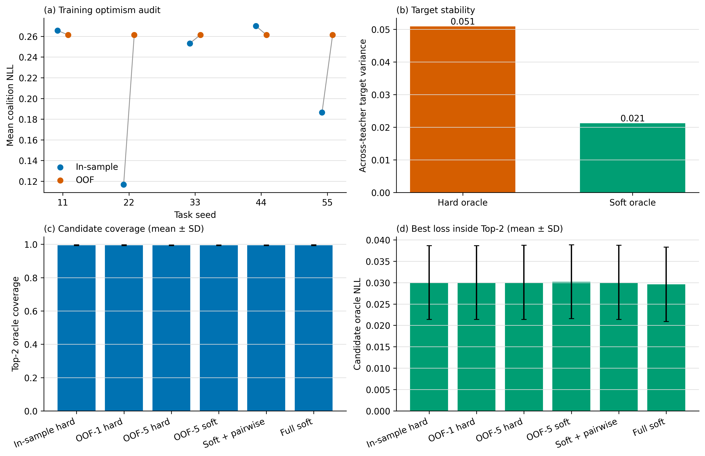

**结果分析：** 六个版本的Top-2覆盖均约为99.4%，任意两个版本的平均差异都不超过0.03个百分点。这是候选恢复的天花板，而不是六种监督同等有效的证据。多教师软目标与多教师硬目标的Top-2覆盖完全持平，而完整软监督相对训练内硬目标只低0.017个百分点，$p=0.553$。

完整软监督的候选oracle NLL数值最低，比训练内硬目标低$0.00043$，仅在3/5个种子改善，$p=0.301$。硬选择NLL也数值最低，平均低$0.00143$，3/5种子改善，$p=0.250$。与此同时，其成对排序准确率比训练内硬目标低$0.00686$，5/5种子下降，$p=0.0281$。因此不能根据极小的NLL数值差异宣称软监督在AV-MNIST上更好。

**AV-MNIST实验结论：** 该数据集再次支持OOF可以显示训练内乐观偏差，软化能够降低目标方差；但在教师高度一致、候选覆盖接近饱和的强互补任务上，当前软监督没有可验证的下游优势。

**E2四数据集总结：** OOF在四个数据集上均揭示了训练内乐观偏差，软化也都降低了教师目标方差，因此“多教师OOF可信监督和分歧表达”得到跨任务支持。然而下游改善不具备普遍性：MOSI偏好多教师硬目标，MOSEI只有软目标加成对偏序显著扩大Top-3候选覆盖，CREMA-D与AV-MNIST的Top-2覆盖几乎不受监督版本影响。当前完整软监督在四个数据集上均不是稳定最佳版本。因此，创新一应定位为可信联盟监督协议，不应把特定软目标组合写成主性能来源。

**正式预期判读：**

- OOF损失高于训练内损失，说明训练内目标存在乐观偏差；
- 多教师软目标的种子间方差低于单教师硬标签；
- 软目标提高Top-2或Top-3候选覆盖；
- 一致性权重主要改善高分歧样本，而不是只降低训练损失；
- 监督改进至少传递到路由NDCG、候选oracle上限或最终NLL之一。

**失败解释：** 如果软目标只降低训练损失，却不能改善候选覆盖、路由排序或最终性能，创新一只能表述为联盟监督稳定化协议，不能作为主要性能来源。

**结果图表：** Table 3报告监督稳定性和候选覆盖；Figure A报告教师分歧、软oracle熵和Top-$K$覆盖曲线。

**产物路径：** 正式运行位于`runs/formal-e2-{mosi,mosei,cremad,avmnist}/`；可追踪汇总为`results/e2_{dataset}_*`；论文图片位于`figures/e2_{dataset}_supervision_ablation.png`。

---

# 5. 创新二：解析贡献锚定列表式路由

## E3：条件贡献识别

**状态：** ✅ 四数据集统一联盟识别、普通MLP后验对照和三数据集强方法原生分数诊断已完成。

**研究目的：** 验证标签后验积分得到的解析贡献是否比单模态可靠性、现有方法原生分数和直接收益回归更适合识别有益联盟。

**比较方法：** 最大概率、负熵、TMC evidence、QMF uncertainty、PDF confidence/Co-Belief、I²MoE routing score、完整联盟概率直接作为标签后验、普通MLP后验、直接realized-benefit回归和解析贡献估计。

**实验单位：** 按数据集和候选联盟分别报告，并提供宏平均；不能只把所有联盟拼接后给出一个容易受类别比例支配的总AUROC。

**评价指标：** 有益事件AUROC/AUPRC、收益Spearman、Top-10%/20%安全精确率、有益概率Brier/ECE，以及按预测有益概率十分位统计的真实有益率和平均收益。

### 统一联盟识别协议

对每个非完整联盟$S$，固定评价目标为：

$$
b_S=\mathbb I[L_{\mathcal M}-L_S>0.01].
$$

比较方法包括联盟最大概率、归一化负熵、旧版直接联盟损失回归差、直接使用完整联盟输出作为标签后验、普通MLP标签后验，以及本文关系后验的解析积分。普通MLP与本文后验均使用五成员集成、selection早停和selection温度校准；MLP输入是拼接的固定模态表示与全联盟概率，不使用显式成对关系编码。

每个联盟先单独计算指标，再对联盟做宏平均，避免样本量或事件比例较大的联盟支配结果。MOSI/MOSEI/AV-MNIST在标准测试集评价；CREMA-D先合并同种子的五个演员隔离外折。所有模型和温度在读取测试标签前已固定，测试标签只用于离线评价。

| 数据集 | 最大概率 | 负熵 | 直接损失回归 | 完整输出后验 | 普通MLP后验 | 本文关系后验 |
|---|---:|---:|---:|---:|---:|---:|
| MOSI | 0.443±0.027 | 0.443±0.027 | 0.707±0.007 | 0.815±0.016 | **0.829±0.008** | 0.813±0.008 |
| MOSEI | 0.391±0.018 | 0.391±0.018 | 0.647±0.035 | 0.867±0.003 | **0.877±0.002** | **0.877±0.001** |
| CREMA-D | 0.502±0.018 | 0.504±0.018 | 0.597±0.009 | 0.747±0.004 | **0.780±0.007** | 0.764±0.007 |
| AV-MNIST | 0.367±0.030 | 0.364±0.031 | 0.699±0.094 | 0.984±0.006 | 0.985±0.004 | **0.988±0.006** |

上表为按联盟宏平均的有益事件AUROC，以五个任务种子报告均值±标准差。本文关系后验的其他指标如下：

| 数据集 | AUPRC | 收益Spearman | Top-20%有益率 | Brier↓ | ECE↓ | 有益事件占比 |
|---|---:|---:|---:|---:|---:|---:|
| MOSI | 0.625 | 0.348 | 63.28% | 0.1394 | 0.0465 | 29.76% |
| MOSEI | 0.636 | 0.450 | 59.47% | 0.0992 | 0.0165 | 19.50% |
| CREMA-D | 0.546 | 0.430 | 57.37% | 0.1607 | 0.0490 | 28.11% |
| AV-MNIST | 0.776 | 0.961 | 7.01% | 0.0057 | 0.0039 | 1.42% |

### 现有方法原生分数诊断

对TMC、QMF、PDF和I²MoE的统一特征适配模型，将“从完整联盟移除模态$m$后收益超过0.01 nats”作为有益移除事件，使用负的原生可靠性、质量或路由分数进行识别。下表为五种子、各模态宏平均AUROC：

| 数据集 | 最大概率 | TMC evidence | QMF quality | PDF Co-Belief | I²MoE routing |
|---|---:|---:|---:|---:|---:|
| MOSI | 0.551 | **0.561** | 0.550 | 0.437 | 0.484 |
| MOSEI | **0.653** | 0.629 | 0.556 | 0.503 | 0.481 |
| CREMA-D | 0.582 | 0.632 | **0.634** | 0.615 | 0.505 |

该表在各方法自身的固定模型和条件贡献上评价，用于判断原生分数是否具备识别有害模态的能力。因为不同方法的联盟预测和真实事件不同，这些数字不与RCG骨干的解析方法做成对显著性比较。

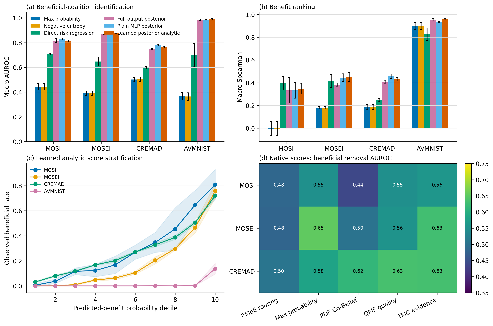

### 结果分析

在统一RCG骨干上，本文解析方法相对直接损失回归的AUROC分别提高10.59、22.97、16.73和28.90个百分点，四个数据集均为5/5种子改善，配对$p$分别为$6.3\times10^{-6}$、$1.5\times10^{-4}$、$8.1\times10^{-6}$和$0.0021$。相对最大概率的改善更大；相对直接回归的四数据集平均AUROC增益为19.80个百分点。这说明“逐标签收益＋标签后验边缘化”比可靠性代理和直接拟合realized loss更适合有益事件识别。

学习后验相对直接使用完整联盟输出的额外AUROC很小：MOSI为$-0.20$个百分点，MOSEI为$+0.95$，CREMA-D为$+1.65$，AV-MNIST为$+0.40$。只有MOSEI和CREMA-D的AUROC改善获得统计支持。因此，解析贡献分解是主要收益来源，不能将全部改善归因于学习的关系后验。

普通MLP进一步界定了模型结构的贡献。本文关系后验在MOSI和CREMA-D的AUROC分别低1.60和1.58个百分点，配对$p=0.0054$和$p=0.0009$；在MOSEI上实质持平，在AV-MNIST上AUROC无显著差异，但AUPRC、收益Spearman和概率校准更好。这不支持“关系Transformer是创新二的主要必要组件”。创新二应固定为“标签后验积分的结构化贡献估计”，关系编码器只能作为可替换实现。

概率十分位图中，MOSI、MOSEI和CREMA-D的真实有益率随预测概率分位单调上升。AV-MNIST前九个分箱几乎没有有益子联盟，最高分箱有益率升至13.72%，高于1.42%的总体占比。但AV-MNIST的高概率分箱平均realized benefit仍可为负：有益概率能识别稀有正事件，不等价于净收益为正。这为创新三同时考虑收益概率、收益幅度和损害提供了直接依据。

**E3实验结论：** 创新二通过了“有益事件识别”的核心检验，但没有完全通过原定的贡献幅度排序门槛：只有AV-MNIST的收益Spearman超过0.5，MOSI、MOSEI和CREMA-D分别为0.348、0.450和0.430。因此，论文可以宣称解析后验积分能有效估计“有益概率”，不能宣称它在所有任务上精确恢复样本级贡献幅度。

**预期判读：** 解析贡献相对最佳原生分数平均提高至少5个百分点AUROC；高有益概率分箱具有更高真实有益率；解析积分优于直接回归；学习标签后验至少在高分区域精确率、NLL或最终安全收益上优于直接使用完整联盟概率。

**失败解释：** 如果解析方法只提高分类准确率而不能改善联盟收益排序或有益事件校准，则创新二不能表述为贡献估计方法。

**结果图表：** Table 4中的E3部分报告统一联盟识别与强方法原生分数；Figure B为`figures/e3_contribution_identification.png`。逐联盟、逐种子和配对比较数据位于`results/e3_*`。

## E4：列表式路由与解析锚定

**状态：** ✅ 四数据集正式实验完成；创新三的收益传递检验留待E5。

**研究目的：** 检验列表式残差能否在保持解析第一候选的同时扩充Top-2/Top-3候选，使创新三获得更大的可用收益空间。

**比较版本：** 仅解析排序、多教师硬oracle分类、软列表排序、纯成对排序、无锚定的列表式加成对排序，以及解析Top-1锚定的列表式加成对排序。所有学习路由器都使用相同的OOF教师、冻结任务骨干和冻结标签后验；残差强度只在selection上从$\{0,0.1,0.25,0.5,0.75,1\}$中选择。

**评价指标：** NDCG、Top-1/2/3 oracle恢复、成对准确率、候选集合最佳真实收益、候选oracle NLL和候选oracle headroom。MOSI/MOSEI在7个联盟中评价Top-3；CREMA-D/AV-MNIST在3个联盟中评价Top-2，避免二模态Top-3必然覆盖全部联盟的平凡结果。候选oracle headroom定义为候选动作集合（始终加入完整联盟回退）可消除的完整联盟后悔比例。

### 历史失败与当前修正

原列表式残差直接改写排序时，MOSI Top-1从解析方法的51.59%下降到43.87%，Top-2只提高1.92个百分点。冻结五模型后验并使用多教师上下文后，Top-2提高8.05个百分点，但Top-1仍下降5.12个百分点，成对准确率也没有改善。这一历史版本未通过预注册门槛。

当前版本固定：

$$
\mathcal C_K^{\mathrm{anchor}}[1]=S_{\mathrm{anchor}},
$$

即解析Top-1由候选构造保证，列表式残差只能补充第二和第三候选。该等式是结构性质，不作为实验提升。实验需要证明的是列表式补充能否增加Top-2/Top-3覆盖、候选oracle上限以及创新三的实际收益。

### 正式结果

下表报告5个任务种子的均值；CREMA-D先在每个种子内按测试折样本数聚合。括号内为候选集合可消除的完整联盟后悔比例。三模态报告Top-3，二模态报告Top-2。

| 数据集 | 仅解析 | 硬oracle分类 | 软列表 | 纯成对 | 列表＋成对（无锚定） | 列表＋成对（锚定） |
|---|---:|---:|---:|---:|---:|---:|
| MOSI | 39.79%（29.28%） | **64.45%（35.48%）** | 50.37%（29.31%） | 55.73%（23.24%） | 54.63%（29.69%） | 55.82%（31.46%） |
| MOSEI | 48.86%（20.75%） | 48.86%（20.75%） | 64.62%（**25.71%**） | 48.86%（20.75%） | 66.57%（24.70%） | **67.12%**（24.41%） |
| CREMA-D | 80.22%（52.13%） | **81.23%（53.90%）** | 80.87%（52.98%） | 81.02%（52.68%） | 81.08%（53.18%） | 80.95%（53.15%） |
| AV-MNIST | 99.37%（50.26%） | **99.38%（50.28%）** | 99.34%（49.44%） | 99.36%（49.33%） | 99.35%（50.26%） | 99.36%（50.26%） |

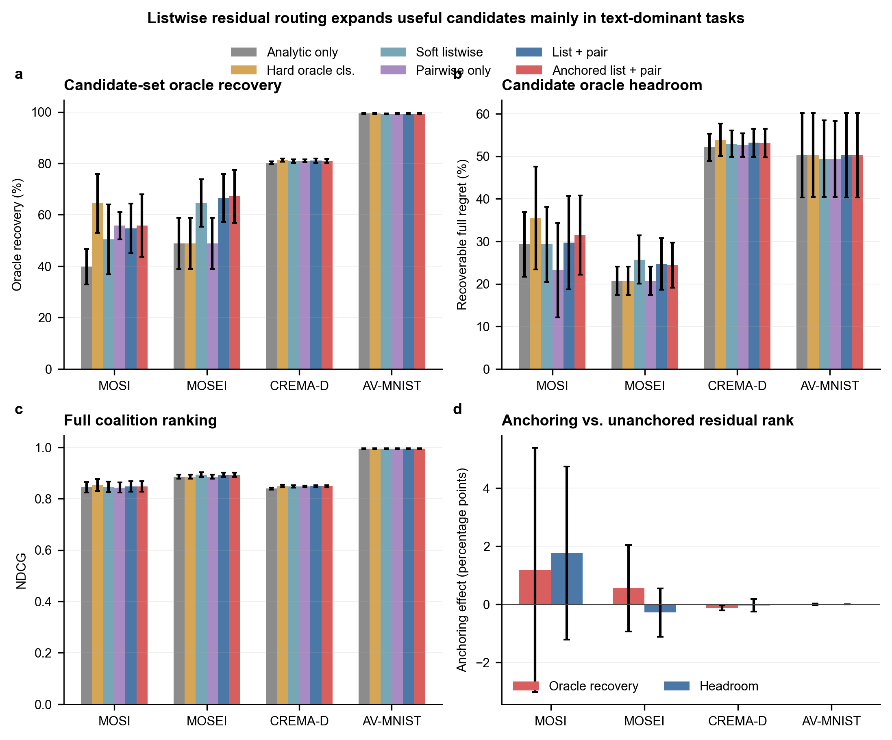

### 结果分析

相对仅解析候选，锚定列表＋成对路由在MOSI和MOSEI分别提高Top-3 oracle覆盖16.04和18.26个百分点；CREMA-D只提高0.73个百分点，AV-MNIST下降0.02个百分点。对应的可恢复完整联盟后悔仅提高2.18、3.67、1.02和约0个百分点。这说明学习残差主要在联盟较多、信息不对称的文本情感任务中扩充候选，在二模态任务中的额外空间很小。

锚定相对同一残差排序的无锚定版本并未产生稳定数值提升：oracle覆盖变化依次为$+1.19$、$+0.56$、$-0.13$和$+0.006$个百分点；headroom变化为$+1.77$、$-0.28$、$-0.03$和约0个百分点。Holm校正后，这些比较均不显著。因此，“解析Top-1保持”只能作为候选构造的确定性安全性质，不能写成经验性能优势。

排序目标也没有出现统一赢家。列表＋成对相对解析的NDCG在MOSI、MOSEI和CREMA-D分别提高0.0037、0.0073和0.0099，但AV-MNIST下降0.0001；其成对准确率只在CREMA-D提高，MOSI和MOSEI反而下降。MOSI的硬oracle分类取得最高候选覆盖，MOSEI的软列表取得最高headroom。这不支持“同时加入列表和成对损失普遍优于单一目标”的强主张。

**E4实验结论：** E4支持把列表式残差描述为“在部分任务中扩充解析候选集合的可选模块”，但尚不足以把它作为跨任务稳定成立的独立核心创新。解析锚定应保留，因为它在结构上阻止残差覆盖解析Top-1；残差路由是否值得进入最终主方法，必须由E5证明其候选增量能够转化为NLL、纠错率或收益—损害Pareto改善。若E5不能产生这种传递，应删去列表式残差，只保留解析贡献与安全融合。

**正式判定：** 解析Top-1严格保持已经通过结构测试；列表式补充只在MOSI/MOSEI明显提高Top-3候选覆盖，未达到跨四数据集稳定改善；是否传递到创新三仍未判定。

**失败解释：** 如果Top-$K$覆盖提高但最终融合无收益，则列表式路由只能被描述为候选扩充器，不能声称其直接改善融合决策。

**结果图表：** 本节表格与Figure C `figures/e4_anchored_routing.png`。误差线为5个任务种子均值的95% $t$ 区间；源数据位于`results/e4_routing_by_seed.csv`、`results/e4_routing_summary.csv`和`results/e4_routing_paired_tests.csv`。

**产物路径：** `runs/formal-e4-mosi/`、`runs/formal-e4-mosei/`、`runs/formal-e4-cremad-top2/`和`runs/formal-e4-avmnist-top2/`。

---

# 6. 创新三：完整联盟锚定两级安全融合

## E5：样本级候选动作混合

**状态：** ✅ 四数据集正式分组件实验完成；本实验不使用E6收缩或E7模型集成。

**研究目的：** 验证软动作混合能否减少硬路由选错时承担的完整损害，并把锚定候选集合的oracle空间转化为任务收益。

**比较版本：** 完整联盟、标签后验单独预测、解析Top-1硬切换、列表式Top-1硬切换、候选动作等权平均、普通softmax混合、完整联盟锚定混合、锚定混合加相对损害惩罚，以及锚定混合加软oracle蒸馏。测试标签候选oracle只作为上界。

**实验设置：** 每个样本的动作集合由完整联盟、标签后验和互不重复的非完整联盟候选组成。三模态保留解析最佳替代联盟及两个列表式支持联盟，二模态保留两个非完整联盟；完整联盟始终作为动作0，避免候选中重复加入完整联盟。四个学习式mixer使用相同初始化、OOF教师上下文、骨干、后验和候选，区别仅为是否启用完整联盟偏置、损害项和软oracle蒸馏。selection只用于早停，测试标签不参与动作权重学习。为隔离E5，本实验不使用自适应收缩或多模型聚合。

**评价指标：** Accuracy、Macro-F1、NLL、纠错率、负向翻转率、平均截断损害、完整联盟平均动作权重、候选动作使用率和候选oracle差距。

### 正式结果

下表给出5个任务种子的平均Accuracy/NLL；CREMA-D先在每个种子内按测试折样本数聚合。粗体分别标出每个数据集上可部署方法的最高Accuracy和最低NLL，因此同一行可能有两个粗体项。

| 数据集 | 完整联盟 | 后验单独 | 解析硬切换 | 列表硬切换 | 等权平均 | 普通softmax | 完整联盟锚定 | ＋损害 | ＋损害＋蒸馏 |
|---|---:|---:|---:|---:|---:|---:|---:|---:|---:|
| MOSI | 77.87 / .4658 | **79.27** / .4660 | 77.77 / .4610 | 77.84 / .4622 | 78.96 / .4613 | 78.96 / .4617 | 79.12 / .4613 | 79.05 / .4607 | 78.96 / **.4592** |
| MOSEI | 83.83 / .3676 | **84.17** / .3574 | 84.12 / .3647 | 83.85 / .3683 | 84.05 / .3621 | 84.05 / .3576 | 84.04 / .3575 | 84.02 / **.3573** | 84.08 / .3586 |
| CREMA-D | 60.92 / 1.0485 | 62.60 / 1.0043 | 61.84 / 1.0444 | 62.01 / 1.0419 | 62.99 / 1.0373 | 63.29 / .9857 | 63.24 / .9866 | **63.35** / .9846 | 63.29 / **.9846** |
| AV-MNIST | 98.81 / .0412 | 98.95 / .0415 | 98.89 / .0412 | 98.89 / .0408 | 98.91 / .1244 | 98.92 / .0395 | 98.92 / .0389 | 98.96 / **.0380** | **98.97** / .0403 |

测试标签动作oracle的Accuracy/NLL分别为MOSI 84.15%/.3742、MOSEI 87.04%/.2982、CREMA-D 78.98%/.6418和AV-MNIST 99.49%/.0142。该上界只表明当前动作集合仍包含可利用空间，不是可部署结果。

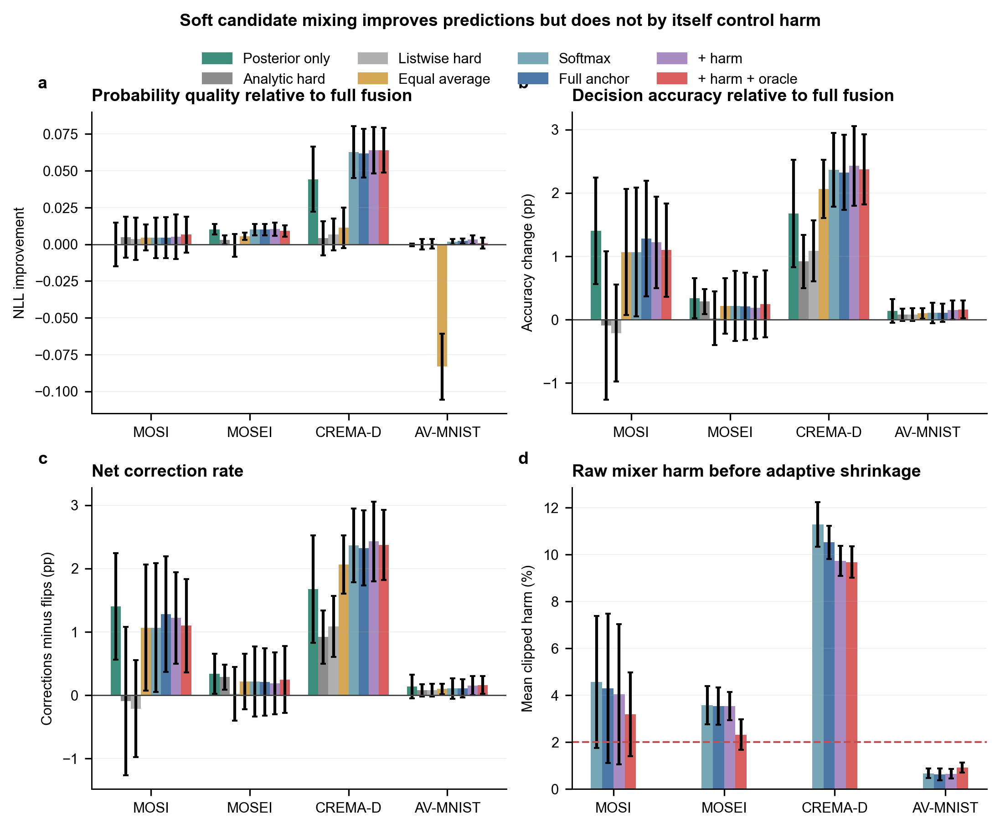

### 结果分析

首先，软动作组合整体优于硬路由。解析和列表式硬切换在MOSI上均未提高Accuracy，列表式硬切换还使MOSEI NLL增加0.0007。相比之下，四种学习式混合在MOSI、MOSEI和CREMA-D均提高平均Accuracy与NLL；其中CREMA-D提升最稳定，普通softmax相对完整联盟提高2.36个准确率百分点并降低0.0628 NLL，5/5种子均改善，经过本节全部预注册比较的Holm校正后仍获得统计支持。

其次，加入“后验单独”对照后可以区分普通辅助分类器收益和联盟候选收益。MOSI和MOSEI中，后验单独已经获得最高Accuracy；MOSEI普通softmax相对后验没有改善NLL或Accuracy。CREMA-D中，损害约束mixer相对后验额外提高0.75个准确率百分点并降低0.0198 NLL；AV-MNIST中额外降低0.0036 NLL。MOSI也降低0.0054 NLL，但Accuracy低0.18个百分点。因此，候选动作在CREMA-D上的额外价值最明确，在MOSEI上没有得到支持。

第三，显式完整联盟偏置没有表现出稳定优势。相对普通softmax，锚定混合的NLL变化在MOSI、MOSEI、CREMA-D和AV-MNIST分别为$-0.00034$、$-0.00003$、$+0.00089$和$-0.00055$，幅度都很小。损害惩罚将CREMA-D的平均截断损害从10.52%降至9.73%，但MOSI只从4.30%降至4.05%，MOSEI几乎不变，AV-MNIST略有增加。软oracle蒸馏进一步将MOSI和MOSEI损害降至3.19%和2.31%，但在AV-MNIST将损害从0.64%提高到0.92%，且NLL变差。因此，这两个训练项都不能被描述为跨任务稳定有效。

动作权重揭示了性能来源。普通softmax给标签后验的平均权重在MOSI、MOSEI、CREMA-D和AV-MNIST分别为60.81%、92.59%、72.82%和81.44%，说明大部分收益来自后验动作。蒸馏把联盟候选总权重提高到46.38%、45.89%、13.05%和25.83%，但没有带来一致性能改善；提高候选使用率本身并不足以证明候选有效。

未经E6收缩时，四个学习式mixer只有AV-MNIST满足2%平均截断损害预算。MOSI、MOSEI和CREMA-D的最佳损害仍分别为3.19%、2.31%和9.68%。因此，E5证明软混合能够将候选信息转化为任务收益，但不能单独支撑“安全融合”主张。

**E5实验结论：** 软混合相对硬选择有效，且CREMA-D明确存在超出标签后验本身的候选收益；完整联盟偏置、损害惩罚和软oracle蒸馏没有形成统一的跨任务改进。创新三若要成立，必须由E6证明贡献概率收缩能在保留这些收益的同时把损害压到预算内。若E6不能做到，应把E5收窄为概率集成模块，并删除“样本级安全”表述。

**实际判读：** “软混合优于硬选择”通过；“候选增量在所有任务有效”未通过；“损害惩罚稳定控制风险”未通过；“软oracle蒸馏稳定改善融合”未通过；“无收缩mixer满足2%损害预算”仅AV-MNIST通过。

**结果图表：** 本节表格和`figures/e5_candidate_mixer.png`。误差线为5个任务种子均值的95% $t$ 区间；源数据为`results/e5_candidate_mixer_by_seed.csv`、`results/e5_candidate_mixer_summary.csv`和`results/e5_candidate_mixer_paired_tests.csv`。

**产物路径：** `runs/formal-e5-mosi/`、`runs/formal-e5-mosei/`、`runs/formal-e5-cremad/`和`runs/formal-e5-avmnist/`。

## E6：贡献概率自适应收缩

**状态：** ✅ 当前锚定候选mixer的四数据集正式扫描完成。

**研究目的：** 检验基于解析有益概率的逐样本更新强度是否优于固定插值和置信度插值。

**比较设置：**

$$
\alpha\in\{0,0.25,0.5,0.75\},
$$

以及

$$
\alpha(x)=\alpha_{\max}\pi(x),\qquad
\alpha(x)=\alpha_{\max}\pi(x)^2,\qquad
\alpha(x)=\alpha_{\max}\pi(x)^3.
$$

固定插值、selection选择的全局插值、最大概率控制、熵控制和贡献概率控制必须在相同候选动作上比较。

**正式设置：** 固定E5的“完整联盟锚定＋损害＋软oracle”mixer，不重新训练任务模型、后验、路由器或mixer。收缩强度只从

$$
\alpha_{\max}\in\{0,0.1,0.25,0.5,0.75,1\}
$$

中选择。对每个控制器，selection上先筛选平均截断损害不超过2%的强度，再以NLL最低、平均更新幅度最小的顺序决定部署点。测试集不参与强度选择。具体控制量为：

$$
g_{\mathrm{fixed}}=1,
\qquad
g_{\mathrm{conf}}=\max_kp_{\mathrm{mix}}(k),
$$

$$
g_{\mathrm{ent}}=1-\frac{H(p_{\mathrm{mix}})}{\log K},
\qquad
g_{\pi,\gamma}=\pi_{\mathrm{mix}}^\gamma,
\ \gamma\in\{1,2,3\},
$$

最终更新为：

$$
p_{\mathrm{final}}
=
(1-\alpha_{\max}g)p_{\mathcal M}
+
\alpha_{\max}g p_{\mathrm{mix}}.
$$

另外单独评价预注册固定点$0.75\pi^2$，不根据测试结果修改其强度。

**评价指标：** NLL改善、Accuracy变化、平均截断损害、负向翻转、纠错率、后悔下降，以及不同强度形成的测试收益—损害Pareto曲线。Pareto曲线展示全部预先给定强度；正式性能结论只使用selection选定点。

### 正式结果

下表报告selection约束下选定策略的5种子平均结果。每个单元格依次为“NLL改善 / Accuracy改善百分点 / 测试平均截断损害”。CREMA-D先在每个种子内按测试折样本数聚合。

| 数据集 | 全局固定 | 最大概率 | 负熵 | $\pi$ | $\pi^2$ | $\pi^3$ |
|---|---:|---:|---:|---:|---:|---:|
| MOSI | .0034 / +.64 / .82% | .0049 / +.61 / 1.09% | .0023 / +.12 / .41% | .0050 / +.64 / .79% | **.0063 / +.58 / .86%** | .0051 / +.49 / .56% |
| MOSEI | .0089 / +.17 / 2.13% | **.0083 / +.30 / 1.61%** | .0032 / +.10 / .48% | .0056 / +.32 / 1.19% | .0037 / +.26 / .78% | .0027 / +.21 / .57% |
| CREMA-D | .0248 / +.76 / 1.40% | .0236 / +.68 / 1.36% | .0255 / +.70 / 1.56% | .0237 / +.87 / 1.33% | **.0260 / +1.06 / 1.61%** | .0254 / **+1.11** / 1.72% |
| AV-MNIST | .0026 / +.14 / .56% | .0028 / +.10 / .48% | .0027 / +.12 / .51% | **.0042 / +.16 / .37%** | .0040 / +.11 / .31% | .0037 / +.09 / **.28%** |

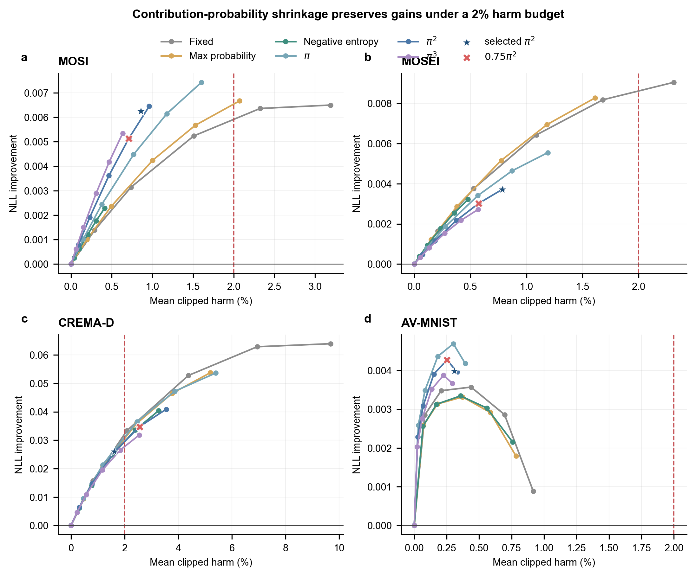

### 结果分析

selection约束的$\pi^2$策略在四个数据集、全部20个数据集×任务种子组合上均取得正NLL收益、非负Accuracy变化，并且测试平均截断损害均低于2%。其平均NLL改善依次为0.0063、0.0037、0.0260和0.0040，Accuracy分别提高0.58、0.26、1.06和0.11个百分点；相对完整联盟oracle后悔分别下降3.80%、2.30%、7.47%和17.82%。这证明条件贡献概率可以把E5原始mixer的损害压回预算内，同时保留一部分任务收益。

相对无收缩mixer，$\pi^2$将MOSI、MOSEI、CREMA-D和AV-MNIST的平均截断损害从3.19%、2.31%、9.68%和0.92%降至0.86%、0.78%、1.61%和0.31%。代价是NLL收益也从0.0065、0.0091、0.0640和0.0009变为0.0063、0.0037、0.0260和0.0040。AV-MNIST反而提高NLL收益，因为强互补任务中稀疏的贡献概率门控抑制了原始mixer的错误大幅更新。

贡献概率控制没有在所有数据集上支配可靠性控制。$\pi^2$在MOSI和CREMA-D的预算内NLL最高；MOSEI由最大概率取得更高NLL改善，AV-MNIST由$\pi$取得更高NLL和Accuracy改善。CREMA-D中$\pi^2$相对最大概率仅多改善0.0024 NLL，5种子区间包含零；MOSEI中$\pi^2$则显著牺牲收益以换取更低损害。因而论文可以声称贡献概率形成有效且任务相关的收益—损害前沿，不能声称它普遍严格优于置信度或熵控制。

预注册固定点$0.75\pi^2$在MOSI、MOSEI和AV-MNIST满足2%预算，并分别改善0.0051、0.0030和0.0043 NLL；在CREMA-D上改善0.0348 NLL但损害为2.55%，未通过预算。selection约束版本将CREMA-D平均强度降至约0.50，使损害降到1.61%。因此，固定$\alpha_{\max}=0.75$不能继续作为所有数据集统一的安全设置；若保留主方法，应将“selection约束下选择$\alpha_{\max}$”写入正式协议。

需要强调，当前2%约束是selection上的经验风险约束，并非有限样本conformal保证。它在本次测试中成功泛化，不等价于任意分布漂移下的风险保证。

**E6实验结论：** 自适应收缩解决了E5暴露的高损害问题；selection约束$\pi^2$在全部四个数据集和全部种子上保持正NLL收益且满足测试2%平均损害预算。贡献概率控制在三类任务中位于或接近Pareto前沿，但并非所有数据集的唯一最优控制量。因此创新三可以保留“贡献概率驱动的风险—收益调节”，但不应使用“普遍优于可靠性门控”或“固定$0.75\pi^2$统一安全”的表述。

**实际判读：** “在2%预算内保留正任务收益”通过；“纠错多于负向翻转”通过；“固定$0.75\pi^2$在所有数据集安全”未通过；“贡献概率严格支配固定、置信度和熵控制”未通过。

**结果图表：** 本节表格和`figures/e6_adaptive_shrinkage.png`。曲线为预先指定强度下的5种子平均测试结果，星号为selection选定的$\pi^2$部署点，叉号为固定$0.75\pi^2$；源数据位于`results/e6_shrinkage_*`。

**产物路径：** `runs/formal-e6-mosi/`、`runs/formal-e6-mosei/`、`runs/formal-e6-cremad/`和`runs/formal-e6-avmnist/`。

## E7：模型级稳定凸聚合与完整联盟回退

**状态：** ⚫ 历史模型级分解已完成；该实验聚合“完整联盟＋标签后验”，不等同于P0冻结的A7→A8最终系统。I3-3将按规范动作链重新比较。

**研究目的：** 分离普通集成、标签后验、非负凸权重和完整联盟回退分别产生的收益，并降低单成员动作选择的训练随机性。

**比较版本：** 完整联盟平均集成、标签后验平均集成、完整联盟与后验等权平均、无约束logit stacking、非负凸聚合，以及凸聚合加完整联盟回退。样本级候选混合和贡献概率收缩已经分别在E5、E6中隔离评价；本节不把它们的收益重复计入模型级聚合。

**主要公平性要求：** 完整系统的主要比较对象是相同成员数量的完整联盟集成，而不是单个任务模型。模型级权重和回退系数只能在selection上拟合；测试标签不得参与权重选择。

**正式设置：** 每个模型组包含五个任务成员及其对应的五个解析标签后验。完整联盟集成和后验集成分别对五个成员等权平均；等权全动作平均对十个概率动作等权。无约束基线将十个成员的对数概率拼接后，在selection上拟合$L_2$正则的多项logistic stacking。非负凸聚合在概率单纯形上最小化selection NLL，并固定$10^{-3}$的权重正则。完整联盟回退在

$$
\rho\in\{0,0.1,\ldots,1\}
$$

中选择：先要求selection Accuracy不低于完整联盟集成，再最小化selection NLL。最终概率为

$$
p_{\mathrm{safe}}
=(1-\rho)p_{\mathrm{full\text{-}ens}}+\rho p_{\mathrm{convex}}.
$$

MOSI和MOSEI各使用五组互不重叠的五成员集成；CREMA-D使用一组五成员模型并覆盖五个演员外折；AV-MNIST使用一组五成员模型。测试不重新选择权重或$\rho$。

### 正式结果

下表给出各模型级策略相对计算匹配完整联盟集成的结果。Accuracy为绝对值，括号中为Accuracy差值；NLL括号中为NLL改善，正数表示更好。MOSI、MOSEI为五个独立模型组的均值，CREMA-D为五个演员外折按样本数加权结果。

| 数据集 | 完整联盟集成 | 后验集成 | 全动作等权 | Logit stacking | 非负凸聚合 | 凸聚合＋回退 |
|---|---:|---:|---:|---:|---:|---:|
| MOSI Accuracy | 79.82% | 79.82% (+0.00) | 79.79% (-0.03) | **81.13% (+1.31)** | 80.49% (+0.67) | 80.55% (+0.73) |
| MOSI NLL | .4514 | .4575 (-.0061) | .4517 (-.0003) | **.4427 (+.0086)** | .4436 (+.0077) | .4432 (+.0081) |
| MOSEI Accuracy | 84.21% | 84.28% (+0.07) | 84.24% (+0.03) | **84.33% (+0.12)** | 84.31% (+0.10) | 84.31% (+0.10) |
| MOSEI NLL | .3553 | .3550 (+.0003) | **.3538 (+.0015)** | .3597 (-.0044) | .3551 (+.0001) | .3551 (+.0001) |
| CREMA-D Accuracy | 63.44% | 63.11% (-0.32) | **63.87% (+0.43)** | 60.00% (-3.44) | 63.46% (+0.03) | 63.60% (+0.16) |
| CREMA-D NLL | .9738 | .9869 (-.0131) | .9624 (+.0115) | 1.5038 (-.5300) | .9683 (+.0056) | **.9622 (+.0117)** |
| AV-MNIST Accuracy | 99.19% | 99.19% (+0.00) | 99.14% (-0.06) | 99.25% (+0.06) | **99.44% (+0.25)** | **99.44% (+0.25)** |
| AV-MNIST NLL | .0278 | .0283 (-.0005) | .0268 (+.0010) | .0283 (-.0005) | **.0213 (+.0065)** | **.0213 (+.0065)** |

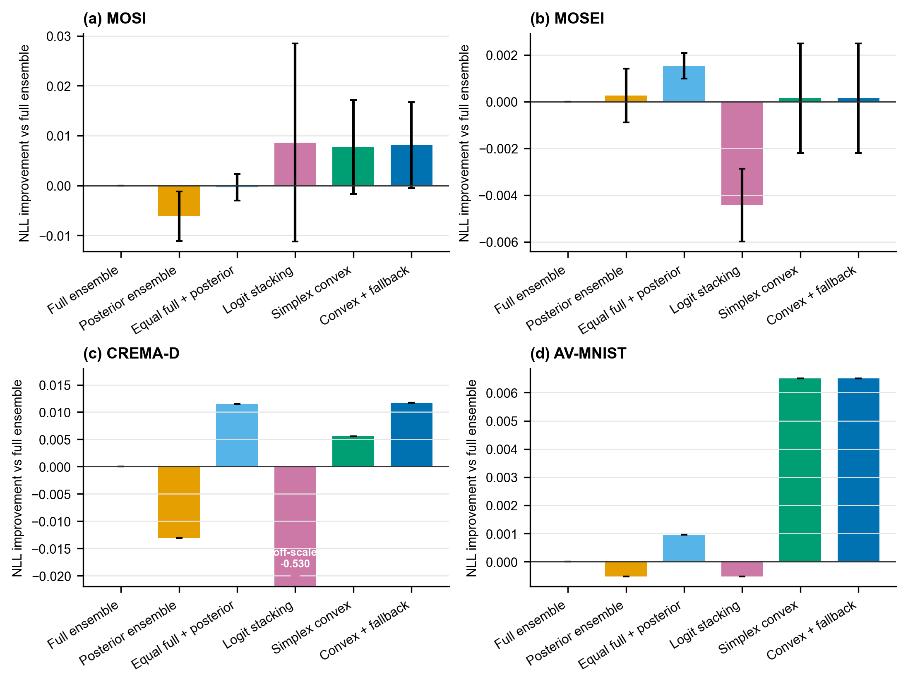

### 结果分析

非负凸聚合及回退在四个数据集的平均NLL方向均优于完整联盟集成，但统计强度不同。按原视频对五个模型组的逐样本差值取平均后进行10,000次簇bootstrap，MOSI的Accuracy差为$+0.73$个百分点，95% CI为$[+0.09,+1.37]$，NLL差为$-0.0081$，95% CI为$[-0.0136,-0.0024]$。AV-MNIST的Accuracy差为$+0.25$个百分点，类别分层bootstrap区间为$[+0.06,+0.47]$，NLL区间为$[-0.0104,-0.0022]$。这两个数据集支持模型级聚合优于计算匹配完整联盟集成。

MOSEI的平均Accuracy只提高$0.10$个百分点，bootstrap区间$[-0.16,+0.38]$包含零；NLL仅改善$0.00015$，区间$[-0.00290,+0.00267]$同样包含零。CREMA-D的Accuracy差为$+0.16$个百分点，演员簇区间$[-0.56,+0.89]$；NLL改善$0.0117$，区间$[-0.0258,+0.0032]$。因此这两个数据集只支持持平或改善趋势，不能作为稳定提升证据。

无约束logit stacking揭示了非负凸限制的作用。在MOSI上它取得最高平均Accuracy和最低NLL，但在CREMA-D上Accuracy下降3.44个百分点、NLL增加0.5300，平均截断损害达到29.49%；在MOSEI上也使NLL增加0.0044。非负凸聚合把动作限制在有效概率凸包内，避免了这种严重外推。这个结果支持“凸约束降低小selection集上的过拟合风险”，但不意味着凸聚合在每个任务都最优。

完整联盟回退只在CREMA-D第三外折选择$\rho=0$，在MOSI G3选择$\rho=0.8$，其余模型组或外折均选择$\rho=1$。回退使CREMA-D总体NLL改善从0.0056扩大到0.0117，并降低负向翻转和截断损害；但MOSI仍有1/5组、MOSEI仍有2/5组出现测试NLL负迁移。selection上的Accuracy非退化条件因此只能作为经验保护，不能写成测试分布保证。

收益来源也不是“后验平均”本身：后验集成在MOSI和CREMA-D分别使NLL增加0.0061和0.0131；学习到的凸权重通过在成员完整预测与后验预测之间稀疏分配权重才获得改善。另一方面，MOSEI的全动作等权平均优于学习凸权重，说明selection拟合仍可能带来方差，模型级权重学习没有形成跨任务严格优势。

**E7实验结论：** “相对完整联盟集成，非负凸聚合在四个数据集均取得平均NLL正收益”通过；“MOSI和AV-MNIST的配对置信区间支持改善”通过；“MOSEI和CREMA-D存在统计支持的提升”未通过；“非负凸约束比无约束stacking更稳健”通过；“selection回退消除所有测试负迁移”未通过。模型级稳定聚合可以保留为创新三的方差控制与回退层，但论文不能把它表述为无条件安全机制，也不能把从单模型到集成的全部提升归因于RCG。

**正式判定：** 相对完整联盟集成改善NLL并控制Accuracy负迁移；MOSI和MOSEI在五组独立集成上重复；去掉非负约束或完整联盟回退后，有害修正或测试方差增加。

**失败解释：** 如果模型级聚合贡献了全部收益，而样本级候选路由没有增益，方法主张应收窄为稳定后验聚合；如果普通完整联盟集成与最终系统相当，则不能将单模型到最终系统的全部差异归因于RCG。

**结果图表：** 本节表格与`figures/e7_stable_aggregation.png`。可追踪结果位于`results/e7_aggregation_by_group.csv`、`results/e7_aggregation_summary.csv`、`results/e7_aggregation_paired_tests.csv`、`results/e7_aggregation_bootstrap.csv`、`results/e7_simplex_weights.csv`和`results/e7_safe_fallback.csv`。

**产物路径：** `runs/formal-e7-mosi/`、`runs/formal-e7-mosei/`、`runs/formal-e7-cremad/`和`runs/formal-e7-avmnist/`。

---

# 7. 三个创新点的逐层消融

## E8：完整系统消融

**状态：** ✅ 四数据集逐层机制链、单成员部署链和真实A7→A8桥接均已完成。

**研究目的：** 验证三个创新环节及其主要组件分别提供可识别作用，并检查组件之间是否只是在重复普通集成或校准收益。

| 版本 | 组成 |
|---|---|
| A0 | coalition-aware完整联盟骨干 |
| A1 | A0 + OOF硬联盟监督 |
| A2 | A0 + 多教师软联盟监督 |
| A3 | A2 + 解析贡献 |
| A4 | A3 + 无锚定列表式残差路由 |
| A5 | A3 + 解析锚定列表式路由 |
| A6 | A5 + 样本级锚定候选混合 |
| A7 | A6 + 贡献概率自适应收缩 |
| A8 | A7 + 模型级稳定凸聚合与完整联盟回退 |

焦点消融包括：训练内与OOF、单教师与多教师、硬oracle与软oracle、有无一致性权重、有无成对损失、有无列表损失、有无解析Top-1锚定、有无损害惩罚、有无软oracle蒸馏、有无样本级收缩，以及有无模型级回退。

消融表同时报告主任务NLL/Accuracy、Top-3覆盖、贡献AUROC、纠错率和负向翻转，避免只展示最终Accuracy。若某组件没有改善它声称解决的机制指标，则不能仅因整体系统较强而保留其创新表述。

### 消融协议说明

A1–A5并非都会直接产生最终任务概率。A1、A2定义联盟监督，A5定义候选集合；把它们强行与A0、A6–A8放在同一Accuracy列中会混淆监督质量、候选覆盖和最终决策。因此本实验使用两条严格对应的证据链：

1. **机制链：** A1/A2评价OOF监督、联盟排序和候选恢复；A3/A4/A5评价解析排序、列表式残差和锚定候选覆盖。
2. **部署链：** A0/A3/A4/A6/A7使用相同单成员骨干和五个任务种子；A0集成/A7等权集成/A8使用相同五成员计算预算。

A8重新运行真实桥接实验，而不是复用E7的“完整联盟＋标签后验”聚合。每个成员先按E6中selection冻结的强度生成A7预测，再将五个完整联盟动作和五个A7动作送入非负凸聚合，最后由selection选择完整联盟回退系数。测试标签只用于最终统计。

### 机制链结果：A1–A5

下表报告A3解析排序、A4无锚定列表式路由和A5解析锚定候选集包含样本级oracle联盟的比例。

| 数据集 | A3解析候选 | A4列表候选 | A5锚定候选 | A5相对A3 |
|---|---:|---:|---:|---:|
| MOSI | 39.79% | 54.63% | **55.82%** | +16.03 pp |
| MOSEI | 48.86% | 66.57% | **67.12%** | +18.26 pp |
| CREMA-D | 80.22% | **81.08%** | 80.95% | +0.73 pp |
| AV-MNIST | **99.37%** | 99.35% | 99.36% | -0.02 pp |

列表式残差在MOSI和MOSEI显著扩大候选覆盖，A5锚定又分别增加1.19和0.56个百分点；CREMA-D增量很小，AV-MNIST已经接近饱和。候选oracle NLL从A3到A5分别由0.4267降至0.4215、0.3389降至0.3336、0.8745降至0.8696，AV-MNIST则基本不变。这说明创新二的列表候选主要在模态不对称任务中提供增量空间，而不是所有任务统一提高排序。

A1/A2的结果更弱。相对A1的多教师OOF硬监督，完整软监督只在MOSEI把候选恢复率从48.86%提高到59.99%，在MOSI从65.82%降到57.62%，CREMA-D和AV-MNIST近似持平或略降；它也没有跨数据集提高NDCG或成对准确率。因此创新一当前得到支持的是“OOF隔离和软目标表达联盟分歧”的协议价值，而不是“软监督必然提高性能”。若论文保留创新一，应把它定位为可信监督构造与问题定义，不能作为普遍增益模块。

### 单成员部署链结果：A0、A3、A4、A6、A7

每个单元格为五个任务种子的平均`Accuracy / NLL`。A3和A4使用硬联盟输出，A6为完整联盟锚定、损害惩罚和软oracle蒸馏的候选混合，A7在A6上增加selection约束的解析贡献概率收缩。

| 数据集 | A0完整联盟 | A3解析硬路由 | A4列表硬路由 | A6候选混合 | A7自适应收缩 |
|---|---:|---:|---:|---:|---:|
| MOSI | 77.87 / .4658 | 77.77 / .4610 | 77.65 / .4621 | **78.96** / **.4592** | 78.45 / .4595 |
| MOSEI | 83.83 / .3676 | **84.12** / .3647 | 83.85 / .3683 | 84.08 / **.3586** | 84.09 / .3639 |
| CREMA-D | 60.92 / 1.0485 | 61.84 / 1.0444 | 62.01 / 1.0419 | **63.29 / .9846** | 61.98 / 1.0225 |
| AV-MNIST | 98.81 / .0412 | 98.89 / .0412 | 98.89 / .0408 | **98.97** / .0403 | 98.92 / **.0372** |

硬路由A3/A4没有稳定把候选覆盖转化为任务收益：A4相对A3只在CREMA-D和AV-MNIST轻微降低NLL，在MOSI和MOSEI反而变差。A6软混合是单成员Accuracy和NLL改善的主要来源，尤其CREMA-D相对A0提高2.37个百分点并降低0.0640 NLL。A7把A6的平均截断损害从MOSI、MOSEI、CREMA-D、AV-MNIST的3.18%、2.31%、9.68%、0.92%降至0.86%、0.78%、1.61%、0.31%，但在MOSEI和CREMA-D放弃了较多A6收益。这说明贡献概率收缩的作用是风险—收益折中，而不是单调提高性能。

### 计算匹配的A7→A8桥接

下表使用同一组五个任务成员。A0为五成员完整联盟平均；A7为五个自适应收缩输出的等权平均；A8在五个完整联盟与五个A7动作上学习非负凸权重，并应用完整联盟回退。

| 数据集 | A0完整联盟集成 | A7等权集成 | A8凸聚合 | A8＋回退 |
|---|---:|---:|---:|---:|
| MOSI Accuracy / NLL | 79.73 / .4504 | 79.57 / .4467 | **80.34 / .4418** | **80.34 / .4418** |
| MOSEI Accuracy / NLL | **84.34 / .3556** | 84.15 / **.3550** | 84.12 / .3563 | 84.12 / .3563 |
| CREMA-D Accuracy / NLL | 63.44 / .9738 | **63.85 / .9641** | 63.69 / .9673 | 63.53 / .9655 |
| AV-MNIST Accuracy / NLL | 99.19 / .0278 | 99.14 / .0261 | **99.33 / .0213** | **99.33 / .0213** |

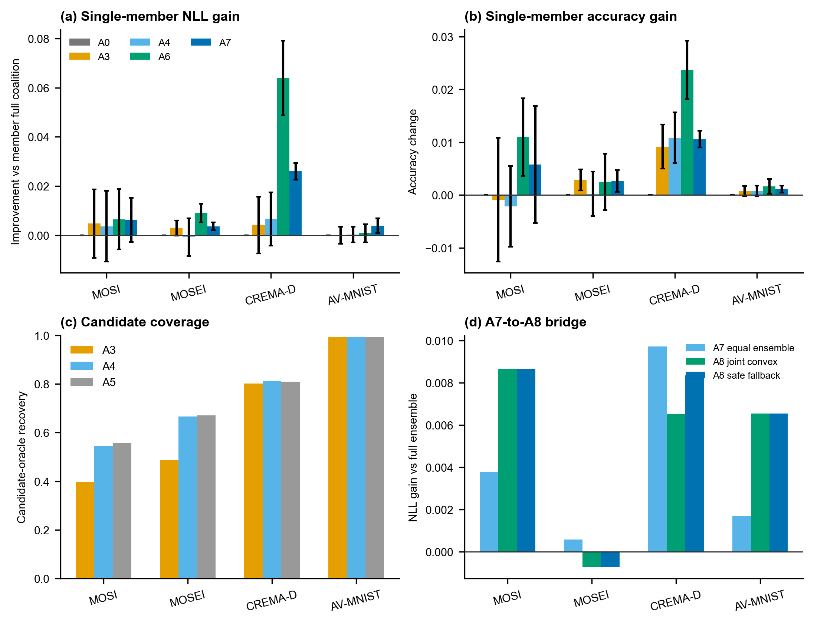

A8相对A7在MOSI和AV-MNIST分别降低0.0049和0.0048 NLL，但在MOSEI增加0.0013，在CREMA-D增加0.0014。10,000次配对bootstrap中，只有AV-MNIST的A8相对A7 NLL区间不含零，区间为$[-0.0085,-0.0010]$；MOSI、MOSEI和CREMA-D均包含零。相对A0，A8只有AV-MNIST的NLL区间明确低于零；MOSI方向为正但单组训练成员下的视频簇区间仍包含零。

回退在CREMA-D第三折选择$\rho=0$、第五折选择$\rho=0.6$，使总体A8 NLL从0.9673降至0.9655；其他数据集选择$\rho=1$。但回退后的CREMA-D仍不如A7等权集成，MOSEI也未避免负迁移。selection回退再次表现为经验保护，而非测试安全保证。

### E8总体判定

- **创新一：部分支持。** OOF协议控制训练内泄漏，软目标表达近优联盟和教师分歧；但软监督没有跨数据集提高路由或最终性能，不能作为主要性能来源。
- **创新二：机制支持、决策转化有限。** 解析贡献与列表式路由明显扩大MOSI/MOSEI候选覆盖；硬路由不稳定，必须依赖后续软混合才能转化为任务收益。
- **创新三的样本级部分：支持。** A6软混合产生主要任务收益，A7将四数据集平均截断损害压至2%以内，但会牺牲部分收益。
- **创新三的模型级部分：任务依赖。** A8只在MOSI和AV-MNIST继续改善，MOSEI和CREMA-D不优于A7；不能声称稳定凸聚合普遍增强完整系统。

因此，当前三个创新点可以形成“可信监督—贡献候选—风险受控融合”的方法链，但实验不支持“三个模块逐层、跨所有任务单调增益”的叙事。投稿时应把创新一强调为监督与评估框架，把创新二强调为候选恢复，把创新三的核心落在样本级软混合与贡献概率收缩；模型级A8应作为可选稳定化层或补充实验，而不宜作为最强的第三创新主张。

**结果图表：** 本节表格与`figures/e8_complete_ablation.png`。源数据为`results/e8_mechanism_chain.csv`、`results/e8_single_member_chain.csv`、`results/e8_single_member_summary.csv`、`results/e8_single_member_paired_tests.csv`、`results/e8_ensemble_bridge.csv`和`results/e8_bridge_bootstrap.csv`。

**产物路径：** `runs/formal-e8-mosi/`、`runs/formal-e8-mosei/`、`runs/formal-e8-cremad/`和`runs/formal-e8-avmnist/`。

---

# 8. 连续质量退化与模态缺失

## E9：连续特征质量退化

**状态：** ✅ 已完成。包括clean-only零样本退化测试，以及所有比较策略共享动态退化增强任务骨干的训练对照。

**研究目的：** 检验RCG-Fusion在表示质量连续下降时能否保持任务性能、调整候选权重并控制有害修正。

每次只扰动一个模态，其余模态保持不变。高斯噪声设置为：

$$
\sigma\in\{0.25,0.5,1,2\}.
$$

特征遮蔽设置为：

$$
p\in\{0.25,0.5,0.75\}.
$$

扰动种子固定为101、202和303。完整输入与删除输入必须共享完全相同的其他模态和扰动实现。

实验包含两种训练协议：第一种只在干净数据上训练并直接测试退化；第二种让所有比较方法使用相同动态退化增强重新训练。第二种用于排除收益来自本方法独占退化增强的解释。

报告各强度下的Accuracy、Macro-F1、NLL、曲线下面积、最严重退化性能、贡献识别AUROC，以及样本级收缩系数和动作权重随扰动的变化。不能预设收缩系数必须随噪声强度单调变化，因为贡献取决于联盟关系而非单模态质量本身。

### E9.1 clean-only训练后的连续退化测试

**实验设置。** 冻结E7/E8中已经训练完成的任务骨干、标签后验、列表式路由器、样本级混合器及selection确定的策略强度，不在退化测试数据上重新训练或重新选择超参数。比较完整联盟集成、标签后验集成、原始混合器集成、置信度收缩、熵收缩、A7贡献概率自适应收缩和A8模型级安全回退。每个数据集、每种方法和每个训练成员使用完全相同的扰动场；同一扰动种子下的较强扰动由较弱扰动嵌套得到。

CREMA-D的五个演员外测试折按测试样本数加权聚合。配对bootstrap先在每个原始测试样本内平均全部扰动模态、强度和三个扰动种子，再按MOSI/MOSEI原视频、CREMA-D演员或AV-MNIST类别分层样本重采样10,000次，避免把同一样本的重复扰动视为独立证据。

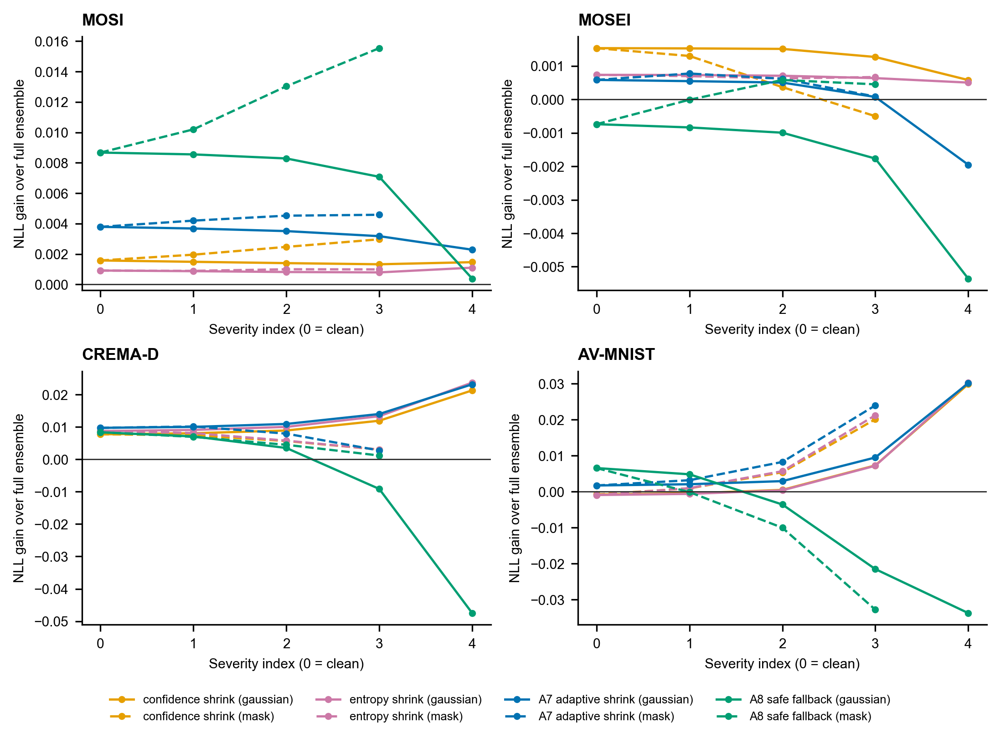

图中纵轴为相对完整联盟集成的NLL改善，正值表示更好；实线表示高斯噪声，虚线表示特征遮蔽。横轴0为干净测试，后续位置按各退化族由弱到强排列。曲线为了比较总体趋势，先在受扰模态与扰动种子上平均；具体模态结果保存在逐条件结果表中。

| 数据集 | 方法 | 全部退化平均 $\Delta$NLL（方法−完整联盟） | 95% CI | 全部退化平均 $\Delta$Accuracy | 95% CI | 判读 |
|---|---|---:|---:|---:|---:|---|
| MOSI | A7自适应收缩 | -0.00371 | [-0.00691, -0.00036] | -0.00053 | [-0.00527, 0.00381] | 概率质量稳定改善，Accuracy持平 |
| MOSI | A8安全回退 | -0.00901 | [-0.02058, 0.00335] | +0.00927 | [-0.00907, 0.02627] | 均值改善但视频簇CI跨零 |
| MOSEI | A7自适应收缩 | -0.00009 | [-0.00149, 0.00136] | -0.00090 | [-0.00243, 0.00066] | 与完整联盟基本持平 |
| MOSEI | A8安全回退 | +0.00113 | [-0.00125, 0.00353] | -0.00047 | [-0.00263, 0.00173] | 无稳定收益 |
| CREMA-D | A7自适应收缩 | -0.01127 | [-0.01525, -0.00703] | +0.00417 | [0.00192, 0.00627] | NLL和Accuracy均获演员簇支持 |
| CREMA-D | A8安全回退 | +0.00478 | [-0.00703, 0.01770] | -0.00093 | [-0.00554, 0.00382] | 总体无稳定收益 |
| AV-MNIST | A7自适应收缩 | -0.01141 | [-0.01303, -0.00974] | +0.00170 | [0.00105, 0.00234] | NLL和Accuracy均获分层bootstrap支持 |
| AV-MNIST | A8安全回退 | +0.01386 | [0.00946, 0.01847] | -0.00632 | [-0.00786, -0.00478] | 在分布偏移下显著劣化 |

**曲线面积与最强退化。** 相对完整联盟，A7在AV-MNIST的Gaussian/Mask NLL曲线面积分别降低8.70%/9.12%，在CREMA-D分别降低1.25%/0.78%；MOSI的降幅为0.73%/0.91%，MOSEI接近零。最强AV-MNIST音频高斯噪声下，A7的NLL为0.3707，完整联盟为0.4101；最强音频遮蔽下分别为0.2431和0.2648。CREMA-D最强视觉高斯噪声下，A7的NLL为1.2235，完整联盟为1.2520。A8在AV-MNIST最强音频高斯噪声和遮蔽下的NLL分别升至0.4789和0.3458，在CREMA-D最强高斯噪声下也劣于完整联盟，说明干净selection学习的模型级凸权重不能被视为分布偏移安全机制。

**机制解释。** A7在退化条件下的平均贡献识别AUROC为MOSI 0.759–0.770、MOSEI 0.821–0.834、CREMA-D 0.667–0.694、AV-MNIST 0.935–0.948，说明解析贡献信号在强互补任务和文本情感任务中仍保留排序信息。不过，A7的平均收缩系数并不随数据集总体噪声强度机械单调变化；它根据联盟概率与后验关系调整，符合条件贡献而非单模态质量的设计。

**当前结论。** clean-only协议支持把A7贡献概率自适应收缩作为主要鲁棒组件：它在CREMA-D和AV-MNIST上取得有统计支持的总体改善，在MOSI改善NLL，在MOSEI保持近似不变。A8只在MOSI及部分遮蔽场景有利，却在AV-MNIST和CREMA-D强偏移下失败，因此不能宣称“两级安全融合”整体具有分布偏移安全性。正文鲁棒性主结果应分别报告A7与A8，A8应被限定为同分布selection下的性能聚合层。

**产物路径：**

- `runs/formal-e9-clean-{dataset}/metrics_by_condition_fold.csv`
- `runs/formal-e9-clean-{dataset}/predictions.parquet`
- `results/e9_clean_stress_curves.csv`
- `results/e9_clean_stress_severity.csv`
- `results/e9_clean_stress_summary.csv`
- `results/e9_clean_stress_worst.csv`
- `results/e9_clean_stress_bootstrap.csv`
- `figures/e9_clean_stress.png`

### E9.2 共享动态退化增强骨干对照

**实验设置。** 每个任务成员从随机初始化重新训练coalition-aware backbone。训练批次中50%的样本保持干净，50%的样本均匀选择一个模态，并随机施加一种高斯噪声或特征遮蔽；强度从E9预注册集合中均匀抽取。所有比较策略共享同一增强骨干、同一扰动场和相同测试样本。为了隔离“任务骨干是否见过退化”这一替代解释，标签后验、列表式路由器和候选混合器保持clean-only阶段的冻结参数；A7收缩强度、A8非负凸权重与回退系数只在新骨干的干净selection输出上重新拟合。该设计是共享上游增强控制，不等同于为RCG元模块额外提供退化监督。

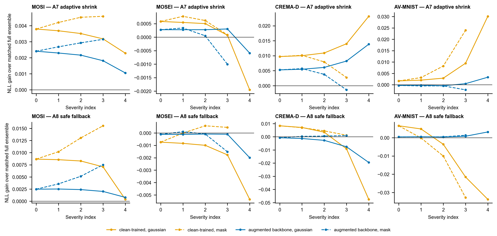

图中每个方法都相对于同一训练协议下、计算匹配的完整联盟集成计算NLL增益。橙色为clean-only协议，蓝色为共享增强骨干；实线为高斯噪声，虚线为遮蔽。共享增强显著提高了完整联盟本身的鲁棒性，因此蓝色曲线回答的是RCG在强增强基线之上的额外价值，而不是相对原始弱基线的总体提升。

| 数据集 | 方法 | 全部退化平均 $\Delta$NLL（方法−增强完整联盟） | 95% CI | 全部退化平均 $\Delta$Accuracy | 95% CI | 判读 |
|---|---|---:|---:|---:|---:|---|
| MOSI | A7自适应收缩 | -0.00230 | [-0.00525, 0.00066] | -0.00266 | [-0.00860, 0.00306] | NLL均值改善但CI跨零 |
| MOSI | A8安全回退 | -0.00342 | [-0.00822, 0.00183] | -0.00107 | [-0.00799, 0.00528] | 无统计支持 |
| MOSEI | A7自适应收缩 | +0.00005 | [-0.00133, 0.00148] | -0.00059 | [-0.00214, 0.00095] | 与增强完整联盟持平 |
| MOSEI | A8安全回退 | +0.00054 | [-0.00128, 0.00241] | +0.00047 | [-0.00192, 0.00283] | 与增强完整联盟持平 |
| CREMA-D | A7自适应收缩 | -0.00596 | [-0.00950, -0.00223] | +0.00286 | [0.00107, 0.00465] | NLL和Accuracy均获演员簇支持 |
| CREMA-D | A8安全回退 | +0.00419 | [-0.00466, 0.01370] | -0.00120 | [-0.00520, 0.00288] | 无稳定收益 |
| AV-MNIST | A7自适应收缩 | +0.00000 | [-0.00073, 0.00079] | +0.00002 | [-0.00026, 0.00030] | 增强基线已接近饱和 |
| AV-MNIST | A8安全回退 | -0.00104 | [-0.00179, -0.00028] | +0.00016 | [-0.00039, 0.00071] | NLL获支持，Accuracy持平 |

**增强本身的作用。** 相对clean-only完整联盟，共享增强使AV-MNIST完整联盟的Gaussian/Mask NLL曲线面积分别下降58.13%/62.97%，CREMA-D下降2.54%/2.67%，MOSI下降1.31%/1.36%，MOSEI下降0.57%/1.17%。因此，clean-only阶段AV-MNIST上的大部分鲁棒收益可以由标准共享增强吸收，不能全部归因于RCG。增强后的AV-MNIST干净Accuracy也从0.9919提高到0.9953，说明该任务中的动态退化增强同时改善了干净与压力条件。

**RCG在强增强基线上的增量。** A7在CREMA-D仍取得有演员簇支持的NLL和Accuracy改善，说明其价值没有被共享增强完全替代；MOSI只保留方向一致但不显著的NLL改善，MOSEI没有额外收益。AV-MNIST中A7与增强完整联盟持平，而重新拟合的A8获得很小但显著的NLL改善。增强后A8不再出现clean-only协议中的AV-MNIST灾难性失效，表明之前的失败主要来自selection分布与强测试偏移不匹配，而不是凸聚合在所有条件下必然有害。

**结论边界。** E9支持两个互补结论。第一，A7能够在未见退化时为CREMA-D、AV-MNIST和MOSI提供不同程度的保护；第二，当任务骨干接受共享退化增强后，完整联盟本身吸收了大量收益，RCG只在CREMA-D保留稳定的额外改善。因此不能宣称RCG普遍替代数据增强，更准确的主张是：贡献自适应收缩可与共享增强叠加，并在存在可避免联盟损害的任务中继续提供增量价值。第二协议冻结了clean-only后验、路由器和混合器，专门隔离共享任务骨干增强；它不证明针对退化重新训练全部RCG元模块后的最优性能。

**产物路径：**

- `runs/formal-e9-augmented-backbones/{dataset}/fold_{fold}/seed_{seed}/backbone.pt`
- `runs/formal-e9-augmented-{dataset}/metrics_by_condition_fold.csv`
- `runs/formal-e9-augmented-{dataset}/predictions.parquet`
- `results/e9_augmented_stress_curves.csv`
- `results/e9_augmented_stress_severity.csv`
- `results/e9_augmented_stress_summary.csv`
- `results/e9_augmented_stress_worst.csv`
- `results/e9_augmented_stress_bootstrap.csv`
- `results/e9_protocol_comparison.csv`
- `figures/e9_augmented_backbone_stress.png`

## E10：模态缺失与任意可用联盟

**状态：** ✅ 已完成。四个数据集的全部非空可用联盟均已评估。

三模态数据测试全部7个非空可用联盟，二模态数据测试全部3个非空联盟。缺失模态不得进入标签后验输入、候选集合或动作混合。比较完整输入训练后清零、modality dropout和coalition dropout。

AV-MNIST用于检查强互补场景：完整系统应在多数干净样本中保留完整联盟优势，而不是为了显示动态性而频繁删除模态。MOSI、MOSEI和CREMA-D则用于检查部分联盟是否能在冲突或冗余样本中降低强制完整融合损失。

### E10.1 实验设置与缺失安全约束

三种任务骨干采用相同架构、训练划分、五个训练种子和早停规则：`full-only + zeroing`只见完整输入，测试时将缺失表示清零但仍按完整输入前向；`modality dropout`独立以0.5概率保留每个模态并修复空集合；`coalition dropout`以0.5概率使用完整联盟、0.5概率均匀采样非空不完整联盟。主比较使用五成员概率平均。CREMA-D五个演员外测试折按样本数加权聚合。

availability-safe RCG使用已有clean训练的标签后验和候选混合器，但增加三个结构约束：缺失模态token在标签后验中严格置零；包含缺失模态的联盟不能参与后验注意力或候选排序；当只有一个合法联盟时精确回退该联盟且收缩系数为零。单元测试通过改变缺失表示和无效联盟概率验证后验不变性。每个可用联盟的收缩强度只由对应selection输入确定，测试标签只用于指标和oracle分析。

配对bootstrap先在每个原始样本内平均所有不完整可用联盟，再按MOSI/MOSEI原视频、CREMA-D演员或AV-MNIST类别分层样本重采样10,000次。因此多个缺失模式不被当成新增独立样本。

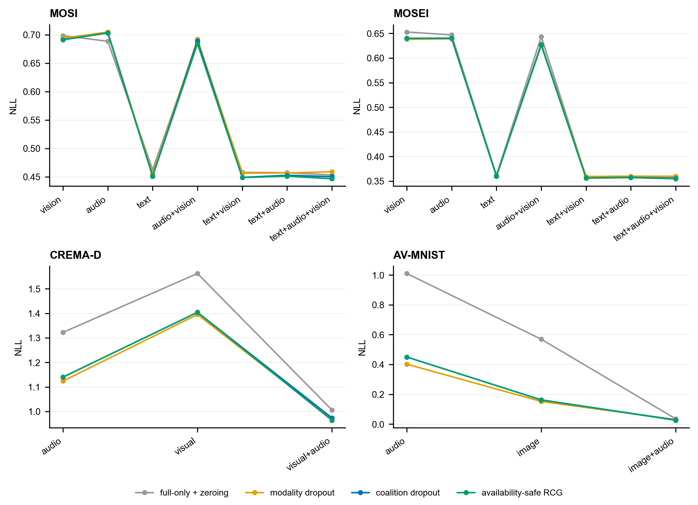

### E10.2 不完整联盟主结果

| 数据集 | 清零 Accuracy / NLL | Modality dropout Accuracy / NLL | Coalition dropout Accuracy / NLL | Availability-safe RCG Accuracy / NLL | 可用联盟参考后悔 | 参考联盟oracle率 |
|---|---:|---:|---:|---:|---:|---:|
| MOSI | 0.6616 / 0.5753 | 0.6563 / 0.5764 | 0.6639 / 0.5727 | **0.6651 / 0.5716** | 0.0548 | 63.97% |
| MOSEI | 0.7353 / 0.5039 | 0.7394 / 0.4977 | **0.7423 / 0.4968** | 0.7427 / 0.4969 | 0.0570 | 65.45% |
| CREMA-D | 0.4342 / 1.4424 | **0.5137 / 1.2595** | 0.5066 / 1.2720 | 0.5066 / 1.2720 | 0 | 100% |
| AV-MNIST | 0.7317 / 0.7898 | **0.9099 / 0.2772** | 0.9019 / 0.3064 | 0.9019 / 0.3064 | 0 | 100% |

二模态数据的不完整可用集合均为单模态，已经没有更小的非空联盟可选，因此参考后悔严格为零，availability-safe RCG按协议与coalition dropout完全相同。三模态数据的双模态可用集合仍可退回单模态，MOSI/MOSEI的不完整联盟平均参考后悔分别为0.0548/0.0570，说明缺失一个模态后仍存在进一步选择空间。

### E10.3 配对统计和协议判读

| 比较（不完整联盟平均） | MOSI $\Delta$NLL [95% CI] | MOSEI $\Delta$NLL [95% CI] | CREMA-D $\Delta$NLL [95% CI] | AV-MNIST $\Delta$NLL [95% CI] |
|---|---:|---:|---:|---:|
| Coalition dropout − 清零 | -0.00263 [-0.01091, 0.00524] | **-0.00704 [-0.01120, -0.00294]** | **-0.17031 [-0.19230, -0.14894]** | **-0.48345 [-0.49854, -0.46853]** |
| Coalition dropout − Modality dropout | -0.00373 [-0.00903, 0.00115] | -0.00090 [-0.00407, 0.00218] | **+0.01253 [0.00390, 0.02100]** | **+0.02921 [0.02472, 0.03367]** |
| Availability-safe RCG − Coalition dropout | **-0.00108 [-0.00193, -0.00020]** | +0.00010 [-0.00051, 0.00074] | 0 | 0 |

未经缺失训练的清零在CREMA-D和AV-MNIST显著失效，说明测试时清零不能作为有效删除协议。Coalition dropout相对清零在MOSEI、CREMA-D和AV-MNIST显著改善，MOSI方向有利但CI跨零。Coalition dropout并未在所有缺失条件下优于普通modality dropout：CREMA-D和AV-MNIST的单模态输入上，modality dropout反而更好。这与采样分布一致——独立dropout给予单模态组合更高训练频率，而本文coalition dropout保留50%完整输入，以兼顾干净完整联盟。论文不能把coalition dropout表述成所有缺失模式上的普遍最优训练策略。

MOSI中availability-safe RCG相对coalition dropout进一步显著降低NLL，但Accuracy改善的95% CI仍跨零；MOSEI没有稳定增益。二模态单模态输入触发精确回退，既不人为制造动态性，也不会因后验校正破坏唯一合法预测。

### E10.4 完整可用联盟与强互补边界

完整联盟条件下，availability-safe RCG相对coalition dropout的NLL差异为：MOSI -0.00372，95% CI [-0.00678, -0.00037]；MOSEI -0.00060，CI跨零；CREMA-D -0.00968，95% CI [-0.01429, -0.00491]；AV-MNIST -0.00171，95% CI [-0.00309, -0.00014]。CREMA-D的Accuracy同时提高0.403个百分点，演员簇CI为[0.040, 0.793]个百分点；其余数据集Accuracy未获得稳定支持。

AV-MNIST中完整图像+音频联盟在95.72%的样本上就是全部合法联盟中的oracle，完整联盟NLL为0.0278，RCG为0.0261。该结果确认强互补任务中系统基本保留完整融合，而不是为了显示路由动态性频繁删除模态。相比之下，完整联盟oracle率在MOSI、MOSEI和CREMA-D分别只有14.63%、12.91%和54.33%，说明前两个文本情感数据中存在很大的标签oracle联盟空间；RCG只实现其中很小一部分，不能用oracle上界代替实际方法收益。

**E10结论。** 联盟有效训练对于可靠的模态缺失评估是必要条件，但具体采样分布决定了完整输入与极端缺失之间的权衡。RCG的缺失安全实现已经满足合法联盟约束，并在MOSI不完整联盟及MOSI、CREMA-D、AV-MNIST完整联盟上改善NLL；它没有在MOSEI或单模态无选择条件下制造虚假收益。该结果支持“任意合法联盟推理”和“无合法替代时回退”，但不支持“coalition dropout在所有缺失模式上优于modality dropout”的更强主张。

**产物路径：**

- `runs/formal-e10-backbones/{dataset}/{mode}/fold_{fold}/seed_{seed}/backbone.pt`
- `runs/formal-e10-{dataset}/metrics_by_fold_alliance.csv`
- `runs/formal-e10-{dataset}/predictions.parquet`
- `runs/formal-e10-{dataset}/oracle_by_fold_alliance.csv`
- `results/e10_alliance_metrics.csv`
- `results/e10_alliance_oracle.csv`
- `results/e10_incomplete_summary.csv`
- `results/e10_missing_bootstrap.csv`
- `figures/e10_missing_coalitions.png`

---

# 9. 骨干迁移与强基线

## E11：Base与Base + RCG

**状态：** 🟡 历史统一特征适配已完成；S4需在MOSI与CREMA-D上按P0规范链重新运行。

**研究目的：** 验证RCG模块是否依赖当前统一Transformer骨干，还是能够迁移到不同的融合机制。

选择能够稳定复现且具有合法联盟输出的骨干：统一concat Transformer、TMC、QMF、PDF，以及I²MoE或MulT。每个骨干至少报告：

```text
Base
Base + analytic contribution
Base + anchored router
Base + complete RCG fusion
```

统一特征轨道保持数据、表示、划分、训练种子和扰动相同。若官方架构无法合法产生所有联盟预测，则必须明确适配方式，不能用未训练清零替代联盟有效输出。

只有至少三个不同骨干上的`Base + RCG`改善NLL，才能支持“可迁移融合校正模块”的表述。如果只在统一骨干上成立，论文应将方法限定为当前coalition-aware架构。

### 正式设置

本实验只回答骨干迁移问题，因此固定在MOSI标准划分上，不重复跨数据集主性能实验。复用E1中已经采用coalition dropout训练并完成逐联盟温度校准的Concat、TMC、QMF、PDF和I²MoE统一特征检查点。五种骨干均使用相同的BERT、音频和视觉冻结表示、相同的训练/selection/测试划分，以及种子11、22、33、44、55。所有骨干都能原生处理7个非空联盟；未使用完整输入模型测试时清零的替代协议。

对每个冻结骨干训练同构轻量适配器，并逐级评价：

1. `Base`：骨干的完整联盟预测；
2. `Base + analytic contribution`：解析标签后验动作与完整联盟之间进行贡献概率收缩；
3. `Base + anchored router`：解析Top-1与列表式支持候选构成锚定动作集，使用等权候选动作隔离路由收益；
4. `Base + complete RCG`：使用学习式锚定mixer，并进行相同的贡献概率收缩。

后验、路由器和mixer只使用训练集拟合；selection用于早停、残差强度及收缩强度选择。测试标签仅在所有决策冻结后计算指标。这里的适配器训练用于检验创新二、三能否迁移到冻结骨干；它不替代E2对多教师OOF软监督的独立验证，也不把训练内联盟损失当作创新一的新证据。

### 正式结果

下表给出五种任务种子的平均结果。三阶段数值均为相对对应骨干完整联盟的NLL改善；Accuracy为完整RCG相对基线的绝对百分点变化。集成NLL及95% CI先对五个任务种子的概率取平均，再按31个原视频进行10,000次配对簇bootstrap。

| 骨干 | 解析贡献NLL改善 | 锚定路由NLL改善 | 完整RCG NLL改善 | 完整RCG Accuracy变化 | 平均截断损害 | 五成员集成NLL改善（95% CI） |
|---|---:|---:|---:|---:|---:|---:|
| Concat | .00434 | **.00583** | .00439 | +0.37 pp | 0.84% | .00305 [.00052, .00547] |
| TMC | .00125 | **.00164** | .00128 | +0.09 pp | 0.30% | .00110 [-.00003, .00225] |
| QMF | **.01403** | .00760 | .00626 | +0.09 pp | 0.49% | .00459 [.00091, .00996] |
| PDF | **.00235** | .00116 | .00091 | +0.06 pp | 0.24% | .00039 [-.00054, .00131] |
| I²MoE | .00848 | .00952 | **.00973** | +1.22 pp | 0.93% | .00762 [.00342, .01196] |

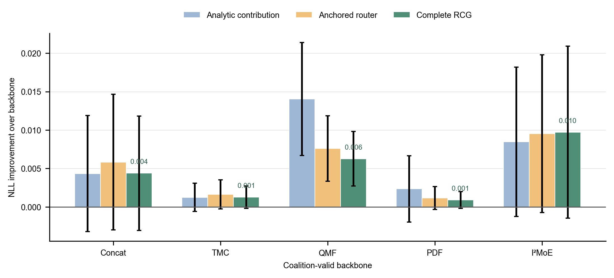

### 结果分析

完整RCG在五种骨干上的五种子平均NLL均为正，且每种骨干至少有4/5个种子不劣于自身完整联盟。预注册的“至少三个骨干改善NLL”门槛通过。五成员概率集成后，Concat、QMF和I²MoE的NLL改善置信区间严格高于零；TMC和PDF保持正方向，但区间包含零。因此可支持的表述是：RCG校正在不同融合机制上具有迁移性，并在三种骨干上获得统计支持；不能写成五种骨干均显著提升。

完整RCG的平均Accuracy在五种骨干上均未下降，其中I²MoE提高1.22个百分点，Concat提高0.37个百分点。五种骨干的平均截断损害均低于1%，且纠错率均高于负向翻转率。这个结果说明完整联盟锚定和selection收缩没有通过大幅有害修正换取NLL收益。

逐级结果并不支持“每增加一个模块性能必然单调提高”。QMF和PDF的解析贡献阶段优于完整RCG，Concat和TMC则由等权锚定路由获得最高NLL收益，只有I²MoE在完整系统达到最佳。这意味着路由器和mixer的主要价值是为不同骨干提供受控候选组合，而不是保证在每个骨干上超过解析校正。论文应把完整系统的必要性主要建立在E5—E8的跨数据集消融上，不应利用E11声称所有骨干都需要全部组件。

本实验仍是统一冻结特征适配，而非QMF、PDF或I²MoE官方端到端表格复现；结论限定为“联盟有效骨干上的后处理迁移”。当前迁移实验只在MOSI完成，因此它证明架构迁移，不单独证明跨任务迁移。

**E11实验结论：** 骨干迁移门槛通过。完整RCG在五种骨干上取得正平均NLL收益，在Concat、QMF和I²MoE上获得视频簇bootstrap支持；但完整系统不在每种骨干上支配解析贡献或等权锚定路由。

**结果图表：** 本节表格与`figures/e11_backbone_transfer.png`。误差线为五个任务种子的标准差；图中正值表示NLL优于对应骨干完整联盟。

**产物路径：**

- `runs/formal-e11-backbone-transfer/metrics_by_seed.csv`
- `runs/formal-e11-backbone-transfer/final_summary.csv`
- `runs/formal-e11-backbone-transfer/ensemble_bootstrap.csv`
- `runs/formal-e11-backbone-transfer/predictions.parquet`
- `results/e11_backbone_transfer_summary.csv`
- `results/e11_backbone_transfer_bootstrap.csv`
- `figures/e11_backbone_transfer.png`

---

# 10. 效率、复杂度与失败案例

## E12：训练与推理效率

**状态：** ✅ 已完成；RTX 4070 SUPER统一计时，四数据集参数统计，MOSI训练与部署基准。

报告总参数量、可训练参数量、单成员训练GPU小时、五成员集成训练成本、batch size为1和64的推理延迟、峰值显存、二模态3联盟与三模态7联盟前向成本，以及完整系统相对单次完整联盟前向的计算倍数。

非空联盟数量为：

$$
|\mathcal C|=2^M-1.
$$

因此当前方法只面向二模态和三模态等少模态任务。实验不能以小规模数据上的可运行性掩盖联盟枚举随模态数指数增长的限制。

### 正式设置

参数量按正式检查点中的可训练参数精确求和。延迟在RTX 4070 SUPER上使用PyTorch 2.6.0+cu124测量；输入张量预先驻留GPU，不包含磁盘读取、CPU到GPU传输或冻结特征编码器。每个配置先预热20次，再进行7轮CUDA同步墙钟计时；batch size 1每轮重复200次，batch size 64每轮重复100次，五成员配置为控制总运行时间分别重复40次和20次。显存由每个配置独立进程加载所需模型后测量，避免其他模型驻留污染结果。

训练时间在MOSI上重新运行一个代表性正式流程，包括5折×5教师种子的OOF教师库、coalition-aware任务骨干、五模型标签后验集成、列表式路由器和锚定mixer。最多100 epochs并保持原早停协议。OOF教师库在同一五成员组内共享；单成员独立训练成本和五成员完整训练成本分别按一次共享教师库加一个或五个部署成员计算。所有时间均不包含BERT、Wav2Vec2或R3D等冻结特征提取。

### 参数量

| 数据集 | 联盟骨干 | 五后验模型 | 列表式路由器 | Mixer | 单成员RCG总参数 | 五成员RCG总参数 |
|---|---:|---:|---:|---:|---:|---:|
| MOSI | 0.434M | 2.475M | 0.485M | 0.001M | 3.395M | 16.975M |
| MOSEI | 0.445M | 2.529M | 0.495M | 0.001M | 3.470M | 17.352M |
| CREMA-D | 0.480M | 2.708M | 0.531M | 0.002M | 3.722M | 18.609M |
| AV-MNIST | 0.434M | 2.480M | 0.485M | 0.004M | 3.403M | 17.015M |

MOSI中五模型标签后验占单成员全部参数的72.9%，列表式路由器占14.3%，联盟任务骨干占12.8%，mixer不足0.1%。因此当前参数开销主要来自后验集成，而不是最终融合头。

### 训练成本

| 阶段 | 复用范围 | 秒 | GPU小时 |
|---|---|---:|---:|
| 5折×5种子OOF教师库 | 每个五成员组一次 | 21.62 | 0.00601 |
| 联盟任务骨干＋校准 | 每个部署成员 | 1.34 | 0.00037 |
| 五模型后验集成＋校准 | 每个部署成员 | 11.07 | 0.00307 |
| 列表式路由器 | 每个部署成员 | 1.79 | 0.00050 |
| 锚定候选mixer | 每个部署成员 | 2.43 | 0.00068 |
| 单成员独立完整训练 | 含一次OOF教师库 | 38.26 | 0.01063 |
| 五成员完整训练 | 共享一次OOF教师库 | 104.79 | 0.02911 |

这些数值说明固定表示上的融合训练本身很轻。每个部署成员的边际训练时间为16.63秒，其中后验集成占66.5%；五成员训练并非简单的五倍单成员独立训练，因为OOF教师库只生成一次。该时间不能外推到端到端重新训练BERT、Wav2Vec2或视频编码器的场景。

### 推理延迟与显存

下表的倍数均相对同一batch size下的一次MOSI完整联盟前向。峰值显存报告batch size 64。

| 配置 | 模态/联盟 | BS=1延迟（ms） | BS=1倍数 | BS=64延迟（ms） | BS=64倍数 | BS=64峰值显存 |
|---|---|---:|---:|---:|---:|---:|
| 单次完整联盟前向 | 三模态/1次 | 0.995 ± 0.033 | 1.00× | 0.938 ± 0.013 | 1.00× | 11.73 MB |
| 三模态全联盟枚举 | 三模态/7联盟 | 6.890 ± 0.271 | 6.93× | 6.846 ± 0.067 | 7.29× | 11.73 MB |
| 二模态全联盟枚举 | 二模态/3联盟 | 2.875 ± 0.132 | 2.89× | 2.862 ± 0.057 | 3.05× | 11.77 MB |
| 单成员完整RCG | 三模态/7联盟 | 24.740 ± 0.879 | 24.87× | 28.968 ± 0.166 | 30.87× | 24.72 MB |
| 五成员完整联盟集成 | 三模态/各1次 | 4.991 ± 0.118 | 5.02× | 4.736 ± 0.055 | 5.05× | 18.35 MB |
| 五成员完整RCG | 三模态/各7联盟 | 121.286 ± 3.183 | 121.92× | 145.603 ± 0.665 | 155.15× | 76.56 MB |

### 结果分析

二模态3联盟和三模态7联盟的延迟分别为单次完整联盟的约2.9倍和6.9—7.3倍，说明当前联盟骨干基本按联盟数量线性重复计算。完整单成员RCG进一步加入五个后验网络、列表式路由和mixer，batch size 1延迟为24.74 ms，约40.4样本/秒；batch size 64延迟为28.97 ms，约2209样本/秒。冻结特征批处理可以有效摊薄固定开销，但单样本实时延迟仍明显高于普通融合。

五成员完整RCG的batch size 1延迟为121.29 ms，约8.2样本/秒；batch size 64吞吐约440样本/秒。它相对单成员完整RCG接近线性增加五倍，表明当前实现没有跨成员共享后验编码或并行合并联盟计算。模型级集成提高稳定性所付出的计算成本必须与E7中的性能收益共同报告，不能把五成员结果描述为低成本部署方案。

显存不是当前主要瓶颈。单成员和五成员完整RCG在batch size 64下的峰值显存分别只有24.72 MB和76.56 MB，远低于12 GB显卡容量；计算时间才是主要限制。这里的低显存依赖预抽取特征，不包含原始文本、音频和视频编码器。

复杂度方面，当前精确联盟枚举需要$2^M-1$次联盟骨干前向；后验集成和多成员集成再分别引入近似线性系数。因此方法适合二到三模态、离线分析或对延迟要求不严格的固定表示融合，不适合直接扩展到大量模态。后续可以研究共享一次模态投影、并行批量化联盟token、蒸馏五后验模型以及候选联盟剪枝，但这些优化不属于当前论文已经验证的贡献。

**E12实验结论：** 完整系统在参数和显存上较轻，固定表示下五成员正式训练约0.029 GPU小时；但精确联盟枚举、五后验模型和五成员集成使推理延迟达到单次完整联盟的约25—31倍和122—155倍。论文可以声称该方法在少模态固定表示任务上可运行，不能声称其具有实时或大规模模态扩展效率。

**结果图表：** 本节三个Markdown表格；E12不额外生成图片。

**产物路径：**

- `results/e12_parameters.csv`
- `results/e12_efficiency.csv`
- `results/e12_training_times.csv`
- `results/e12_benchmark_manifest.json`
- `results/e12_training_manifest.json`
- `runs/formal-e12-training-benchmark/`

## E13：成功案例与失败案例

**状态：** ✅ 正式规则分析完成。

**研究目的：** 检查最终系统具体纠正了哪些完整联盟错误、又制造了哪些负向翻转；同时验证高可靠负贡献案例和AV-MNIST完整联盟回退是否与前文机制判断一致。

**冻结选择规则：** 所有案例均由脚本自动选择，没有人工挑选。成功纠错定义为五成员完整联盟集成预测错误而A8最终预测正确，并按真实标签交叉熵收益降序选前5个；负向翻转定义相反，并按交叉熵损害降序选前5个；高可靠负贡献要求单模态可靠性不低于该模态校准集$q_{0.9}$且删除贡献小于$-0.01$ nats，并按损害幅度选前5个；AV-MNIST完整联盟保留案例要求完整联盟为样本级oracle且基线和最终系统均预测正确，先按平均收缩系数升序、再按完整联盟优势降序选择。

**总体预测变化：**

| 数据集 | 测试样本 | 错误→正确 | 正确→错误 | 净正确数变化 | Accuracy变化 | 平均CE收益 |
|---|---:|---:|---:|---:|---:|---:|
| MOSI | 656 | 22 | 18 | +4 | +0.61 pp | +0.00867 |
| MOSEI | 3,634 | 21 | 29 | -8 | -0.22 pp | -0.00074 |
| CREMA-D | 7,442 | 191 | 184 | +7 | +0.09 pp | +0.00835 |
| AV-MNIST | 3,600 | 11 | 6 | +5 | +0.14 pp | +0.00654 |

正的CE收益表示最终系统降低了真实标签NLL。MOSI、CREMA-D和AV-MNIST的纠错数略高于负向翻转数；MOSEI则相反，且平均CE收益为负。这与E1和E8中MOSEI缺乏稳定主性能增益的结论一致，说明案例分析没有掩盖总体失败。

**规则选取的最大纠错案例：**

| 数据集 | 样本 | 标签 | Base→Final | $p(y)$ Base→Final | CE收益 | 平均$\alpha$ | 路由Top-3 |
|---|---|---:|---|---|---:|---:|---|
| MOSI | `etzxEpPuc6I$_$12` | 1 | 0→1 | 0.368→0.534 | +0.371 | 0.360 | text > text+audio > full |
| MOSEI | `28006$_$0` | 0 | 1→0 | 0.378→0.510 | +0.300 | 0.145 | vision > text+audio > full |
| CREMA-D | `1044_ITH_HAP_XX` | 3 | 1→3 | 0.118→0.261 | +0.793 | 0.170 | full > visual > audio |
| AV-MNIST | `2328` | 4 | 9→4 | 0.147→0.743 | +1.624 | 0.372 | full > image > audio |

这些案例中，最终系统并不总是依靠删除完整联盟：CREMA-D和AV-MNIST的路由首位仍是完整联盟，但后验动作在候选混合中获得较大权重，从而提高真实类别概率。该现象说明创新三的收益来源同时包含联盟候选和后验校正，不能把全部改善归因于子联盟选择。

**规则选取的最大负向翻转案例：**

| 数据集 | 样本 | 标签 | Base→Final | $p(y)$ Base→Final | CE损害 | 平均$\alpha$ | 后验动作权重 |
|---|---|---:|---|---|---:|---:|---:|
| MOSI | `vyB00TXsimI$_$3` | 1 | 1→0 | 0.538→0.336 | 0.469 | 0.119 | 0.291 |
| MOSEI | `221153$_$5` | 1 | 1→0 | 0.652→0.493 | 0.280 | 0.160 | 0.459 |
| CREMA-D | `1050_IWW_NEU_XX` | 4 | 4→3 | 0.367→0.131 | 1.027 | 0.187 | 0.585 |
| AV-MNIST | `18120` | 2 | 2→7 | 0.401→0.053 | 2.022 | 0.400 | 0.716 |

四个最大失败案例的后验动作权重均高于完整联盟动作权重；CREMA-D和AV-MNIST的极端失败尤其明显。AV-MNIST最大翻转的CE损害为2.022 nats，高于其最大纠错收益1.624 nats，说明平均性能提升不能替代尾部损害报告。当前损害惩罚和自适应收缩仍不能完全阻止置信错误的后验产生过度校正，这是创新三的主要失败模式。

**高可靠负贡献极值：**

| 数据集 | 样本 | 模态 | 可靠性/$q_{0.9}$ | 条件贡献 | 完整联盟真实类概率 | 删除后真实类概率 | 平均$\alpha$ |
|---|---|---|---:|---:|---:|---:|---:|
| MOSI | `nbWiPyCm4g0$_$1` | vision | 0.646/0.580 | -0.340 | 0.476 | 0.669 | 0.381 |
| MOSEI | `252097$_$10` | text | 0.989/0.983 | -3.609 | 0.015 | 0.569 | 0.000 |
| CREMA-D | `1043_DFA_FEA_XX` | visual | 0.916/0.770 | -3.739 | 0.017 | 0.701 | 0.044 |
| AV-MNIST | 无满足条件样本 | — | — | — | — | — | — |

MOSEI和CREMA-D的极端样本中，模态最大类别概率分别达到0.989和0.916，但其真实类别概率很低；删除该模态后真实类别概率大幅提高。这直接展示了“对错误类别非常确定”仍可能产生高可靠分数，并且可靠性不能单独决定条件贡献。AV-MNIST没有样本同时越过对应模态的校准集$q_{0.9}$阈值并满足$u<-0.01$，因此该数据集继续作为低RCG边界，而不是被强行用于支持普遍性主张。

**AV-MNIST完整联盟安全保留：** 规则选取的样本`21674`、`6763`、`2791`、`4281`和`2704`均以完整联盟为oracle，完整联盟集成与最终预测的真实类概率均约为1.000，平均$\alpha$在保存精度下为0。它们说明贡献概率收缩在部分强互补、完整联盟已经充分确定的样本上能够精确退回基线；该案例性质不等价于对所有样本的安全保证。

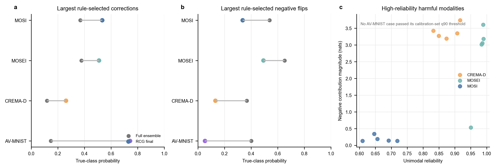

Figure F的a、b面板分别展示每个数据集规则选取的最大纠错和最大负向翻转，其中灰点为完整联盟集成、彩色点为A8最终预测；c面板展示全部入选的高可靠负贡献样本。图中不画统一可靠性阈值线，因为阈值由数据集、模态和校准集分别确定。

全部Top-5案例及其联盟真实类概率、解析路由Top-3、动作权重和收缩系数直接保存在Markdown表格[规则选取案例明细](results/e13_case_tables.md)中；逐样本全量内部量保存在Parquet记录中，可复算选择与统计。案例是预定义极值诊断，不用于估计现象发生率，也不构成因果证据。

**E13实验结论：** E13同时确认了系统的有效机制与剩余风险。RCG能够纠正四个数据集中的部分完整联盟错误，并在AV-MNIST强互补样本上退回完整联盟；但它也会产生负向翻转，且MOSEI总体上翻转多于纠错。高可靠负贡献在MOSI、MOSEI和CREMA-D的规则样本中仍然清晰，AV-MNIST则保持边界反例。论文必须将创新三表述为平均风险和概率质量改善机制，不能表述为逐样本无害或在所有数据集上提高准确率。

**结果图表：** Figure F（PNG，300 dpi）和本节Markdown表格；完整Top-5明细另存为Markdown。

**产物路径：**

- `figures/e13_case_analysis.png`
- `results/e13_case_records.parquet`
- `results/e13_selected_cases.csv`
- `results/e13_case_counts.csv`
- `results/e13_case_tables.md`
- `results/e13_manifest.json`

---

# 11. 正文图表安排

## 11.1 正文表格

| 表格 | 内容 | 当前状态 |
|---|---|---|
| Table 1 | 数据集、表示、划分和任务统计 | 🟡 信息已具备，待排版 |
| Table 2 | 四数据集干净主性能 | ✅ 四数据集正式统计完成 |
| Table 3 | 创新一监督稳定性与候选覆盖 | ✅ 四数据集五种子正式消融完成 |
| Table 4 | 创新二贡献识别与联盟排序 | ✅ E3贡献识别与E4候选排序均完成 |
| Table 5 | 创新三收益、损害和集成分解 | ✅ E5—E7正式结果完成 |
| Table 6 | 三创新逐层消融 | ✅ E8正式结果完成 |
| Table 7 | 噪声、遮蔽和模态缺失 | ✅ E9与E10正式结果完成 |
| Table 8 | 骨干迁移与效率 | ✅ E11骨干迁移与E12效率均完成 |

## 11.2 正文图片

| 图片 | 内容 | 结论任务 |
|---|---|---|
| Figure A | 教师分歧、软oracle熵和Top-$K$覆盖 | 软监督是否更稳定 |
| Figure B | 解析有益概率分箱与真实收益 | 解析贡献是否校准 |
| Figure C | 解析锚定路由的Top-$K$恢复 | 列表式路由是否扩大候选覆盖 |
| Figure D | 两级融合收益—损害Pareto图 | 自适应融合是否优于固定策略 |
| Figure E | 噪声、遮蔽和模态缺失曲线 | 方法是否在质量变化下成立 |
| Figure F | 动作权重、收缩系数及成功/失败案例 | 方法如何成功及在哪里失败 |

全部图片只导出PNG，分辨率300 dpi，白色背景，使用色盲友好配色。不生成SVG、PDF或TIFF作为论文图片交付物。

---

# 12. 统一逐样本记录接口

所有论文指标必须能够从逐样本记录重新计算，无需重新训练。正式记录至少包含：

```text
dataset
sample_id
group_or_video_id
fold
ensemble_replicate
train_seed
corruption_type
corruption_level
corruption_seed
available_modalities
coalition
coalition_probabilities
observed_coalition_loss
soft_oracle_distribution
pairwise_preference
teacher_agreement_weight
posterior_probability
analytic_expected_contribution
analytic_benefit_probability
analytic_expected_gain
analytic_expected_harm
analytic_anchor
router_scores
anchored_candidate_set
candidate_action_weights
adaptive_alpha
member_full_probability
full_ensemble_probability
aggregation_weights
fallback_rho
final_probability
label
```

测试推理代码不得读取`label`、`observed_coalition_loss`或测试标签定义的oracle字段。它们只能在预测保存完成后用于离线评价。

---

# 13. 当前完成度

| 实验或产物 | 状态 | 说明 |
|---|---|---|
| 独立RCG观测章节 | ✅ 基本完成 | 两个任务族成立，AV-MNIST界定边界 |
| 四数据集基础任务模型 | ✅ 已完成 | 当前五种子构成一个集成点 |
| 创新一软目标实现 | ✅ 正式消融完成 | 四数据集均降低目标方差；只有MOSEI的软目标＋成对偏序提高候选覆盖 |
| 创新二解析贡献 | ✅ E3正式识别完成 | 有益事件AUROC明显优于可靠性与直接回归；幅度排序未在三个数据集达标 |
| 解析锚定列表式路由 | ✅ 已完成 | 四数据集五种子完成；MOSI/MOSEI候选覆盖增益明确 |
| 创新三样本级候选融合 | ✅ 已完成 | E5分组件与E6贡献概率收缩均完成 |
| 模型级稳定凸聚合 | 🟡 历史分解完成 | E7使用完整联盟＋标签后验动作；P0规范A7→A8聚合已在E8实现，I3-3正式比较待补 |
| MOSI五组独立集成 | ✅ 已完成 | 5/5组Accuracy优于完整联盟集成；NLL为4/5组改善 |
| MOSEI五组独立集成 | ✅ 已完成 | 与完整联盟集成持平，未获得统计支持的Accuracy或NLL提升 |
| CREMA-D演员簇bootstrap | ✅ 已完成 | 主任务差异CI跨零；NLL在4个启用聚合的折中均下降 |
| AV-MNIST分层bootstrap | ✅ 已完成 | Accuracy、Macro-F1、NLL、Brier和ECE均获得分层bootstrap支持 |
| 完整逐层消融 | ✅ 已完成 | 机制链、单成员部署链和真实A7→A8桥接均已完成 |
| 最新系统连续质量退化 | ✅ 已完成 | clean-only与共享增强骨干两协议完成；共享增强后A7只在CREMA-D保留稳定增益 |
| 最新系统模态缺失 | ✅ 已完成 | 全联盟评估与缺失安全RCG完成；清零伪象被排除 |
| Base + RCG骨干迁移 | 🟡 历史适配完成 | MOSI旧适配结果保留；S4需用P0规范链补MOSI与CREMA-D |
| 完整效率分析 | ✅ 已完成 | 四数据集参数；MOSI训练成本；二/三模态延迟与显存 |
| 成功与失败案例分析 | ✅ 已完成 | 四数据集规则选取Top-5；Figure F、明细表与全量逐样本记录已生成 |

---

# 14. 实验章节最终验收标准

实验章节完成需要同时满足：

1. 四个数据集均具有计算匹配的完整联盟集成基线；
2. MOSI和MOSEI完成五组独立的五成员集成；
3. 创新一证明软监督改善稳定性、Top-$K$候选覆盖或下游性能中的至少一项；
4. 创新二证明解析贡献优于可靠性分数和直接收益回归；
5. 列表式路由提高Top-2或Top-3覆盖，并且不把结构保证的解析Top-1写成实验发现；
6. 创新三相对计算匹配的完整联盟集成取得可验证收益；
7. 所有性能收益同时报告纠错率、负向翻转和截断损害；
8. A0–A8逐层消融能够分别对应三个创新点；
9. 噪声、遮蔽和模态缺失使用所有方法共享的扰动与训练协议；
10. 至少三个骨干完成`Base`与`Base + RCG`比较，才能声称具有迁移性；
11. 主要结论完成配对置信区间和Holm校正；
12. 所有指标能够从统一逐样本记录重新计算；
13. 未达到10%相对改善时如实报告，不改变指标定义或比较基线；
14. 结果不足时收窄论文主张，不通过增加弱基线或无关实验掩盖失败。

最终实验论证应形成以下闭环：

$$
\boxed{
\text{主任务收益}
\rightarrow
\text{软监督可信性}
\rightarrow
\text{贡献与候选识别}
\rightarrow
\text{安全融合转化}
\rightarrow
\text{消融、鲁棒性和迁移验证}
}
$$

---

# 15. 顶会级补充实验状态

旧版E1—E13均保留其真实产物，但其中E1、E7和E11不能替代P0之后的规范系统比较。以下清单是当前唯一的补充实验执行表；只有标记为“正式结果”的产物才能进入新的论文主表。

| 编号 | 实验 | 状态 | 规范要求 |
|---|---|---|---|
| P0 | 统一最终系统定义、版本和预测哈希 | ✅ 完成 | `rcg-fusion-a8-v1`；四数据集规范预测及SHA-256已登记 |
| I1-1 | OOF监督可信性 | 🔴 待运行 | 六种监督版本、四数据集、教师与路由重复 |
| I1-2 | 软监督的下游传递 | 🔴 待运行 | 固定后续结构，仅替换监督目标 |
| I2-1 | 解析贡献识别主实验 | 🔴 待统一复验 | 外部原生分数与内部估计器分轨比较 |
| I2-2 | 列表式残差路由 | 🔴 待统一复验 | 排序、候选覆盖与mixer收益联动 |
| I2-3 | 上下文依赖机制 | 🔴 待运行 | 固定目标模态，只改变其他模态上下文 |
| I3-1 | 候选融合价值 | 🔴 待统一复验 | 相对标签后验单独输出验证候选增量 |
| I3-2 | 匹配损害预算的收益—风险 | 🔴 待运行 | 0.5%、1%、2%、5%预算及Pareto超体积 |
| I3-3 | 模型级稳定聚合与回退 | 🔴 待规范复验 | 使用P0冻结的A7动作，分离普通集成和A8增量 |
| S1 | 四数据集计算匹配干净主结果 | 🔴 待运行 | 统一外部基线、重复CI、Holm校正 |
| S2 | 连续退化鲁棒性 | 🔴 待规范复验 | clean-only与共享增强，比较强外部基线 |
| S3 | 模态缺失与任意联盟 | 🔴 待规范复验 | availability-safe RCG与外部缺失适配 |
| S4 | 骨干可迁移性 | 🔴 待规范复验 | 五骨干，MOSI与CREMA-D，Base/Base+RCG |
| S5 | A0—A8三链消融 | 🔴 待规范汇总 | 监督、路由、决策三条证据链 |
| S6 | 效率与收益归一化 | 🔴 待规范复验 | 单成员、蒸馏和五成员版本及外部基线 |

下一项固定为I1-1。在I1-1完成前，不启动S1主表，也不把历史E1/E7/E11结果复制到新的正式主表。
