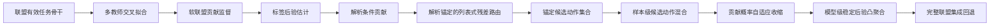

# RCG-Fusion：面向条件贡献建模的可靠信息融合方法

## 1. 问题定义与方法概览

### 1.1 研究问题

给定由多个异构模态组成的输入，信息融合方法通常根据单模态置信度、不确定性或质量分数为不同模态分配权重。这类方法隐含了一个常见假设：一个模态自身越可靠，将其加入融合过程就越可能改善最终预测。然而，单模态可靠性描述的是该模态独立预测的确定程度，而一个模态是否值得加入，还取决于它与当前已有模态之间的互补、冗余和冲突关系。因此，可靠性是单模态属性，融合贡献则是相对于当前模态联盟定义的条件关系量。

本文将这种差异称为**可靠性–贡献差距**（Reliability–Contribution Gap，RCG）。RCG-Fusion 的核心目标不是静态评估某个模态在整个数据集上的平均重要性，而是回答一个更直接的融合决策问题：

> 在给定样本、给定任务模型和当前可用模态联盟的条件下，哪些模态联盟值得进入最终融合决策，以及应当以多大强度使用这些联盟？

为解决这一问题，本文提出一条由监督构造、贡献推断和安全融合组成的完整技术链：



该方法包含三个相互衔接的创新。第一，本文利用分组交叉拟合和多教师预测构造软联盟贡献监督，使后续路由不依赖训练样本上的乐观损失或单一教师产生的不稳定硬标签。第二，本文将联盟的逐标签损失差与未知标签后验分开建模，通过标签后验积分解析得到期望贡献、有益概率和期望损害，并以解析贡献为不可被学习残差覆盖的候选锚点。第三，本文不将候选排序直接转换为高风险硬选择，而是在样本级执行完整联盟锚定的候选动作混合与自适应收缩，并在多模型部署时进一步执行非负凸聚合和完整联盟集成回退。

本文讨论的“贡献”均指**固定模型、固定任务损失和给定联盟条件下的模型条件贡献**。它不是独立于模型的模态真实价值，也不表示现实世界中的因果效应。

### 1.2 符号约定

为避免后续章节在“置信度”“价值”“贡献”和“收益”等概念之间发生漂移，本文固定采用下列术语。

| 中文规范名称 | 英文或符号 | 本文中的含义 |
|---|---|---|
| 可靠性–贡献差距 | Reliability–Contribution Gap, RCG | 单模态自身可靠性与其相对当前联盟的条件贡献之间的失配 |
| 模态集合 | $\mathcal M$ | 当前任务定义的全部模态 |
| 模态联盟 | $S\subseteq\mathcal M$ | 任意非空模态子集 |
| 完整联盟 | $\mathcal M$ | 包含全部模态的联盟 |
| 联盟预测 | $p_S(y\mid x_S)$ | 联盟 $S$ 对任务标签的预测分布 |
| 条件贡献 | $u_m(S,x,y)$ | 向联盟 $S$ 加入模态 $m$ 后的任务损失变化 |
| 联盟优势 | $A_S(x,y)$ | 联盟 $S$ 相对完整联盟的损失改善 |
| 标签后验 | $q_\theta(y\mid x)$ | 在测试标签未知时估计的条件标签分布 |
| 解析期望贡献 | $\mu_S(x)$ | 对逐标签联盟收益按标签后验积分所得的期望 |
| 有益概率 | $\pi_S(x)$ | 联盟收益超过预设容差的后验概率 |
| 解析锚点 | analytic anchor | 解析期望贡献最高且在候选构造中不可被残差覆盖的联盟 |
| 列表式残差路由 | listwise residual router | 在解析贡献先验上学习联盟排序残差的路由器 |
| 锚定候选集 | anchored candidate set | 固定解析 Top-1，并由残差排序补充其他联盟的候选集合 |
| 完整联盟回退 | full-coalition fallback | 不确定时精确返回完整联盟或完整联盟集成的机制 |
| 稳定后验聚合 | stable posterior aggregation | 在概率单纯形上对完整联盟与后验动作进行非负凸聚合 |

设全部模态构成集合

$$
\mathcal M=\{1,2,\ldots,M\}.
$$

一个多模态样本表示为

$$
x=\{x_m\}_{m\in\mathcal M},
\qquad
y\in\{1,2,\ldots,K\},
$$

其中，$x_m$ 是第 $m$ 个模态的输入，$y$ 是任务标签，$K$ 是类别数。任意非空模态子集称为一个**模态联盟**：

$$
S\subseteq\mathcal M,
\qquad S\neq\varnothing.
$$

全部非空联盟的集合为

$$
\mathcal C
=
\{S\subseteq\mathcal M:S\neq\varnothing\},
$$

其大小为

$$
|\mathcal C|=2^M-1.
$$

包含全部模态的联盟 $\mathcal M$ 称为**完整联盟**。对于任意联盟 $S$，联盟任务模型输出类别概率

$$
p_S(k\mid x_S)
=
f_\omega(x_S,S)_k,
\qquad k\in\{1,\ldots,K\}.
$$

为简化记号，在上下文明确时将 $p_S(k\mid x_S)$ 写作 $p_S(k)$。对应的交叉熵损失为

$$
L_S(x,y)
=
-\log p_S(y\mid x_S).
$$

向联盟 $S$ 中加入尚未包含的模态 $m$ 时，定义该模态的条件贡献为

$$
u_m(S,x,y)
=
L_S(x,y)-L_{S\cup\{m\}}(x,y),
\qquad m\notin S.
$$

当 $u_m(S,x,y)>0$ 时，加入模态 $m$ 降低了任务损失；当 $u_m(S,x,y)<0$ 时，加入该模态增加了任务损失。该定义同时依赖样本、联盟、模型和任务损失，因此应理解为模型条件下的边际贡献。

以完整联盟为参考，联盟 $S$ 的优势定义为

$$
A_S(x,y)
=
L_{\mathcal M}(x,y)-L_S(x,y).
$$

$A_S>0$ 表示联盟 $S$ 优于强制完整融合，$A_S<0$ 表示切换至该联盟将产生损害。完整联盟相对于逐样本最佳联盟的融合后悔定义为

$$
R_{\mathrm{fusion}}(x,y)
=
L_{\mathcal M}(x,y)
-
\min_{S\in\mathcal C}L_S(x,y).
$$

该量刻画了强制使用全部模态可能造成的可避免损失，也是本文设计候选路由与安全回退机制的直接动机。

### 1.3 单模态可靠性不足以决定条件贡献

考虑一个由模态 $m$ 与其余模态组成的概率融合模型。记不使用模态 $m$ 时的预测为 $p_{-m}$，模态 $m$ 的单模态预测为 $p_m$，其融合权重为 $w_m\in(0,1)$。完整预测对真实类别 $y$ 的概率为

$$
p_{\mathrm{all}}(y)
=
(1-w_m)p_{-m}(y)+w_mp_m(y).
$$

加入模态 $m$ 带来的交叉熵改善为

$$
\begin{aligned}
u_m
&=
-\log p_{-m}(y)+\log p_{\mathrm{all}}(y)\\
&=
\log\frac{p_{\mathrm{all}}(y)}{p_{-m}(y)}\\
&=
\log
\left[
(1-w_m)
+
w_m\frac{p_m(y)}{p_{-m}(y)}
\right].
\end{aligned}
$$

单模态可靠性通常写作

$$
r_m(x_m)=\max_kp_m(k\mid x_m).
$$

这一分数只依赖 $p_m$，而 $u_m$ 的符号还取决于 $p_{-m}(y)$。

**命题1（单模态可靠性的不充分性）.** 对任意只依赖单模态可靠性 $r_m$ 的融合价值判别函数，都存在两个具有相同 $p_m$ 和相同 $r_m$ 的跨模态上下文，使模态 $m$ 在两个上下文中的条件贡献符号相反。

**证明.** 固定 $p_m$、$w_m$ 及真实类别 $y$。由上式可知：

$$
u_m>0
\Longleftrightarrow
p_m(y)>p_{-m}(y),
$$

且

$$
u_m<0
\Longleftrightarrow
p_m(y)<p_{-m}(y).
$$

现选择两个其余模态上下文，使第一个上下文满足 $p_{-m}^{(1)}(y)<p_m(y)$，第二个上下文满足 $p_{-m}^{(2)}(y)>p_m(y)$。由于两个样本中的 $p_m$ 完全相同，其可靠性 $r_m$ 也完全相同；但第一个上下文中的贡献为正，第二个上下文中的贡献为负。因此，$r_m$ 不是条件贡献符号的充分统计量。证毕。

该命题并不意味着可靠性分数没有信息，也不意味着所有多模态任务中都会频繁出现负贡献。它表明：仅凭单模态自身分数，原则上无法完整决定该模态相对于其他模态的条件融合价值。因此，融合机制需要显式建模联盟关系和任务条件贡献。

## 2. 联盟有效任务骨干

### 2.1 模态表示与联盟编码

RCG-Fusion 的贡献监督和候选选择建立在同一个联盟有效任务骨干上。对模态 $m$ 的输入表示 $z_m\in\mathbb R^{d_m}$，使用模态专属投影器将其映射到统一的 $d$ 维空间：

$$
\tilde h_m=P_m(z_m),
$$

其中 $P_m$ 是由线性层、非线性激活和随机失活组成的轻量投影网络。加入模态身份嵌入和可用性嵌入后，有

$$
h_m
=
\tilde h_m
+e_m^{\mathrm{id}}
+e_m^{\mathrm{avail}}.
$$

$e_m^{\mathrm{id}}$ 用于区分异构模态，$e_m^{\mathrm{avail}}$ 表示该模态在当前输入中是否存在。对联盟 $S$，只保留满足 $m\in S$ 的模态 token，并使用无位置顺序依赖的集合编码器建模联盟内部交互：

$$
H_S
=
\operatorname{Transformer}
\left(
\{h_m:m\in S\}
\right).
$$

随后对有效 token 执行注意力池化：

$$
\bar h_S
=
\operatorname{AttnPool}(H_S),
$$

并通过共享任务头输出联盟 logits 与概率：

$$
o_S=W_o\bar h_S+b_o,
$$

$$
p_S=\operatorname{softmax}(o_S).
$$

通过显式传入联盟掩码，骨干能够在共享参数的条件下为不同联盟生成合法预测。

### 2.2 Coalition dropout

若任务模型只在完整输入上训练，再在测试阶段将某个模态清零，则删除输入可能落在训练分布之外。此时损失变化既包含模态信息被移除的影响，也包含模型面对未训练输入形式产生的分布外误差。为减少这一混杂因素，本文在训练阶段采用 coalition dropout。

对每个训练样本，以一半概率使用完整联盟，以另一半概率从所有非空不完整联盟中均匀采样：

$$
S\sim
\begin{cases}
\mathcal M,
&\text{概率为 }0.5,\\[2mm]
\operatorname{Uniform}
(\mathcal C\setminus\{\mathcal M\}),
&\text{概率为 }0.5.
\end{cases}
$$

任务骨干的训练目标为

$$
\mathcal L_{\mathrm{task}}
=
\mathbb E_{(x,y),S}
[-\log p_S(y\mid x_S)].
$$

该训练协议使所有非空联盟都处于模型的训练支持范围内，并让不同联盟共享投影器、集合编码器和任务头。联盟有效骨干本身不是本文的独立创新，而是保证后续条件贡献、联盟偏序和候选融合具有可解释性的基础设施。

## 3. 创新一：多教师交叉拟合的软联盟贡献监督

### 3.1 待解决的问题

训练联盟路由器首先需要回答“哪一个联盟更好”。最直接的做法是在训练样本上计算每个联盟的交叉熵，然后把损失最小的联盟作为硬标签。这一做法存在四个问题。

第一，任务模型已经见过训练样本，训练内损失会低估真实预测风险，特别是高容量模型可能对某些联盟产生不同程度的过拟合。第二，逐样本最优联盟对初始化、训练顺序和随机失活敏感，单教师硬标签可能只是一次训练随机性的结果。第三，多个联盟的损失可能非常接近，硬 $\arg\min$ 却会将其中一个联盟标为唯一正确答案，丢弃联盟之间的近似等价关系。第四，单个 realized CE 依赖实际标签，其数值方差较大，直接回归全部联盟损失容易把标签随机性当成可预测结构。

因此，创新一不把单教师的硬最优联盟作为监督，而是建立**多教师交叉拟合的软联盟贡献监督**。其目标是同时保留联盟的软最优分布、成对偏序、相对完整联盟的稳定改善概率以及教师一致性。

### 3.2 思想来源与本文设计

本模块借鉴了 Shapley 联盟分析 `[Shapley / SHAPE]`、交叉拟合 `[Cross-fitting]`、教师集成与温度化软标签 `[Knowledge Distillation / Ensemble Distillation]`、列表式学习排序 `[Listwise Learning-to-Rank]` 和成对排序 `[Pairwise Ranking]` 的基本思想。

这些思想分别解决不同环节的问题：Shapley 视角说明模态价值应在联盟中定义；交叉拟合用于隔离样本自身对教师训练的直接影响；教师集成用于表达训练随机性；温度化软标签用于保留近优联盟；列表式和成对排序使监督目标与后续候选决策一致。

本文的设计不在于首次使用上述任一技术，而在于将它们组织成面向带符号联盟优势的统一监督体系：同一组 OOF 联盟损失被同步转换为软 oracle、成对偏序、稳定改善和一致性权重，并直接用于解析锚定路由及候选动作混合。

### 3.3 分组交叉拟合教师

将训练数据按原始组划分为 $F$ 个互斥子集：

$$
\mathcal D_{\mathrm{train}}
=
\bigcup_{f=1}^{F}\mathcal D_f,
\qquad
\mathcal D_f\cap\mathcal D_{f'}=\varnothing
\quad(f\neq f').
$$

“组”的定义由任务决定，例如同一原始视频的片段或同一主体的样本必须属于同一折。对第 $f$ 折，教师只使用

$$
\mathcal D_{-f}
=
\mathcal D_{\mathrm{train}}setminus\mathcal D_f
$$

进行训练，然后为 $\mathcal D_f$ 中的样本输出全部联盟概率。对样本 $i\in\mathcal D_f$、教师 $t\in\{1,\ldots,T\}$ 和联盟 $S\in\mathcal C$，记 OOF 预测为

$$
p_{S,i}^{(t)},
$$

其 OOF 联盟损失为

$$
L_{S,i}^{(t)}
=
-\log p_{S,i}^{(t)}(y_i).
$$

教师索引 $t$ 可以对应不同随机初始化、训练种子或独立交叉拟合模型。每个训练样本的联盟监督只能由没有使用该样本训练的教师生成。

### 3.4 软 oracle 联盟分布

对于教师 $t$，将样本 $i$ 的全部联盟损失转换为温度化概率分布：

$$
z_{S,i}^{(t)}
=
\frac{
\exp(-L_{S,i}^{(t)}/T_o)
}{
\sum_{S'\in\mathcal C}
\exp(-L_{S',i}^{(t)}/T_o)
},
$$

其中 $T_o>0$ 为 oracle 温度。随后对教师分布求平均：

$$
z_{S,i}
=
\frac1T
\sum_{t=1}^{T}z_{S,i}^{(t)}.
$$

当 $T_o\rightarrow0$ 时，每个教师分布趋近其硬最优联盟；当 $T_o$ 增大时，多个近优联盟可以同时获得非零质量。由于 $z_i$ 是若干概率分布的算术平均，因此满足

$$
z_{S,i}\ge0,
\qquad
\sum_{S\in\mathcal C}z_{S,i}=1.
$$

软 oracle 的作用不是模糊最优联盟，而是保留联盟损失之间的相对尺度：两个损失非常接近的联盟不会因为微小数值扰动而被强制分配完全相反的监督标签。

### 3.5 成对联盟偏序

软分布描述整体联盟列表，但后续决策还需要知道联盟之间的相对次序。对任意联盟 $S_i,S_j$，定义成对偏好概率

$$
P_{ij}(x)
=
\frac1T
\sum_{t=1}^{T}
\mathbb I
\left[
L_i^{(t)}+\epsilon<L_j^{(t)}
\right],
$$

其中 $\epsilon\ge0$ 是预先指定的损失容差。当两个联盟的损失差不超过 $\epsilon$ 时，该教师不对二者建立严格偏序。因此有

$$
P_{ij}+P_{ji}\le1.
$$

差额

$$
1-P_{ij}-P_{ji}
$$

表示教师认为两个联盟近似等价的比例。这一设计避免将接近零的数值波动误当成具有实际意义的排序信号。

### 3.6 稳定改善目标

完整联盟是默认融合动作。为了判断某个子联盟是否具有替代完整联盟的稳定价值，定义教师级联盟优势

$$
A_{S,i}^{(t)}
=
L_{\mathcal M,i}^{(t)}-L_{S,i}^{(t)}.
$$

联盟 $S$ 的稳定改善概率为

$$
\zeta_{S,i}
=
\frac1T
\sum_{t=1}^{T}
\mathbb I[A_{S,i}^{(t)}>\epsilon].
$$

进一步定义稳定改善标签

$$
b_{S,i}
=
\mathbb I[\zeta_{S,i}\ge\eta],
$$

其中 $\eta\in[0.5,1]$ 是教师一致比例，默认取 $\eta=0.8$。该标签只有在大多数教师都认为联盟 $S$ 显著优于完整联盟时才为正，因而比单教师的优势符号更加保守。

### 3.7 教师一致性权重

不同样本的教师共识程度并不相同。为降低不稳定样本对路由器的影响，计算软 oracle 分布的熵：

$$
H(z_i)
=
-\sum_{S\in\mathcal C}
z_{S,i}\log z_{S,i}.
$$

定义归一化一致性权重

$$
w_i
=
1-
\frac{H(z_i)}{\log|\mathcal C|}.
$$

**性质1（一致性权重的有界性）.** 对任意样本 $i$，有 $0\le w_i\le1$。

**证明.** $|\mathcal C|$ 类离散分布的熵满足

$$
0\le H(z_i)\le\log|\mathcal C|.
$$

两端同时除以 $\log|\mathcal C|$ 并从 $1$ 中减去，即得

$$
0\le
1-\frac{H(z_i)}{\log|\mathcal C|}
\le1.
$$

证毕。

当教师质量集中在少数联盟上时，$H(z_i)$ 较低、$w_i$ 较高；当教师意见接近均匀时，$w_i$ 较低，路由训练会相应减小该样本的列表式监督权重。

### 3.8 软联盟监督的性质与边界

**协议性质1（交叉拟合隔离）.** 对样本 $i\in\mathcal D_f$，其联盟监督来自仅在 $\mathcal D_{-f}$ 上训练的教师。因此，目标构造不直接使用教师在自身训练样本 $i$ 上的训练内损失。

这一性质减少了训练内损失的乐观偏差，但不应被表述为无条件统计无偏性。教师仍可能受到模型错设、有限样本和训练分布偏差的影响。

**性质2（软目标的连续性）.** 对固定温度 $T_o>0$，从联盟损失向量 $L_i$ 到 softmax 分布 $z_i$ 的映射连续。因此，当联盟损失只发生足够小的扰动时，软监督也只发生小幅变化。相反，硬 $\arg\min$ 在最优联盟交换位置时会产生离散跳变。

**性质3（监督与决策目标一致）.** $z_i$、$P_i$ 和 $b_i$ 均由联盟任务损失构造，分别表示整体联盟偏好、局部成对偏序和相对完整联盟的稳定改善。三类监督直接对应后续的候选排序和融合决策，而不是依赖单模态可靠性与任务收益之间的间接相关关系。

### 3.9 创新一的输出接口

每个训练样本最终得到联盟监督集合

$$
\mathcal Y_i^{\mathrm{coal}}
=
\left\{
z_i,
P_i,
b_i,
\zeta_i,
w_i,
\bar L_i
\right\},
$$

其中

$$
\bar L_{S,i}
=
\frac1T\sum_{t=1}^{T}L_{S,i}^{(t)}.
$$

软 oracle、成对偏序、稳定改善和一致性权重用于创新二的列表式路由；教师损失和软 oracle 还可用于创新三的动作级蒸馏。Shapley 贡献可以由同一组联盟损失计算，但其用途是解释联盟边际价值，而不是作为本文唯一的路由监督。因此，本文不主张首次将 Shapley 值用于多模态贡献分析。

## 4. 创新二：解析贡献锚定的列表式残差路由

### 4.1 待解决的问题

创新一可以在训练阶段使用标签构造联盟监督，但测试阶段真实标签未知，因而无法直接计算

$$
L_S(x,y),
\qquad
A_S(x,y),
\qquad
u_m(S,x,y).
$$

一种直接方案是用神经网络回归每个联盟的 realized CE，再选择预测损失最小的联盟。然而，对同一输入状态，单样本 realized CE 仍受到实际标签的影响；模型既要恢复条件期望，又要拟合不可由输入完全确定的标签随机性。另一种方案是完全依赖标签后验计算期望损失，但后验估计误差会导致联盟排序偏差。纯学习路由还可能覆盖原本合理的解析排序，使候选 Top-1 在训练噪声作用下发生不稳定改变。

为此，本文提出解析贡献锚定的列表式残差路由。该方法先学习标签后验，再对逐标签联盟收益进行解析积分；随后用列表式残差补充解析模型未能表达的联盟关系，但通过候选构造保证解析 Top-1 不被残差覆盖。

### 4.2 思想来源与本文设计

本模块借鉴严格适当评分规则 `[Proper Scoring Rules]`、插件决策 `[Plug-in Decision Theory]`、残差学习 `[Residual Learning]`、学习排序 `[Learning-to-Rank]` 以及置换等变集合编码 `[Set Transformer / Permutation-equivariant Models]` 的思想。

本文的关键设计包含三点。第一，将“每个标签下的确定性损失差”与“标签发生的后验概率”分开，仅学习标签后验，贡献由解析边缘化获得。第二，以解析贡献作为具有明确任务含义的先验，残差网络只学习软联盟监督中无法由解析项解释的部分。第三，不要求不稳定的残差路由覆盖解析 Top-1，而是固定解析第一候选，仅让残差路由提高候选集合对其他潜在优联盟的覆盖。

### 4.3 关系感知标签后验

定义标签后验估计器

$$
q_\theta(k\mid x)
=
P_\theta(Y=k\mid\mathcal Z(x)),
$$

其中 $\mathcal Z(x)$ 包含模态表示、单模态概率、全部联盟概率、模态身份、存在标记、联盟掩码和跨模态关系状态。

对于模态 $m$，构造模态 token

$$
e_m
=
P_m(z_m)
+P_p(p_{\{m\}})
+P_s
\left[
H(p_{\{m\}}),
\max_kp_{\{m\}}(k),
a_m
\right]
+e_m^{\mathrm{id}},
$$

其中 $a_m$ 是可用性标记。对模态对 $(i,j)$，构造关系特征，包括预测分布的 Jensen–Shannon 散度、表示余弦相似度、预测类别一致性、置信度差和熵差。关系特征只在联盟同时包含相应模态时激活。

对联盟 $S$，由联盟内模态 token、联盟掩码、联盟规模嵌入、联盟概率及关系特征构造联盟查询：

$$
q_S^{\mathrm{token}}
=
\operatorname{Pool}\{e_m:m\in S\}
+e_S^{\mathrm{mask}}
+e_{|S|}^{\mathrm{size}}
+P_c(p_S)
+P_r(R_S).
$$

所有联盟查询共同输入无位置编码的 Transformer，使联盟查询顺序改变时输出同步置换。完整联盟状态与全局模态状态共同生成后验 logits：

$$
o^q
=
g_\theta
\left(
[h_{\mathcal M};\bar e]
\right),
$$

$$
q_\theta
=
\operatorname{softmax}(o^q).
$$

后验训练采用交叉熵与 Brier 损失：

$$
\mathcal L_{\mathrm{posterior}}
=
\operatorname{CE}(q_\theta,y)
+
\lambda_B
\operatorname{Brier}(q_\theta,y),
$$

其中

$$
\operatorname{Brier}(q_\theta,y)
=
\sum_{k=1}^{K}
\left[
q_\theta(k\mid x)-\mathbb I(y=k)
\right]^2,
$$

默认 $\lambda_B=0.1$。交叉熵与 Brier 损失均来自严格适当评分规则的思想，用于鼓励后验概率的整体质量，而不只优化硬分类边界。

### 4.4 逐标签解析收益

对联盟 $S$ 和可能标签 $k$，定义其相对于完整联盟的逐标签收益

$$
\delta_{S,k}(x)
=
\operatorname{clip}
\left(
\log
\frac{p_S(k\mid x)+\varepsilon_p}
{p_{\mathcal M}(k\mid x)+\varepsilon_p},
-c,
c
\right),
$$

其中 $\varepsilon_p=10^{-6}$ 用于避免概率为零，$c>0$ 用于限制极端对数比。默认取 $c=1$。

忽略仅用于数值稳定的截断时，若真实标签为 $k$，则

$$
\begin{aligned}
L_{\mathcal M}(x,k)-L_S(x,k)
&=
-\log p_{\mathcal M}(k)+\log p_S(k)\\
&=
\log\frac{p_S(k)}{p_{\mathcal M}(k)}\\
&=
\delta_{S,k}(x).
\end{aligned}
$$

因此，$\delta_{S,k}>0$ 表示在标签为 $k$ 的条件下联盟 $S$ 优于完整联盟，$\delta_{S,k}<0$ 表示切换至联盟 $S$ 会增加损失。

### 4.5 标签后验积分与贡献分解

将逐标签收益按标签后验积分，得到联盟的解析期望贡献：

$$
\mu_S(x)
=
\sum_{k=1}^{K}
q_\theta(k\mid x)\delta_{S,k}(x).
$$

进一步将正收益和损害分开：

$$
g_S(x)
=
\sum_{k=1}^{K}
q_\theta(k\mid x)
\max(\delta_{S,k},0),
$$

$$
h_S(x)
=
\sum_{k=1}^{K}
q_\theta(k\mid x)
\max(-\delta_{S,k},0).
$$

给定损失容差 $\tau$，联盟产生超过容差收益的后验概率为

$$
\pi_S(x)
=
\sum_{k=1}^{K}
q_\theta(k\mid x)
\mathbb I[\delta_{S,k}(x)>\tau].
$$

默认取 $\tau=0.01$。$\pi_S$ 并不是联盟自身的置信度，而是在当前跨模态状态和标签后验下，该联盟相对完整联盟产生实质收益的概率。

### 4.6 解析贡献的理论性质

**命题2（条件期望等价性）.** 若后验估计等于真实条件标签分布，即

$$
q_\theta(k\mid x)=P(Y=k\mid X=x),
$$

且不考虑截断引入的近似，则

$$
\mu_S(x)
=
\mathbb E
\left[
L_{\mathcal M}(X,Y)-L_S(X,Y)
\mid X=x
\right].
$$

**证明.** 根据离散条件期望定义，

$$
\begin{aligned}
&\mathbb E
\left[
L_{\mathcal M}(X,Y)-L_S(X,Y)
\mid X=x
\right]\\
&=
\sum_{k=1}^{K}
P(Y=k\mid X=x)
\left[
L_{\mathcal M}(x,k)-L_S(x,k)
\right]\\
&=
\sum_{k=1}^{K}
q_\theta(k\mid x)
\log\frac{p_S(k\mid x)}{p_{\mathcal M}(k\mid x)}\\
&=
\sum_{k=1}^{K}
q_\theta(k\mid x)\delta_{S,k}(x)\\
&=
\mu_S(x).
\end{aligned}
$$

证毕。

**命题3（收益分解一致性）.** 解析期望贡献满足

$$
\mu_S=g_S-h_S.
$$

**证明.** 对任意实数 $a$，有恒等式

$$
a=\max(a,0)-\max(-a,0).
$$

令 $a=\delta_{S,k}$，两侧乘以 $q_\theta(k\mid x)$ 并对 $k$ 求和，即得

$$
\sum_kq_k\delta_{S,k}
=
\sum_kq_k\max(\delta_{S,k},0)
-
\sum_kq_k\max(-\delta_{S,k},0).
$$

因此 $\mu_S=g_S-h_S$。证毕。

该恒等式使期望贡献、正收益和期望损害来自同一后验分布和同一逐标签收益，避免独立预测多个头时可能出现“安全概率高但净收益为负”等逻辑不一致。

**命题4（后验误差界）.** 设真实标签后验为 $q^*$，且 $|\delta_{S,k}|\le c$，则

$$
|\mu_S(q_\theta)-\mu_S(q^*)|
\le
c\|q_\theta-q^*\|_1.
$$

**证明.**

$$
\begin{aligned}
|\mu_S(q_\theta)-\mu_S(q^*)|
&=
\left|
\sum_k(q_{\theta,k}-q_k^*)\delta_{S,k}
\right|\\
&\le
\sum_k|q_{\theta,k}-q_k^*||\delta_{S,k}|\\
&\le
\|q_\theta-q^*\|_1
\|\delta_S\|_\infty\\
&\le
c\|q_\theta-q^*\|_1.
\end{aligned}
$$

证毕。

这一上界说明，收益截断不仅用于数值稳定，也限制了后验估计误差对解析贡献的最大传递幅度。截断同时会引入偏差，因此 $c$ 是稳定性和收益分辨率之间的折中。

### 4.7 损害厌恶的解析效用

为避免正收益与负损害在候选生成时被对称处理，定义损害厌恶解析效用

$$
v_S^{\mathrm{ana}}
=
g_S-\beta h_S,
$$

其中 $\beta\ge1$ 为损害系数，默认取 $\beta=2$。当潜在收益和潜在损害幅度相同，$\beta>1$ 会降低高损害联盟的优先级。该效用用于风险敏感的候选分析；联盟的基础解析排序仍保留具有条件期望含义的 $\mu_S$。

### 4.8 列表式残差路由器

纯解析贡献的误差主要来自标签后验近似以及有限的解析特征表达。本文在解析先验上增加一个有界残差：

$$
r_\phi(S,x)
=
c_r\tanh
\left(
\tilde r_\phi(S,x)
\right),
$$

其中 $c_r$ 限制残差范围。为消除整体分数平移的不确定性，以完整联盟为参考执行中心化：

$$
r_\phi(S,x)
\leftarrow
r_\phi(S,x)-r_\phi(\mathcal M,x),
$$

从而有

$$
r_\phi(\mathcal M,x)=0.
$$

最终路由分数为

$$
s_S(x)
=
\mu_S(x)+r_\phi(S,x).
$$

残差头的最后一层使用零初始化，因此训练开始时

$$
r_\phi^{(0)}(S,x)=0,
$$

进而

$$
s_S^{(0)}(x)=\mu_S(x).
$$

这使路由器从具有明确条件期望含义的解析先验出发，而不是从随机联盟排序开始学习。

### 4.9 列表式联合目标

列表式损失要求预测联盟分布逼近创新一的软 oracle：

$$
\mathcal L_{\mathrm{list}}
=
-
\frac{
\sum_iw_i
\sum_{S\in\mathcal C}
z_{S,i}
\log
\operatorname{softmax}
\left(
s_{S,i}/T_r
\right)
}{
\sum_iw_i
}.
$$

$T_r>0$ 为路由温度。教师分歧较高的样本通过 $w_i$ 获得较低权重。

对联盟对 $(S_i,S_j)$，定义有效偏序质量

$$
\omega_{ij}=P_{ij}+P_{ji},
$$

以及条件偏好概率

$$
\widetilde P_{ij}
=
\frac{P_{ij}}{P_{ij}+P_{ji}},
$$

其中只对 $\omega_{ij}>0$ 的联盟对计算损失。预测偏好概率为

$$
\hat P_{ij}
=
\sigma
\left(
\frac{s_i-s_j}{T_r}
\right).
$$

成对排序损失为

$$
\mathcal L_{\mathrm{pair}}
=
-\sum_{i<j}\omega_{ij}
\left[
\widetilde P_{ij}\log\hat P_{ij}
+
(1-\widetilde P_{ij})
\log(1-\hat P_{ij})
\right].
$$

对非完整联盟，稳定改善预测 logit 为

$$
\hat a_S
=
\frac{s_S-s_{\mathcal M}}{T_r}.
$$

稳定改善损失为

$$
\mathcal L_{\mathrm{stable}}
=
\operatorname{BCE}(\hat a_S,b_S).
$$

残差正则定义为

$$
\mathcal L_{\mathrm{res}}
=
\frac1{|\mathcal C|}
\sum_{S\in\mathcal C}
r_\phi(S,x)^2.
$$

最终路由目标为

$$
\mathcal L_{\mathrm{route}}
=
\mathcal L_{\mathrm{list}}
+
\lambda_p\mathcal L_{\mathrm{pair}}
+
\lambda_s\mathcal L_{\mathrm{stable}}
+
\lambda_q\mathcal L_{\mathrm{posterior}}
+
\lambda_r\mathcal L_{\mathrm{res}}.
$$

默认设置为

$$
\lambda_p=0.5,
\qquad
\lambda_s=0.2,
\qquad
\lambda_q=1,
\qquad
\lambda_r=0.02.
$$

列表式项学习整体联盟分布，成对项约束局部偏序，稳定改善项直接比较子联盟与完整联盟，后验项维持解析贡献所需的概率基础，残差正则则避免学习部分无边界地覆盖解析先验。

### 4.10 解析锚定候选集

若直接按照 $s_S$ 选取 Top-1，学习残差仍可能因教师噪声而替换解析候选。本文将解析排序第一名定义为不可覆盖的锚点：

$$
S_{\mathrm{anchor}}
=
\arg\max_{S\in\mathcal C}\mu_S.
$$

将残差路由产生的联盟顺序记为

$$
\mathcal R_\phi(x)
=
\operatorname{argsort}_{S\in\mathcal C}[-s_S(x)].
$$

给定候选数 $K_c$，锚定候选集定义为

$$
\mathcal C_{K_c}^{\mathrm{anchor}}(x)
=
\left[
S_{\mathrm{anchor}},
\operatorname{First}_{K_c-1}
\left(
\mathcal R_\phi(x)
\setminus
\{S_{\mathrm{anchor}}\}
\right)
\right].
$$

**命题5（解析 Top-1 不变性）.** 对任意残差路由输出，锚定候选集的第一项恒为 $S_{\mathrm{anchor}}$。

**证明.** 根据候选集定义，第一项由 $\arg\max_S\mu_S$ 直接赋值，残差排序 $\mathcal R_\phi$ 只用于从排除 $S_{\mathrm{anchor}}$ 后的联盟中选择其余 $K_c-1$ 个候选。因此，无论 $r_\phi$ 取何值，均有

$$
\mathcal C_{K_c}^{\mathrm{anchor}}(x)[1]
=
S_{\mathrm{anchor}}.
$$

证毕。

该性质是结构保证，不依赖残差幅度、训练轮数或数据分布。其作用不是保证解析 Top-1 必然正确，而是防止不稳定的学习残差破坏解析基准，同时保留残差路由扩充 Top-$K_c$ 候选覆盖的能力。

### 4.11 创新二的输出接口

对每个样本和联盟，创新二输出

$$
\mathcal O^{\mathrm{route}}(x)
=
\left\{
q_\theta,
\delta_S,
\mu_S,
g_S,
h_S,
\pi_S,
s_S,
\mathcal C_{K_c}^{\mathrm{anchor}}
\right\}.
$$

其中，$q_\theta$ 提供标签后验，$\mu_S$ 和 $\pi_S$ 提供解析贡献状态，$s_S$ 提供辅助联盟排序，锚定候选集则作为创新三的样本级动作来源。

## 5. 创新三：完整联盟锚定的两级安全融合

### 5.1 待解决的问题

候选排序并不等同于最终融合。若将排序第一的联盟直接作为输出，一次路由错误会完整承担该联盟的损害；若对所有候选做普通 softmax 混合，又可能持续为无效联盟分配非零质量。除此之外，单个任务模型和单个后验估计器还会受到训练随机性的影响。样本级混合能够缓和硬路由风险，但其输出仍可能在不同训练种子间波动。

因此，创新三采用两级安全融合。第一级在单个模型内部执行完整联盟锚定的候选动作混合，并利用解析有益概率控制每个样本的修正强度。第二级在多个模型成员之间执行非负凸聚合，并保留完整联盟集成作为可精确回退的参考动作。

### 5.2 思想来源与本文设计

本模块借鉴概率 Mixture-of-Experts `[Mixture-of-Experts]`、stacking 与凸模型聚合 `[Stacking / Convex Aggregation]`、残差或信任域更新 `[Residual / Trust-region Updating]`、风险厌恶决策 `[Risk-sensitive Decision Making]` 和选择性预测 `[Selective Prediction]` 的思想。

本文的设计重点是把这些思想与条件贡献估计相连接。候选动作不是由一般注意力任意产生，而是由完整联盟、标签后验、解析锚点和列表式补充联盟构成；样本更新强度不是单模态置信度的函数，而是候选混合相对完整联盟的解析有益概率；模型级聚合只允许非负凸权重，并通过 $\rho=0$ 显式保留完整联盟集成回退。

### 5.3 样本级锚定动作集合

设创新二输出解析锚点和两个列表式补充联盟。定义动作集合

$$
\mathcal A(x)
=
\left\{
a_0,
a_1,
a_2,
a_3,
a_4
\right\},
$$

其中

$$
a_0=p_{\mathcal M},
$$

$$
a_1=q_\theta,
$$

$$
a_2=p_{S_{\mathrm{anchor}}},
$$

$$
a_3=p_{S_{\mathrm{support},2}},
\qquad
a_4=p_{S_{\mathrm{support},3}}.
$$

若任务中的联盟数量小于预设候选数，则只保留实际存在的动作。完整联盟固定为动作零，使融合器始终能够选择不改变原预测；标签后验是类别层面的校正动作；其余动作来自创新二的锚定候选集。

### 5.4 动作状态与共享评分器

对动作 $a_j$ 构造状态向量

$$
\xi_j
=
\left[
a_j;
\log a_j;
q_\theta;
\log q_\theta;
|a_j-q_\theta|;
H(a_j);
H(q_\theta);
e_j^{\mathrm{type}}
\right],
$$

其中 $e_j^{\mathrm{type}}$ 区分完整联盟、标签后验、解析锚点和列表式补充候选。所有动作共享同一个评分器：

$$
\ell_j=g_\psi(\xi_j).
$$

为使完整联盟在训练初期具有明确优势，在完整联盟 logit 上加入可学习偏置：

$$
\ell_0\leftarrow\ell_0+b_{\mathrm{full}}.
$$

动作权重为

$$
\omega_j
=
\frac{\exp(\ell_j)}
{\sum_{a_r\in\mathcal A(x)}\exp(\ell_r)}.
$$

样本级候选混合为

$$
p_{\mathrm{mix}}
=
\sum_{a_j\in\mathcal A(x)}
\omega_ja_j.
$$

由于权重非负且和为一，$p_{\mathrm{mix}}$ 位于候选动作概率的凸包中。

### 5.5 样本级融合目标

候选混合的任务损失为

$$
L_{\mathrm{mix}}(x,y)
=
-\log p_{\mathrm{mix}}(y).
$$

定义相对于完整联盟的正损害

$$
D(x,y)
=
\left[
L_{\mathrm{mix}}(x,y)
-L_{\mathcal M}(x,y)
\right]_+,
$$

其中 $[a]_+=\max(a,0)$。该项只惩罚候选混合比完整联盟更差的情况，不惩罚其带来的正收益。

对动作 $a_j$，定义其 realized 损失

$$
L(a_j,y)=-\log a_j(y),
$$

并构造动作级软 oracle

$$
\tilde z_j
=
\frac{
\exp[-L(a_j,y)/T_a]
}{
\sum_r\exp[-L(a_r,y)/T_a]
}.
$$

样本级融合目标为

$$
\mathcal L_{\mathrm{mixer}}
=
\mathbb E[L_{\mathrm{mix}}]
+
\lambda_h\mathbb E[D^2]
+
\lambda_o
\mathbb E
\left[
-\sum_j\tilde z_j\log\omega_j
\right].
$$

第一项直接优化最终任务概率；第二项对相对完整联盟的损害施加非对称惩罚；第三项将创新一“保留多个近优联盟”的软监督思想延伸到动作权重。平方损害会对较大的有害偏移施加更强惩罚。

### 5.6 贡献概率自适应收缩

即使 $p_{\mathrm{mix}}$ 由风险敏感目标训练，也不应对所有样本以相同强度替换完整联盟。本文将候选混合视为完整联盟之外的一个新动作。其逐标签收益为

$$
\delta_{\mathrm{mix},k}(x)
=
\log
\frac{p_{\mathrm{mix}}(k)+\varepsilon_p}
{p_{\mathcal M}(k)+\varepsilon_p}.
$$

由创新二的标签后验计算候选混合的有益概率：

$$
\pi_{\mathrm{mix}}(x)
=
\sum_{k=1}^{K}
q_\theta(k\mid x)
\mathbb I
[\delta_{\mathrm{mix},k}(x)>\tau].
$$

定义样本级自适应强度

$$
\alpha(x)
=
\alpha_{\max}
\pi_{\mathrm{mix}}(x)^\gamma,
$$

其中 $\alpha_{\max}\in[0,1]$ 限制最大修正幅度，$\gamma>0$ 控制风险敏感程度。最终样本级预测为

$$
p_{\mathrm{adapt}}
=
[1-\alpha(x)]p_{\mathcal M}
+
\alpha(x)p_{\mathrm{mix}}.
$$

当 $\gamma>1$ 时，中低有益概率会被幂函数进一步压低，而高有益概率仍能保留较大的校正空间。这种收缩依据候选动作的条件收益概率，而不是简单依据完整联盟或某个单模态的最大概率。

### 5.7 样本级安全性质

**命题6（概率有效性）.** 若 $p_{\mathcal M}$ 和 $p_{\mathrm{mix}}$ 是概率分布，且 $0\le\alpha(x)\le1$，则 $p_{\mathrm{adapt}}$ 也是概率分布。

**证明.** 对任意类别 $k$，

$$
p_{\mathrm{adapt}}(k)
=
[1-\alpha(x)]p_{\mathcal M}(k)
+
\alpha(x)p_{\mathrm{mix}}(k)
\ge0.
$$

同时，

$$
\begin{aligned}
\sum_kp_{\mathrm{adapt}}(k)
&=
[1-\alpha(x)]\sum_kp_{\mathcal M}(k)
+
\alpha(x)\sum_kp_{\mathrm{mix}}(k)\\
&=
1-\alpha(x)+\alpha(x)\\
&=1.
\end{aligned}
$$

证毕。

**命题7（完整联盟精确回退）.** 当 $\alpha(x)=0$ 时，有

$$
p_{\mathrm{adapt}}=p_{\mathcal M}.
$$

因此，完整联盟不是方法外部的额外规则，而是样本级融合函数类中的精确特例。

**命题8（单样本交叉熵增量上界）.** 若 $\alpha(x)<1$，则对任意真实标签 $y$，有

$$
L_{\mathrm{adapt}}(x,y)
-
L_{\mathcal M}(x,y)
\le
-\log[1-\alpha(x)].
$$

**证明.** 由于 $p_{\mathrm{mix}}(y)\ge0$，

$$
p_{\mathrm{adapt}}(y)
=
[1-\alpha(x)]p_{\mathcal M}(y)
+
\alpha(x)p_{\mathrm{mix}}(y)
\ge
[1-\alpha(x)]p_{\mathcal M}(y).
$$

对两侧取负对数，得到

$$
-\log p_{\mathrm{adapt}}(y)
\le
-\log[1-\alpha(x)]
-\log p_{\mathcal M}(y).
$$

移项即得结论。证毕。

该上界表明，当 $\alpha_{\max}<1$ 时，样本级更新的最坏交叉熵增量受到显式限制。当允许 $\alpha_{\max}=1$ 时，有限的分布无关上界不再存在，因此不能将该命题扩展到完全替换完整联盟的情形。

### 5.8 模型级稳定后验凸聚合

样本级融合解决单模型内部的候选动作风险，多模型部署还需要处理不同训练种子产生的预测波动。设共有 $E$ 个模型成员，第 $e$ 个成员输出完整联盟预测和标签后验：

$$
p_{\mathcal M}^{(e)},
\qquad
q_\theta^{(e)},
\qquad e=1,\ldots,E.
$$

模型级动作集合定义为

$$
\mathcal B
=
\left\{
p_{\mathcal M}^{(1)},
q_\theta^{(1)},
\ldots,
p_{\mathcal M}^{(E)},
q_\theta^{(E)}
\right\}.
$$

记第 $j$ 个动作对样本 $i$ 的预测为 $b_{j,i}$。在独立 selection 集上求解非负凸权重：

$$
\hat w
=
\arg\min_{w\in\Delta^{2E-1}}
\left{
-\frac1{N_{\mathrm{sel}}}
\sum_{i=1}^{N_{\mathrm{sel}}}
\log
\left[
\sum_{j=1}^{2E}
w_jb_{j,i}(y_i)
\right]
+
\lambda_w\|w\|_2^2
\right\},
$$

其中概率单纯形为

$$
\Delta^{2E-1}
=
\left\{
w\in\mathbb R^{2E}:
w_j\ge0,
\sum_{j=1}^{2E}w_j=1
\right\}.
$$

得到稳定后验聚合

$$
p_{\mathrm{agg}}
=
\sum_{j=1}^{2E}\hat w_jb_j.
$$

该层不使用无约束线性堆叠，而将输出限制在成员概率的凸包中。$\ell_2$ 正则用于抑制 selection 样本有限时权重过度集中于单一成员。

### 5.9 完整联盟集成回退

定义完整联盟成员的等权集成：

$$
p_{\mathrm{full\text{-}ens}}
=
\frac1E
\sum_{e=1}^{E}
p_{\mathcal M}^{(e)}.
$$

模型级最终输出在完整联盟集成和稳定后验聚合之间执行全局收缩：

$$
p_{\mathrm{final}}
=
(1-\rho)p_{\mathrm{full\text{-}ens}}
+
\rho p_{\mathrm{agg}},
$$

其中

$$
\rho\in\{0,0.1,0.2,\ldots,1\}.
$$

只使用 selection 集选择 $\rho$。首先构造可行集合

$$
\mathcal R_{\mathrm{feasible}}
=
\left\{
\rho:
\operatorname{Acc}_{\mathrm{sel}}
(p_{\mathrm{final}}^{(\rho)})
\ge
\operatorname{Acc}_{\mathrm{sel}}
(p_{\mathrm{full\text{-}ens}})
\right\}.
$$

然后在可行集合中最小化 selection NLL：

$$
\hat\rho
=
\arg\min_{\rho\in\mathcal R_{\mathrm{feasible}}}
\operatorname{NLL}_{\mathrm{sel}}
(p_{\mathrm{final}}^{(\rho)}).
$$

由于 $\rho=0$ 时

$$
p_{\mathrm{final}}^{(0)}
=
p_{\mathrm{full\text{-}ens}},
$$

所以 $\rho=0$ 始终满足 Accuracy 非退化约束，可行集合不会为空。

这一规则只能保证 selection 集上的经验非退化，不构成任意测试分布上的 Accuracy 保证。若 selection 与测试分布不满足相同的数据生成假设，模型级聚合仍可能发生泛化偏差。

### 5.10 凸聚合的理论性质

**命题9（凸聚合的概率有效性）.** 若每个 $b_j$ 是概率分布，且 $w\in\Delta^{2E-1}$，则

$$
p_{\mathrm{agg}}=\sum_jw_jb_j
$$

也是概率分布。

证明与命题6相同：非负权重保证每个类别概率非负，权重和与成员概率和均为一，因此聚合概率和为一。

**命题10（交叉熵的凸性上界）.** 对任意真实标签 $y$，有

$$
-\log
\left[
\sum_jw_jb_j(y)
\right]
\le
\sum_jw_j[-\log b_j(y)].
$$

**证明.** 函数 $f(a)=-\log a$ 在 $a>0$ 上为凸函数。根据 Jensen 不等式，

$$
f\left(\sum_jw_jb_j(y)\right)
\le
\sum_jw_jf(b_j(y)).
$$

代入 $f(a)=-\log a$ 即得结论。证毕。

该命题说明凸概率聚合的交叉熵不超过成员交叉熵的加权平均，但不保证聚合结果优于其中最好的单一成员。是否优于特定成员仍取决于成员误差的互补性和 selection 权重的泛化能力。

**命题11（模型级回退存在性）.** 最终决策空间始终包含完整联盟集成。

**证明.** 取 $\rho=0$，立即有

$$
p_{\mathrm{final}}
=
p_{\mathrm{full\text{-}ens}}.
$$

因此，完整联盟集成是模型级融合函数类中的一个可行点。证毕。

### 5.11 两级安全融合的关系

样本级和模型级机制处理不同来源的不确定性。样本级机制针对同一个任务模型内部的联盟选择风险：它保留完整联盟、标签后验和锚定联盟候选，并利用 $\pi_{\mathrm{mix}}(x)$ 对每个样本决定修正强度。模型级机制针对训练随机性和后验成员差异：它在独立 selection 集上估计成员权重，并保留完整联盟集成作为全局回退。

两级机制共享三个原则：第一，所有最终输出均为合法概率的凸组合；第二，完整联盟或完整联盟集成始终处于可行决策空间；第三，校正强度由条件贡献状态或独立 selection 风险决定，而不是由单模态置信度直接决定。

## 6. 端到端优化与推理

### 6.1 训练流程

RCG-Fusion 按以下顺序训练。阶段之间显式冻结中间产物，避免测试标签或后续模块的反馈污染前面的监督构造。

**算法1：RCG-Fusion 训练流程**

```text
输入：
    训练集 D_train
    模型选择集 D_sel
    模态集合 M
    联盟集合 C
    交叉拟合折数 F
    教师种子集合 T

阶段 A：训练联盟有效任务骨干
    1. 枚举全部非空联盟 C。
    2. 使用 coalition dropout 采样训练联盟。
    3. 训练共享投影器、联盟编码器和任务头。
    4. 保存所有联盟的概率预测。

阶段 B：构造多教师 OOF 软联盟监督
    1. 按原始组将 D_train 划分为 F 折。
    2. 对每个折，仅使用其余折训练联盟教师。
    3. 为留出折生成全部联盟的 OOF 概率与损失。
    4. 对多个教师计算软 oracle 分布 z。
    5. 计算成对偏序 P、稳定改善概率 ζ 和标签 b。
    6. 根据软 oracle 熵计算教师一致性权重 w。

阶段 C：训练解析锚定的列表式残差路由
    1. 使用模态状态与联盟概率训练标签后验 q_θ。
    2. 对每个联盟计算逐标签收益 δ_{S,k}。
    3. 解析计算 μ_S、π_S、g_S 和 h_S。
    4. 用 z、P、b 和 w 训练有界残差 r_φ。
    5. 将解析 Top-1 固定为候选锚点。
    6. 使用残差联盟排序补充其余候选。

阶段 D：训练样本级锚定候选融合器
    1. 构造完整联盟、标签后验和锚定联盟动作。
    2. 训练共享动作评分器并得到 p_mix。
    3. 计算候选混合的解析有益概率 π_mix。
    4. 仅在 D_sel 上选择 α_max 与 γ。
    5. 冻结样本级融合策略。

阶段 E：拟合模型级稳定聚合
    1. 汇集多个模型成员的完整联盟预测与标签后验。
    2. 在 D_sel 上拟合概率单纯形权重 w_hat。
    3. 构造完整联盟等权集成。
    4. 在 D_sel 上选择满足 Accuracy 非退化约束的 ρ。
    5. 冻结 w_hat 与 ρ。

输出：
    联盟任务骨干、标签后验估计器、列表式残差路由器、
    样本级候选融合器、自适应收缩参数、模型级凸权重与回退系数。
```

### 6.2 测试推理流程

测试阶段的全部选择均由输入表示、联盟概率和训练阶段冻结的参数完成。

**算法2：RCG-Fusion 推理流程**

```text
输入：测试样本 x

1. 读取当前可用模态及其存在标记。
2. 对所有合法非空联盟计算任务概率 p_S。
3. 标签后验估计器输出 q_θ(y|x)。
4. 对每个联盟计算逐标签收益 δ_{S,k}。
5. 解析计算 μ_S、π_S、g_S 和 h_S。
6. 选择 μ_S 最大的联盟作为解析锚点。
7. 列表式残差路由器对其余联盟排序并补充候选。
8. 构造完整联盟、标签后验和锚定联盟动作集合。
9. 样本级动作评分器输出 p_mix。
10. 由 π_mix 计算 α(x)，得到 p_adapt。
11. 多成员部署时，使用冻结凸权重得到 p_agg。
12. 使用冻结回退系数 ρ 与完整联盟集成组合。
13. 输出最终概率 p_final。
```

测试推理不读取以下量：

$$
y,
\qquad
L_S(x,y),
\qquad
A_S(x,y),
\qquad
u_m(S,x,y),
\qquad
\phi_m(x,y).
$$

真实标签只在推理结束后用于评价，不参与联盟候选生成、样本级收缩或模型级权重选择。

## 7. 计算复杂度与适用边界

### 7.1 联盟枚举复杂度

对于 $M$ 个模态，非空联盟数量为

$$
|\mathcal C|=2^M-1.
$$

若所有联盟分别执行任务前向，联盟推理复杂度与 $2^M-1$ 成正比。二模态任务只包含三个非空联盟，三模态任务包含七个非空联盟，因此本文方法适合当前常见的少模态融合场景。对于模态数较多的任务，需要进一步研究联盟采样、分层搜索或近似 Shapley 等方法，本文不声称已经解决大规模联盟枚举问题。

### 7.2 训练开销

创新一的主要额外成本来自 $F$ 折交叉拟合和 $T$ 个教师。若单个联盟骨干的训练成本为 $C_{\mathrm{task}}$，教师目标生成的量级约为

$$
O(FT\,C_{\mathrm{task}}).
$$

这些教师训练只发生在监督构造阶段。软 oracle、成对偏序和稳定改善均可由保存的联盟损失离线计算，不需要在后续训练中反复执行教师前向。

创新二的标签后验网络和列表式残差路由为轻量集合编码器，其联盟查询数量为 $|\mathcal C|$。创新三的动作数量由 $K_c$ 控制，样本级混合与模型级凸聚合只操作低维概率向量，其成本通常低于模态编码和联盟任务前向。

### 7.3 方法边界

本文方法具有以下适用边界。

1. **模型依赖性。** 条件贡献由固定任务模型和固定损失定义。更换骨干、校准方式或损失函数后，联盟贡献可能改变。
2. **非因果性。** 删除联盟或比较联盟损失描述模型内部的反事实预测差异，不等同于现实世界的因果干预效应。
3. **教师偏差。** 交叉拟合减少训练样本上的直接泄漏和乐观偏差，但不能消除教师模型错设、有限样本误差或训练分布偏差。
4. **后验依赖。** 解析贡献的准确性依赖 $q_\theta$ 对真实条件标签分布的逼近程度。后验误差界限制了误差传播，但不保证后验本身正确。
5. **锚点局限。** 解析锚定保证学习残差不会覆盖解析 Top-1，但不保证解析 Top-1 一定是最佳联盟。
6. **经验回退。** selection 上的 Accuracy 非退化约束是经验规则，不提供分布漂移下的无条件测试保证。
7. **联盟规模。** 精确枚举的成本随模态数指数增长，当前方法面向二模态和三模态等少模态场景。
8. **多成员成本。** 稳定后验聚合需要多个任务模型和后验成员，会增加训练、存储和推理成本。
9. **完全替换边界。** 当自适应强度或模型级回退系数允许取 $1$ 时，完整联盟的有限最坏损失增量上界不再成立。

这些边界限定了本文理论主张：RCG-Fusion 提供的是模型条件贡献监督、无标签解析贡献估计和带完整联盟回退路径的概率融合机制，而不是对任意模态数、任意分布漂移或任意任务模型都成立的全局安全保证。

## 8. 方法小结

RCG-Fusion 将可靠信息融合从“根据单模态置信度分配权重”改写为“根据联盟条件贡献构造候选并进行风险敏感融合”。其第一项创新通过多教师交叉拟合，将高方差的逐样本联盟损失转换为软 oracle、成对偏序、稳定改善和教师一致性监督。第二项创新将未知标签带来的随机性集中到标签后验估计中，再对逐标签损失差进行解析积分，并通过解析 Top-1 锚定限制列表式残差路由的破坏性。第三项创新在样本级保留完整联盟、标签后验与锚定候选的凸组合，通过解析有益概率控制校正强度；在模型级进一步执行非负凸聚合，并将完整联盟集成保留为可精确回退的决策点。

三个模块组成一条统一方法链：

$$
\boxed{
\text{多教师 OOF 软联盟监督}
\rightarrow
\text{解析锚定的贡献路由}
\rightarrow
\text{完整联盟锚定的两级安全融合}
}.
$$

## 9. 待核验参考文献占位符

以下占位符用于标记方法的思想来源。正式论文写作时，应替换为作者已阅读并核验的原始论文，不应直接将占位符当作完整参考文献。

- `[Shapley / SHAPE]`：联盟边际贡献、Shapley 值与多模态协作分析。
- `[Cross-fitting]`：样本外目标生成、交叉拟合与训练内偏差控制。
- `[Knowledge Distillation / Ensemble Distillation]`：温度化软标签和多教师分布聚合。
- `[Listwise Learning-to-Rank]`：列表式排序分布学习。
- `[Pairwise Ranking]`：成对偏好与排序损失。
- `[Proper Scoring Rules]`：交叉熵、Brier 分数与概率后验学习。
- `[Plug-in Decision Theory]`：使用估计后验构造条件期望决策。
- `[Residual Learning]`：解析先验上的有界残差修正。
- `[Set Transformer / Permutation-equivariant Models]`：无顺序集合编码和置换等变联盟建模。
- `[Mixture-of-Experts]`：候选动作或专家概率组合。
- `[Stacking / Convex Aggregation]`：模型级非负凸聚合。
- `[Residual / Trust-region Updating]`：围绕参考预测的有界更新。
- `[Risk-sensitive Decision Making]`：收益与损害的非对称决策。
- `[Selective Prediction]`：不确定条件下的拒绝、保留或回退机制。
